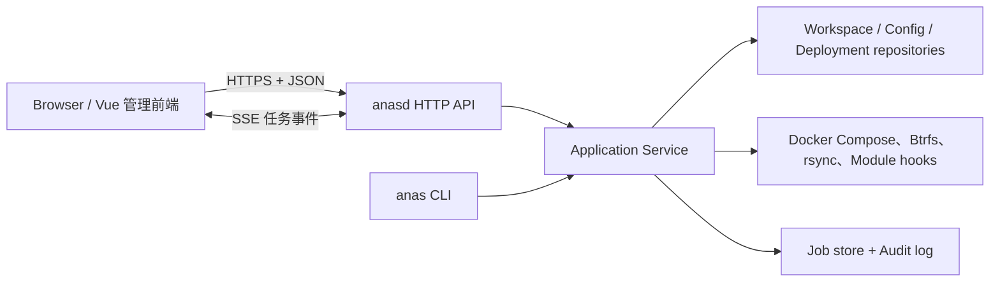

# ANAS Web API 与管理前端要求

本文是 ANAS 管理控制台（`anasd` 与嵌入式前端）的目标、范围、硬约束与验收标准，回答“什么算做对了”，不随实现顺序变化。

**[§10 需求矩阵](#10-需求矩阵规范来源)是规范来源，其余章节是解释。** 逐条要求带稳定 ID（`CONSOLE-R-<序号>`），
测试、检查表与提交都引用 ID 而不是章节号。

该特性**不单独建架构文档**：设计与被否决的替代方案写在 §3—§5 与 §9 决策记录里；
文中的 `/architecture/*` 链接指向相邻系统的既有约束，改到对应部分时才需要读。

落地顺序、里程碑与剩余工作见[Web API 与管理前端实施计划](../plans/web-api-admin-console.md)；
该计划按需求 ID 划分各阶段范围，并在其实现检查表中记录覆盖与执行证据。

「必须／不得」是约束，「应当」是有正当理由可偏离的默认。除计划文档标注为已实施的部分外，本文描述的能力**当前不可执行**，不是操作指南。

## 1. 范围与总体决策

### 1.1 目标

新增守护进程 `anasd`，提供 `/api/v1` HTTP API、管理认证、异步任务与审计日志，并以 `go:embed` 托管管理前端。`internal/runner` 的核心操作抽成带类型、`context.Context` 和事件回调的应用服务；**CLI 与 HTTP 都只是该服务层的适配器**，不各自维护一套部署逻辑。

首版按“单机、单 workspace、一个本地 break-glass owner、单一 `owner` 角色”交付；OIDC 可把多个
`platform_admin` 主体映射到同一角色，API、任务模型与权限字段预留多 workspace 与多角色。实施顺序
只由配套计划决定。

### 1.2 非目标

以下是经过评估后明确不做的，理由见 §9：

- `anasd` **不得**以反复执行 `anas ... --json` 子进程作为正式服务层（早期原型的只读命令除外）。
- **不**从 Web 创建 workspace；`anas init` 保持为终端操作。
- **不**做角色分层，MVP 只有一个角色。
- **不**拆分为「应急系统 + 完整系统」两个独立系统。
- **不**把控制台的前端或后端的任何部分容器化。
- **不**做管理端口与 Traefik 之间的端口移交，也**不**按 Traefik 或 IAM 的运行状态动态开关直连入口。

### 1.3 已同步处理的文档冲突

[CLI 契约索引](../../docs/reference/contracts/index.md)原先称这些契约“面向非交互式调用方——将来的 web 服务、定时任务……”，与 §1.1 的共享服务层方向相反。第一条切片提交 `6841c0e` 已在引入 `anasd` 的同一改动中修正为：面向外部非交互式调用方；ANAS 自己的 web 层共享服务层，只把契约用作兼容基线与黑盒测试依据。

## 2. 前置改造

以下是 Web 化的阻塞项。左列是当前实现事实，右列是需求。

| 现状 | 要求 |
| --- | --- |
| `runner.Main`、`emitJSON`、`emitProgress` 及若干 CLI 路径仍直接使用全局 `os.Stdout`/`os.Stderr` | 应用服务不得写全局流；输出经 `EventSink` 与返回值传递 |
| `internal/runner`、`internal/compose` 与 Hook 执行路径仍有直接 `exec.Command`；仓库其他工具已出现 `CommandContext`，调用点数量会随功能变化 | 所有可由 `anasd` 到达的外部命令改用 `exec.CommandContext`；请求入队与任务执行使用不同生命周期的 `context`，调用点由 CI inventory 门禁而不是文档硬编码数量 |
| 命令函数同时做参数解析、workspace 解析、业务执行与输出格式化 | 拆出稳定的 Go 结果类型，HTTP 直接消费 |
| 进度是写到 stderr 的 JSON Lines | 任务事件必须持久化并可经 SSE 重放，刷新页面后可继续观察 |
| `status` 只读 `.anas/state/active.yml`，不等于容器实时运行与健康状态 | 新增运行态探测能力 |
| `config set` 是单字段语义 | 配置写入需支持一次提交多字段、预检、乐观锁、敏感值只写不读 |

### 2.1 运行时锁必须改为非阻塞

`acquireRuntimeLock`（`internal/runner/deployment.go`）有两条性质，CLI 下无害，守护进程下必须处理：

- **它是阻塞 flock**（`syscall.Flock(fd, LOCK_EX)`，无 `LOCK_NB`）。HTTP handler 里直接调用没有超时、不能被 `context` 取消，一个卡住的 apply 会无限期挂住 goroutine 及其 OS 线程。**必须改为 `LOCK_NB` + 退避重试**，把等待变成可取消、可超时、可观测的状态。
- **取排他锁本身有副作用**：顺带执行 `cleanStaleSnapshotTemp` 与 `compensateContainerTransactions`。这对崩溃恢复是好消息——补偿逻辑不需要重写——但必须显式依赖它，不得另建一套。共享锁无此副作用。

“谁持有锁、持了多久、为哪个任务”**必须**成为 API 可见状态（§4.2 的 workspace status）。

### 2.2 配置元数据

元数据回填之前是“机制存在、数据不足”：141 项公开参数中 Module 只有 12 项声明 `config.types`，17 项全局参数为 0 项（`globalSchema` 当时没有 `Types` 字段），且 `paramTypeDocument` 对“未声明”与“声明为 string”返回同一个 `"string"`，消费者无法区分。

当前状态与精确基线见[实施计划](../plans/web-api-admin-console.md)的落地快照。对后续实现的约束：

- 配置 GET/validate/PUT **必须**消费与 CLI 相同的应用层 schema，**不得**为每个 Module 编写独立 HTTP 适配，也**不得**从 CLI JSON 反解析元数据。新增 Module 参数只改声明与统一投影，不改 handler 分支。
- 字段投影必须返回其在公开配置文档中的规范 `document_path`；前端只按该路径读写内存草稿，不得复制 runner 对 global、env、Module config 或 identity 字段的寻址规则。
- 配置 GET/PUT 必须同时投影 registry 中规范排序的 `available_modules`，包括没有配置字段的 Module；前端不得把“有字段”误当成“可选择”的必要条件。
- CLI 投影**不是** JSON Schema：两者的 `required` 与 `default` 语义不同，前端不得不经转换直接当作 JSON Schema 使用。
- 条件必填、跨字段关系与依赖运行态的规则继续由 resolver、plan 或 Hook 校验，不得伪装成单字段 schema。

### 2.3 子进程环境继承在守护进程下语义改变

`internal/compose/compose.go` 的 `RunFile`/`OutputFile` 使用 `cmd.Env = os.Environ()`；`applyWorkspaceEnv` 从 `os.Getenv("DOCKER_HOST")` 推导 `DOCKER_SOCKET_PATH`。CLI 下这是“当前 shell 说了算”，守护进程下变成两件事：systemd unit 的环境**永久**决定所有 workspace 打到哪个 Docker 端点；`anasd` 自己的环境（会话密钥等）原样泄进每个 compose 子进程与 module hook。需求见 §7.3。

### 2.4 特权模型的前提被守护进程改变

`cmd/anas-helper` 是 root 拥有、`setcap cap_net_admin+ep` 的受限 helper；[特权 helper 草案](../../docs/architecture/privilege-helper-draft.md)中 `btrfs send` 与 `subvolume delete` 仍是草案，靠读 `CapEff` 探测。常驻服务改变了这套设计的全部前提，需求见 §7.4。

## 3. 架构



### 3.1 进程与发布形态

- `cmd/anasd` 作为 systemd 管理的**宿主机**服务运行，**不得**属于被 ANAS 管理的 Compose 部署——否则 `stop`、失败回滚或 Traefik 故障会把管理面一起带走。这条同时决定了 §5 的入口策略。
- 前端使用 Vue 3 + TypeScript + Vite，生产构建产物由 `embed.FS` 嵌入 `anasd`；交付物是一个后端二进制加一个 systemd unit。
- 后端使用 Go 标准库 `net/http`，Go 版本以仓库 `go.mod` 为准；直接使用带方法与路径参数的 `ServeMux`，首版不引入 Web 框架。
- API 采用 OpenAPI 3.1 文档先行，前端类型从规范生成。CLI 的 `anas.dev/cli/v1` 与 HTTP 的 `anas.dev/api/v1` 分别版本化；**不得**把 CLI 信封原样作为 HTTP 响应。

### 3.2 代码边界

```text
cmd/anas/               现有 CLI 适配器
cmd/anasd/              HTTP 服务入口
internal/application/   用例：Plan、Apply、Restart、CreateSnapshot…
internal/api/httpapi/   路由、DTO、认证、错误映射、SSE
internal/jobs/          队列、持久化、事件流、恢复
internal/audit/         安全相关操作审计
internal/platform/      compose/btrfs/命令执行，支持 context 与显式子进程环境
internal/runner/        迁移期保留 CLI flag 与文本输出
web/src/{api,i18n,pages,components,stores}/
api/openapi.yaml
```

`web/` **必须**是独立 npm 工程，不得并入仓库根目录 VitePress 文档站的依赖树，否则 `npm run docs:build` 与前端构建互相牵制。

应用层操作统一为下列形态；CLI 把结果渲染为现有 JSON/文本契约，HTTP 映射为响应或任务结果，因而现有 CLI contract 测试继续保护兼容性：

```go
type EventSink interface {
    Progress(ProgressEvent)
    Warning(WarningEvent)
    Log(LogEvent)
}

type DeploymentService interface {
    Status(ctx context.Context, workspace string) (Status, error)
    Plan(ctx context.Context, req PlanRequest) (PlanResult, error)
    Apply(ctx context.Context, req ApplyRequest, events EventSink) (ApplyResult, error)
}
```

## 4. API

### 4.1 通用约定

- 基础路径 `/api/v1`。只读且快速的请求同步返回 `200`；改变宿主机或可能超过数秒的请求创建任务，返回 `202`、`job` 与 `Location`。
- 错误使用 `application/problem+json`，保留现有枚举（`guarded_changes`、`confirmation_required`、`lock_stale` 等）。
- 配置写入**必须**使用条件请求：已有托管配置携带 `If-Match`，首次托管携带 `If-None-Match: *`，冲突返回 `412`。ETag 是每个实际 generation 由 CSPRNG 生成并持久化的 256-bit opaque validator；`config.yml` 的 SHA-256 只留在 managed state 内检测 ANAS 之外的手工修改，不得出现在 ETag、HTTP body 或审计。零变更 PUT 保持 validator，配置或 Secret Store 的实际提交、CLI 写入和 restore 都必须轮换。
- 创建变更任务的 POST **必须**支持 `Idempotency-Key`。作用域是认证主体、HTTP 方法、规范化路径与
  workspace ID；同一 key 与同一请求摘要返回原 job/result，同一 key 搭配不同摘要返回 `409`。
  幂等记录与 job 同步持久化并至少保留到 job 过期，服务重启不得丢失。重试先查已有幂等记录，
  不能再次消费单次 confirmation；首次创建时 confirmation 消费、job 与幂等记录必须原子提交。
- 列表从第一版就支持 `limit`、`cursor`。
- 响应中的文件系统路径只暴露必要部分；API 输入**不得**接受未注册的 workspace 路径。

### 4.2 端点

`API` 行必须在首版注册真实路由；`终端提示` 行**不得**注册对应写路由，只由 UI 获取并展示服务端
生成的确切 CLI 命令。以后要把后者提升为 API，必须先另立特权需求与威胁模型。

| 领域 | 方法与路径 | 首版可用性 | 说明 |
| --- | --- | --- | --- |
| 服务 | `GET /healthz` | API | 进程存活，不读 Docker |
| 服务 | `GET /api/v1/system`、`GET /api/v1/system/ca` | API | 版本、能力、工具、签发者、监听形态；后者只下载公开的内部 CA |
| 认证 | `POST /api/v1/auth/login`、`POST /api/v1/auth/logout`、`GET /api/v1/auth/session` | API | 本地会话；登录路由只存在于直连监听器（§5.5） |
| 认证 step-up | `POST /api/v1/auth/step-up` | API | `full` 直连会话重新验证当前本地 owner 密码，签发不超过 5 分钟、单次且动作/对象绑定的 proof；不接收 IdP 密码 |
| 引导认证 | `POST /api/v1/auth/bootstrap/exchange` | API | token 原子兑换 bootstrap session；enrollment 中仅可接回同一 transaction |
| 引导认证 | `POST /api/v1/auth/enrollment/handoffs` | API | 已认证 bootstrap session 创建一次性 HTTPS handoff |
| 引导认证 | `POST /api/v1/auth/enrollment/exchange` | API | HTTPS 源兑换 handoff，设置 enrollment/CSRF Cookie 后 `303` 回到目标根路径；§5.2 定义的唯一跨源写例外 |
| 引导认证 | `POST /api/v1/auth/enrollment/owner` | API | enrollment session 原子创建首个 owner 并进入 `full` |
| Workspace | `GET /api/v1/workspaces` | API | 首版通常只有一个注册项 |
| Workspace | `GET /api/v1/workspaces/{ws}/status` | API | 活动部署、配置摘要、运行健康摘要、运行时锁持有者 |
| 部署 | `POST /api/v1/workspaces/{ws}/plans` | API | 只计算，不写入 |
| 部署 | `GET /api/v1/workspaces/{ws}/deployments`、`/{id}` | API | 历史、制品与状态 |
| 部署 | `POST /api/v1/workspaces/{ws}/actions/apply` | API | apply 任务；`allow_risky` 为显式布尔字段 |
| 部署 | `POST /api/v1/workspaces/{ws}/actions/rollback` | API | 明确目标、风险确认后创建任务 |
| Module | `GET /api/v1/workspaces/{ws}/modules` | API | 配置态、版本、运行态、健康、入口地址 |
| Module | `POST /api/v1/workspaces/{ws}/modules/{module}/actions/{enable\|disable}` | API | 携 Module 列表返回的强 `If-Match`，以持久任务原子修改期望配置；不直接改变运行态 |
| Module Command | `GET /api/v1/workspaces/{ws}/modules/{module}/commands`、`/{command}` | API | 活动 deployment 冻结的公开 descriptor 与本地可用性；不含 handler、路径或输入键 |
| Module Command | `POST /api/v1/workspaces/{ws}/modules/{module}/commands/{command}/actions/invoke` | API | 认证/job/审计完成后启用；M0 未认证监听器禁止开放 |
| Module | `POST /api/v1/workspaces/{ws}/modules/actions/{start\|stop\|restart}` | API | body 传目标列表；返回依赖 chain 预览或任务 |
| 配置 | `GET /api/v1/workspaces/{ws}/config` | API | 规范化配置、registry `available_modules`、含规范 `document_path` 的字段 schema、ETag；敏感值只报 set/unset |
| 配置 | `POST /api/v1/workspaces/{ws}/config/validate` | API | 校验候选配置并返回变更计划，不写入 |
| 配置 | `PUT /api/v1/workspaces/{ws}/config` | API | 原子写入；已有配置要求 `If-Match`，首次托管要求 `If-None-Match: *` |
| Module 市场 | `GET /api/v1/catalog/modules`、`POST /api/v1/workspaces/{ws}/actions/update-modules` | API | 目录；同步/更新任务 |
| 终端操作描述 | `POST /api/v1/workspaces/{ws}/terminal-action-previews` | API | 只为枚举的终端专属操作生成影响摘要与确切 CLI 描述，不执行操作 |
| 快照 | `GET`/`POST /api/v1/workspaces/{ws}/snapshots` | API | 列表与健康状态；创建任务 |
| 快照 | `POST /api/v1/workspaces/{ws}/snapshots/{id}/actions/{pin\|unpin\|verify}` | API | 不需要 `CAP_SYS_ADMIN` 的首版子集 |
| 快照 restore/delete | — | 终端提示 | UI 展示影响摘要与确切 CLI 命令，不注册 restore 或 DELETE 路由 |
| 备份 | `POST /api/v1/workspaces/{ws}/backup-plans`、`GET /api/v1/workspaces/{ws}/backups` | API | 能力探测、计划与列表 |
| 备份执行/恢复/验证 | — | 终端提示 | UI 展示影响摘要与确切 CLI 命令，不注册对应写路由 |
| 管理员 | `GET /api/v1/workspaces/{ws}/local-admins` | API | 不返回密码 |
| 管理员 | `POST /api/v1/workspaces/{ws}/local-admins/{module}/{account}/actions/rotate` | API | 轮换任务，**只支持随机生成** |
| 管理员 | `POST /api/v1/workspaces/{ws}/local-admins/{module}/{account}/reveal` | API | 重新认证后短时返回，`Cache-Control: no-store` |
| 任务 | `GET /api/v1/jobs`、`GET /api/v1/jobs/{id}` | API | 历史与最终结果 |
| 任务 | `GET /api/v1/jobs/{id}/events` | API | SSE，支持 `Last-Event-ID` 续传 |
| 任务 | `POST /api/v1/jobs/{id}/cancel` | API | 仅可取消声明为可取消的阶段 |
| 审计 | `GET /api/v1/audit-events` | API | 谁在何时对哪个 workspace 做了什么 |

`terminal-action-previews` 是同步计算接口，不是执行接口。请求只接受枚举的 `operation`（首版为
`snapshot.restore`、`snapshot.delete`、`backup.create`、`backup.restore`、`backup.verify`）以及对应的
OpenAPI 类型化 ID、布尔值与枚举选项；workspace、snapshot、backup、backup plan 和备份目标都只以
已注册 ID 引用，不得接受 argv、shell 字符串或任意路径。响应至少包含
`operation`、`workspace_id`、类型化目标、`impact`（是否触碰 `data/`、是否触碰 `userdata/`、是否可撤销）、
`argv`（逐 token 的 JSON 字符串数组）、`display`（可复制的 POSIX shell 安全转义文本）与
`cli_contract`。服务端必须复用实际 CLI 契约的类型化参数构造器，`display` 必须可无损还原为 `argv`，
前端不得拼接或改写命令。响应只可包含执行所必需的已注册 workspace/备份目标规范路径，不得包含
任意客户端路径或 secret。该 POST 仍要求认证、同源、CSRF，并在响应前持久化“descriptor 已生成并准备返回”审计事件，但不创建 job、
不执行 CLI，也不提供对应的 restore/delete/create/verify 写路由。

**凭据轮换只支持随机生成。** `anas admin local rotate --prompt` 要求真实 TTY 无回显读取并二次确认，不接受密码参数、环境变量或 YAML 明文。API **不得**提供“在浏览器里输入新密码”的路径——那会绕开该规则并把明文送进请求体与中间日志。

### 4.3 异步任务

```text
queued -> running -> succeeded | failed | canceled | interrupted
```

任务至少保存 `id`、`kind`、`workspace_id`、`status`、`created_by`、`created_at`、`started_at`、`finished_at`、脱敏后的请求、进度、警告、最终结果或结构化错误。事件带递增序号供 `Last-Event-ID` 续传。执行器若产生最终事件，必须先持久化该事件再提交 terminal 状态；terminal job 拒绝继续追加事件。SSE 观察到 terminal 后先排空当时的最新游标再关闭，浏览器携已追平的 `Last-Event-ID` 重连时返回 `204`，阻止 `EventSource` 无限重连。

HTTP 请求的 `context` 只负责把任务**持久化入队**；返回 `202` 或客户端断开后，任务使用自己的
job-owned context 继续执行。取消只在声明为安全的阶段生效；外部命令必须以独立进程组运行，先发送
TERM，超过宽限期后 KILL，并进入与崩溃相同的补偿检查，不能只终止直接子进程。

每个 workspace 同时只允许一个变更任务，其余排队；只读请求可并发。底层保留 workspace 文件锁（按 §2.1 改为非阻塞），避免 CLI 与 Web 绕过队列。`anasd` 必须在整个执行器生命周期持有 `console_store/jobs.execution.lock` 排他租约；只有取得该租约的 daemon 才能在启动恢复时把遗留 `running` 任务标记为 `interrupted`，单纯打开任务存储不得据此推断上一执行器已经死亡。第二个 daemon 必须在恢复和监听前因租约冲突失败，且不得改写仍由首个 daemon 执行的任务。恢复出的 `interrupted` 任务在下次取得 workspace 排他锁时由既有补偿逻辑清理；**不得**在不知道外部命令是否已完成时自动重试高风险任务。

### 4.4 任务持久化

两条约束排除了直接选用 SQLite：`scripts/ci/build-anas-release.sh` 以 `CGO_ENABLED=0` 交叉编译 amd64/arm64（cgo 驱动会破坏该路径）；当前直接依赖只有 `yaml.v3`、`semver/v3`、`x/crypto`、`x/text` 四个，`modernc.org/sqlite` 会一次性引入数十个包并扩大一个近 root 服务的攻击面。

**MVP 使用 root 管理的 `console_store`：任务/事件与审计都在单个 generation 内使用 append-only JSONL，分别只允许在 `jobs.lock` / `audit.lock` 下以 crash-safe sealed checkpoint 受控换代；两者的存储层都放在接口后面**。该目录必须位于所有注册 workspace 之外，确有审计检索需求时再换 `modernc.org/sqlite`（保持 `CGO_ENABLED=0`）。最小审计 writer 与脱敏器必须在 LAN bootstrap/auth 开放前初始化，任务与事件流随后复用同一目录安全边界。追加必须串行化，在返回持久化成功前完成 flush/fsync；启动时允许截断最后一条未完成记录，但中间损坏或未封口 checkpoint 必须隔离并报错，不能跳过后继续。

所有受支持的任务/事件 journal writer 必须通过 `consolejobs.Store` 并遵守 `jobs.lock`；审计 writer 使用独立的 `audit.Writer`/`audit.lock`，两者只共享 root-managed `console_store` 的目录安全边界，不共享文件、锁或保留策略。能写 root-owned `0600` journal 且刻意绕过 advisory lock、在一次受支持 append 的检查窗口内并发改写前缀的本地进程是 root 等价对手，不属于该缓存完整性保证，服务也不宣称抵抗已取得本机 root 的攻击者。在这个边界内，未变化查询复用已验证状态；只有 `consolejobs.Store` 的同进程协作增长在有界 append receipt 链完整证明全部增长时才从已验证 offset 增量应用 tail。未知或跨进程增长、receipt 缺失/过期、文件缩短或原位变化必须 fail closed 或回退全量校验，不能让每次 SSE poll 无条件从头扫描完整历史；审计 Writer 发现 canonical inode 换代时必须在 `audit.lock` 下验证 generation 与无回退水位后换 FD。

新建 envelope-format audit store 时必须先持久化 checksummed pristine metadata slot，再 fsync `audit.jsonl` 中带相同 StoreID 的 header；pristine 状态携带当次策略，且 generation、`last_sequence`、`pruned_through` 均为 0、`last_recorded_at` 为空，首次非零策略随后固定。首次初始化只允许有限恢复：空 lock 与既存空 journal（兼容旧格式时也包括可明确识别为旧 Event 编码、没有完整 record 的单条残尾）可视为从未初始化；首槽写入 torn 且没有有效 revision 时只能配对既存的精确空 journal，覆盖重写 revision 1；唯一例外是 journal 能完整验证为旧 Event-only 格式，此时可按其既有水位/commit time 重试首次 metadata 迁移。已有有效 pristine 首槽时，仅可用其中同一个 StoreID/策略补完既存空或可证明为同 StoreID 规范 header 的 partial journal。完整 envelope header 却没有有效 metadata 必须拒绝；非空 torn 首槽配任何 partial journal 也必须拒绝且不得截断。锁元数据使用两个固定 512-byte slot，每槽带递增 revision 与覆盖 revision/metadata 的 SHA-256；更新只能交替 `WriteAt` 且永不 truncate。恢复选择 revision 最高的完整有效槽，最新槽 torn 时回退旧槽，初始化完成后没有有效槽必须 fail closed；旧单行 lock metadata 迁移到双槽时也要保留完整旧前缀，若新槽 torn 则回退该前缀。元数据还保存 generation、`last_sequence`、`pruned_through`、`last_recorded_at` 与首次非零 MaxEvents/Retention 策略 identity；每次产生新已确认状态的 append/compaction 都要在释放锁和返回成功前同步更新。journal 已持久而 metadata 仍旧是合法的后续 crash window，但只能在完整验证同 lineage 的 journal 确为前进状态后接受并写新槽追平；journal 缺失、为空或相对 metadata 发生 lineage、水位/commit time 回退时必须拒绝打开。策略不匹配的新 Open 和已打开旧 Writer 的后续 refresh 也必须 fail closed。

候选 record 与原子追加批次在写盘前校验尺寸，journal 读取也必须在聚合完整行前按同一 record 上限有界拒绝；调用方提供的聚合 warning/result 或审计事件超限分别返回 `ErrInvalid` / `ErrInvalidEvent`，不得把未受损的 Store/Writer 永久标记为 unavailable。任务事件设容量与保留期；审计使用独立的最大事件数与保留期策略，只能按 Writer 自有 commit time 淘汰连续 sequence 前缀，不能信任调用方提供的 occurrence timestamp。兼容旧 Event-only audit journal 时，旧格式没有独立 commit clock，恢复必须以 journal inode mtime 作为 legacy `recorded_at`，首次 append 例外地强制迁移为 sealed envelope generation；除这次一次性迁移外，自动换代只有在存在 obsolete history 且实测回收收益达到门槛时才发生。具体生产保留值在启用删除前另行冻结，不写成需求常量。过期的 `Last-Event-ID` 返回可机读的事件缺口错误。逻辑 prune 必须配套 crash-safe compaction 或 segment rotation 来实际回收磁盘，不能只追加 prune record 后让物理 JSONL 无限增长。由于 `console_store` 不属于任何 workspace，它不得进入 workspace 的 snapshot/backup/restore 内容，恢复操作也不得覆盖正在执行任务与审计记录。无论哪种存储，控制面元数据都**不得**替代 workspace 中的 YAML 状态或成为部署真相源；密码 PHC 与 credential digest 使用独立的 0600 认证状态文件，原始密码、token、session 与 CSRF 值不持久化。当前没有需要加密的控制面持久化数据，因此不得为了满足抽象表述生成一个没有调用方的长期“加密密钥”；将来若引入这类数据，必须另立密钥生命周期与威胁模型要求。

配置 API 对敏感字段使用显式三态操作：`unchanged`、`set`、`unset`；不得用空字符串猜测意图。
配置、Secret Store 与 managed state 作为一个 redo-only 提交单元：WAL manifest 发布前失败保持三者
原 tuple；发布后不回滚，受支持 reader 必须在持锁恢复完成前等待或 fail closed，不得向调用方暴露混合
generation，最终收敛到 manifest 记录的新 tuple。已有托管配置缺少
`If-Match` 返回 `428`，validator 失配返回 `412`；首次托管只接受 `If-None-Match: *`。ETag 使用带引号的
强实体标签。validate 只返回当前 base validator，不在提交前生成候选 validator；旧 managed state 缺少
validator 时，首个受支持配置读写者必须先在 workspace 排他运行时锁内校验内部内容摘要并原子补写随机
validator，迁移完成前不得向客户端回退暴露旧摘要。

HTTP 候选是封闭、规范化的写边界：敏感操作必须严格匹配三态 tagged union，未知字段即使值为空
mapping 也不得借 Module 自定义解码绕过；Module/参数/environment key 必须使用规范拼写，本地账户
占位是只读集合。JSON object 不承诺成员顺序，而 YAML `modules` mapping 的顺序参与部署解析，因此
API 把候选 Module object 解释为集合：保留仍存在 Module 的当前相对顺序，新增 Module 按规范名称
排序追加，删除自然移除；纯 JSON 往返若没有可写语义变化，必须保留原受管字节与 validator。Module
集合的新增/删除必须进入 validate、PUT 与 authorized intent 的无值变更摘要。

CAS 后的 Hook/审计窗口不能授权静默覆盖不遵守 advisory lock 的手工编辑。WAL 发布前必须再次核对
config、Secret Store 与 managed state 仍是 CAS/候选准备时见到的完整旧 tuple；不匹配按 `412` 拒绝且
不发布 WAL。事务 manifest、stage 与目标读取均按 role 设显式尺寸上限，恢复在分配或读取 oversized
image 前 fail closed 并保留证据。

审计 journal 与 workspace 配置事务是两个独立持久化域，不宣称存在跨 journal 原子提交。每次配置
PUT 先从 CSPRNG 生成至少 128 bit 的唯一、不可猜 `operation_id`，用它关联 write-ahead 审计和配置 WAL：先持久记录只含
operation ID、actor/workspace 的脱敏 `attempt`，失败则连
请求体都不解析；候选配置在 workspace 运行时锁内通过 CAS 和校验后，再于配置 WAL 落盘前持久
`authorized` intent。intent 只含同一 operation ID、actor、workspace、当前/候选 validator 和不带值的变更摘要；
它写入失败必须否决配置提交。若需要 WAL，其 manifest 也持久同一 operation ID。

`success`/`failure` 终态事件只是对已持久 write-ahead 证据的补充，带同一 operation ID，并使用与
HTTP 请求取消分离的有界 context 追加。它失败不得回滚已提交的 workspace，也不得把已确认的
成功对外改报为失败，但失败必须写入 daemon 自身的结构化错误日志而不能静默丢弃。

只有配置 WAL manifest 已发布，或 manifest rename 后目录 fsync 使其持久性存疑时，本次结果才是
`indeterminate`（错误码 `config_recovery_required`）；WAL 前失败仍是 `failure`。下一个配置读写者必须先在
workspace 排他锁下完成恢复。MVP 不事后改写该 operation 的历史 `indeterminate`，也不伪造一条与当时
请求同步的成功/失败终态；审计查询将它与当前 managed validator 分开展示。查询同样不得因缺少独立
terminal 记录而推断配置成功或失败。

审计查询只在 `full` 状态经 TLS 对 owner 开放，必须通过 `audit.Writer` 的受支持只读接口取得已经过
lineage、canonical inode、lock metadata 与跨进程换代校验的 retained state，不得由 handler 直接扫描
`audit.jsonl`。结果按 sequence 新到旧排列，支持 `limit` 与 opaque `cursor`；服务级事件和当前已注册
workspace 的事件可见，已移除或未知 workspace 的事件必须在分页前过滤。请求 principal 必须同时具有
owner role 与非空 identity source；响应只投影 writer 已脱敏的 sequence/time/type/actor/workspace/outcome/details。
配置操作的 `attempt`、`authorized` 与 terminal 保持独立事件，`indeterminate` 保持原 outcome，terminal
缺失不得被查询层合成为成功或失败。

## 5. 访问路径、证书与认证

### 5.1 两条不可让步的约束

1. **管理面的可达性必须是静态的、管理员声明的属性，永远不能是被管理系统状态的函数。** 管理面必须在被管理系统停机时仍然可达——Traefik 配错、apply 失败回滚、IAM 故障，正是最需要控制台的时刻。可以随状态变化的只有 §5.2 的**能力分级**：降级能做什么不会把人锁在门外，降级可达性会。
2. **lego 是部署唯一的证书签发者，不得再造第二个。** `anasd` 与 Traefik 一样只是 `ANAS_TLS_*` 的消费者。

关于 lego 行为的两处精确表述，照错的心智模型实现会出问题：它的兜底**不是“自签名”而是内部 CA 签发**（一个 CA 装一次覆盖全部服务，而非每个服务各自自签——`ca.sh` 注释写明当年正是后者导致“谁也不信谁”）；顺序上**不是“ACME 失败才兜底”**，而是 `ca.sh bootstrap` 总是先跑拿到内部证书，之后才尝试 ACME 并由 `cert.sh` 的 `adopt` 在同一组路径原地替换（`verify_published` 拒绝“签发成功但仍是自签名”，`.issuer` 记录当前签发者）。因此 lego 一旦开始工作就始终有可用证书，原地升级，中间没有空窗；首次 apply 前尚未运行 lego 的阶段仍属于 `bootstrap`。

### 5.2 能力分级

引导窗口——从 `install.sh` 结束到创建首个持久 `owner`——分成三个单向状态。状态必须持久化，
服务重启后不得倒退：

1. `bootstrap`：尚无可信证书，也无持久管理员；默认经 LAN 明文 HTTP 完成首次配置与 apply。
2. `enrollment`：已发现并验证 lego 的内部 CA 或 ACME 证书；HTTP 只保留状态、内部 CA 下载、
   一次性 HTTPS handoff 与跳转指引，配置写入和 apply 不再接受。
3. `full`：管理员在 HTTPS 源上使用 handoff 创建首个持久 `owner`；只有这一步成功后才永久关闭
   bootstrap token、session、handoff 与引导端点。

证书出现本身**不得**直接进入 `full`，否则浏览器跨源跳转后还没有可用的持久身份。能开放的能力
绑定到当前状态与通道可信度，边界由一条构造规则确定：

> **引导级只包含“为了到达完整级所必需”的操作，此外一律不含。**

| | `bootstrap` | `enrollment` | `full` |
| --- | --- | --- | --- |
| 通道 | LAN 明文 HTTP（默认）；可选临时自签 HTTPS | lego HTTPS；同一固定端口的明文侧只做过渡 allowlist | lego HTTPS；明文侧只可无凭据健康检查或跳转 |
| 认证 | 一次性 token 兑换的短时 bootstrap session | bootstrap session 兑换的一次性 HTTPS handoff | 持久本地账户，或经 Traefik 的 OIDC（§5.5） |
| 可做 | `GET /system`；选择 Module；初始配置 GET/validate/save；首次 plan/apply；SSE 进度 | 证书状态、内部 CA 下载、handoff、跳转、首个 owner 创建 | 全部首版已实现能力 |
| 不可做 | reveal、凭据轮换、快照/备份写操作与 restore、审计查询、日常配置改写、第二次 apply | HTTP 上的配置与任务写操作 | 未实现或被特权模型排除的能力 |

**单向棘轮**：首个 `owner` 原子创建成功后进入 `full`，所有 bootstrap token、session 与 handoff
立即作废，引导级端点返回 404；重新开启只能从 CLI 显式移除现有管理员并重置引导状态。传输棘轮
禁止的是回到明文 bootstrap/config/job 管理能力；`enrollment` 为完成跨源切换而保留的 CA、状态、
handoff 与跳转 allowlist 是唯一例外。进入 `full` 后，明文侧除无凭据 `/healthz` 和到规范 HTTPS
origin 的跳转外全部返回 404，不接受 Cookie、Authorization 或请求体。证书文件事后消失或损坏时
继续使用最后一组验证通过的证书并产生高危告警，不得降级到 `bootstrap` 或扩大明文能力。

认证侧事务的 WAL 一旦持久化，请求断开便不能再取消其收敛；后续认证快照、capability state publish、
错误仲裁与 rollback 使用脱离请求取消且有明确期限的 context。若 publish 自身耗尽期限，仲裁必须取得新的
有界预算读取真实持久状态，不能因为复用已过期 context 而把正常认证锁死到下次 daemon 重启。

**引导期默认 LAN 明文 HTTP，并在 `lan` 模式监听全部本机地址。** 这是 NAS 首次启动后让同一局域网
设备立即访问和配置的产品决策，不尝试猜测“用户最常用”的某个 IP。升级判断是纯本地的：只有
检测并验证 lego 的 `ANAS_TLS_*` 才进入 `enrollment`，并在 HTTP 侧提供 handoff 与跳转。手动生成
的临时证书只把当前 `bootstrap` 通道改成 HTTPS，不改变能力状态。没有任何证书时要开 HTTPS，必须
显式执行 `anas console tls --self-signed`（生成临时自签证书并在当前 SSH 会话打印 SHA-256 指纹供
带外核对）；这是可选项，不是默认流程。`ssh -L` + `loopback` 监听始终是等价可用的替代路径。

bootstrap token 只能由 CLI 生成，至少 256 bit、服务端只存摘要，默认 TTL 20 分钟且可配置范围为
15—30 分钟；它只能原子地成功兑换一次，并发兑换最多一个成功。兑换结果是服务端随机、可跨刷新与
`anasd` 重启、绑定当前 origin、bootstrap transaction 与引导端点 allowlist 的 bootstrap session；
session 默认绝对期限 2 小时、空闲期限 30 分钟，多次 validate、首次 apply 与 SSE 使用该 session，
而不是重复使用原 token。session 过期不取消已运行任务；CLI 可重新签发 token 接回同一 transaction。
若已进入 `enrollment`，新 token 只能兑换受限的恢复 session，用于该 transaction 的 job/events、CA 与
handoff，不能重新开放配置或 apply。
进入 `enrollment` 后，session 只能兑换一次性 handoff：至少 256 bit、只存摘要、有效 5 分钟，绑定
transaction、源 bootstrap origin、目标 HTTPS origin 与当前证书 SPKI；handoff 明文不得进入 URL、日志或浏览器持久存储，
服务端只持久化摘要和绑定元数据。浏览器以顶层 form POST 的请求体把 handoff 发送到 HTTPS exchange
（不使用 query、fragment、CORS fetch 或持久存储），在 HTTPS 源原子兑换为 15 分钟的 Secure
enrollment session。承载该顶层表单的响应必须使用 `Referrer-Policy: strict-origin`：同为 HTTPS 时保留
精确源 origin 供 exchange 校验，但不泄露源路径或查询；不得使用会让真实浏览器把跨源 POST 的
`Origin` 降为 `null` 的 `no-referrer`。exchange 成功后必须同时设置 HttpOnly 的
`__Host-anas_enrollment_session` 与同源
SPA 可读取的 `__Host-anas_enrollment_csrf`；两者均为 `Secure`、`SameSite=Strict`、`Path=/`、不设
`Domain`，随后以 `303` 跳转到目标 HTTPS origin 的根路径，CSRF 值不得进入 URL 或 JSON。SPA 从 CSRF
Cookie 读取值并复制到 `X-CSRF-Token`；首个 `owner` 的密码只允许在该 session 中提交，且请求必须满足
CSRF Cookie 与请求头精确相等，并继续由服务端校验该值绑定到 session 的摘要。owner 创建成功的同一响应
删除 enrollment session、enrollment CSRF 与 bootstrap session Cookie。重新签发 token 会撤销旧 token
与旧 bootstrap session；token、handoff 与 session 的绝对期限不得自动续期。普通已认证请求可以在绝对期限内
滑动 session 的 idle expiry，但 SSE 的周期存续校验不得把“持续连着”当成用户活动。

`POST /api/v1/auth/enrollment/exchange` 是唯一允许跨源的写请求：它不接受 Cookie、`Authorization`
或普通 CSRF 凭据，只以一次性 handoff 授权；请求必须带非 `null` 的 `Origin`，且精确等于 handoff
绑定的源 bootstrap origin，同时请求的 Host/规范目标 origin 与当前 TLS 连接证书的 SPKI 必须分别
匹配 handoff 绑定值，否则在消费 handoff 前拒绝。其成功响应只设置上述两个目标源 Cookie 并 `303`
回到目标根路径，不在响应 JSON、Location 或其他 URL 部分返回 CSRF。除该端点外，所有浏览器写请求
仍要求严格同源和 CSRF，不因 enrollment 放宽 CORS。

**残余风险必须如实记账且已经接受**：LAN 主动中间人不仅能读取 DNS 厂商 API 凭据，还可能窃取
token/session、篡改 Module 与初始配置、劫持首次 apply 或抢先完成管理员注册，从而取得近 root 的
控制面。这是为了 NAS 首次启动即可从局域网访问而接受的引导窗口风险，短窗口不能表述成密码学保护。
处理方式是：

- 整个明文引导期持续显示不可关闭的风险横幅，明确 wildcard 可能包含非 LAN 接口，并给出防火墙责任、`ssh -L` 与 `anas console tls --self-signed` 替代路径；
- 安装文档明写“引导窗口不具备机密性”，不得含糊成“建议使用可信网络”；
- 到达完整级后提示管理员轮换引导期输入过的 DNS 凭据——这是唯一能真正消除该暴露的动作。

**升级到完整级**：不存在“把证书放进后端”这个动作，`GetCertificate` 回调在下一次握手就用上新证书，管理面只需发现证书、进入 `enrollment` 并提示跳转。跳转是跨源的（`http://<ip>:<port>` → `https://anas.<base_domain>:<port>`），bootstrap session 不跨 origin，授权由一次性 handoff 承接；管理员在新源创建持久账户后才进入 `full`。**证书门槛是“由受支持签发者签发且本地校验通过”而非“ACME 成功”**：`virtual_domain=true` 部署永远没有 ACME 证书，但 `apply` 后有内部 CA 签发的通配证书，管理员可在跳转前下载并安装 `anas-internal-ca.crt`；这是一等公民模式，必须能到达完整级。判定数据源是 `.issuer` 加证书自身校验，由 `GET /api/v1/system` 返回，界面如实显示签发者，不得把内部 CA 说成“证书有问题”。

**引导期的临时证书是丢弃品**，lego 的内部 CA 一旦出现即弃用，**不得**提升为 lego 的 CA（理由见 §9）。

### 5.3 证书消费的实现要求

1. **必须热重载**，不得启动时一次性 `LoadX509KeyPair`。`ca.sh`/`cert.sh` 用 `install` 覆盖同一组路径，文件在 `anasd` 运行期间被原地替换；使用 `tls.Config.GetCertificate` 回调加 mtime/内容变化检测，每次握手取当前证书。enrollment handoff 以该 TLS 连接实际选中的证书 SPKI 为准，因此直连管理 TLS 必须禁用 session resumption，不能让恢复会话绕过选证书与连接级 SPKI 记录。新证书与私钥必须作为一组完成解析、配对、有效期、SAN 与签发链校验后才原子替换缓存；任何读取或校验失败都继续提供 last-known-good 并告警，不能暴露半更新的 pair。
2. **通配证书覆盖 `<base_domain>` 与 `*.<base_domain>`，不覆盖 IP**，因此完整级**必须按名字访问**。代价是管理员设备要能解析该名字（部署内有 samba_dc 时它就是 DNS，否则需 hosts 记录或路由器配置），这条要写进安装文档。**不得**为管理面在 `ca.sh` 里加 `IP:` SAN——ACME 无法为私网 IP 签发，会让内部证书与 ACME 证书形状不同，破坏 lego“消费者看不出区别”的核心不变量。本条不适用于引导期：明文 HTTP 与可选的临时自签证书都不依赖 DNS，可按 IP 访问。
3. **私钥是 0600 且由容器内 root 写出**，`anasd` 必须以能读取它的身份运行。鉴于它本就需要 Docker socket（权限近似 root），这不是新增提升，但必须写进 systemd unit 与文档，不能等运行时报 permission denied。

### 5.4 端口与入口

**`anasd` 永久独占一个固定管理端口，从不让出，并自己终结 HTTPS。** 该端口与 `traefik.base_port` 无关，记录在 `anasd` 自己的服务配置里，**不得**出现在 workspace 的 `config.yml` 中。

在 `enrollment`/`full` 仍需提供明文过渡响应时，同一固定端口按连接首包区分 TLS 与明文；这不是
第二个管理端口。两侧复用同一状态/权限注册表，明文侧只能命中 §5.2 的状态 allowlist，不能因为
协议复用获得 HTTPS 路由。实现必须覆盖慢速首包、未知协议、连接上限和关闭竞态测试。

直连监听范围是**静态策略**，取值不随任何被管理组件的状态变化：

| 模式 | 直连监听 | LAN 访问路径 | 恢复路径 |
| --- | --- | --- | --- |
| `lan`（默认） | 绑 `0.0.0.0` 与 `[::]`（系统支持 IPv6 时），即全部本机接口 | 直连 + Traefik 路由（可用时） | 任一本机可达地址 |
| `loopback` | 只绑 `127.0.0.1` 与启用时的 `[::1]` | 仅经 Traefik | `ssh -L` 隧道 |

`loopback` 就是“关掉 LAN 直连”，是站得住的姿态；关键在于它是一次性配置决定，而非运行期动态判断。生产服务在打开监听器前先建立 bootstrap 凭据、allowlist、TTL 与请求限制；配置为 `lan` 就从首次启动起监听 wildcard，**是否已创建持久管理员不参与绑定判断**。服务不得自行挑选某个“主要 LAN IP”。`lan` 下数值 Host 只有在它与该连接实际命中的本机地址一致时才默认允许；服务配置声明的 DNS Host 也可允许，其他 Host 拒绝。这样新增/热插拔地址无需猜“主 IP”，也不会把 wildcard 绑定退化成任意 Host 信任。

`lan` 是“全部接口”而不是网络类型识别器：Wi-Fi、VPN、容器网桥、热插拔网卡以及主机若存在的
公网接口都会一起监听。该暴露和 bootstrap 明文风险属于已接受产品决策，安装文档、CLI status 与
引导风险横幅必须直说；接口隔离和防火墙由管理员负责。

Traefik 运行时**可以额外**提供 `https://anas.<base_domain>/`，与直连地址并存。`modules/traefik/traefik/anas-entrypoint.sh` 的声明式路由支持 `ANAS_TRAEFIK_ROUTE__<NAME>__SERVERS_TRANSPORT`，并从 `ANAS_TRAEFIK_SERVERS_TRANSPORT__<NAME>__{SERVER_NAME,ROOT_CAS}` 生成后端 transport。管理面使用 `anas-trust-bundle.crt` 校验上游证书，并把 `serverName` 固定为 `anas.<base_domain>`。

后端 transport 的服务端校验不能单独证明请求来自 Traefik。M1.5 因此还为每个命名 transport 在 Secret Store 生成稳定的专属 CA/client credential，只把 CA 公钥、客户端 cert/key 与 SPKI 摘要投影到 Traefik 专用 runtime；代理身份监听器同时要求客户端 CA 验证、叶 SPKI allowlist 和精确源 IP。直连固定端口与这条支线仍可独立推进，但必须在 M5 汇合后才能宣告首版完成。

### 5.5 认证与角色

两条路径使用不同的认证提供方，这是**同一个 `anasd` 进程上的两个监听器，不是两套系统或两套功能**：

| 性质 | 由什么决定 | 直连监听器 | 经 Traefik 的监听器 |
| --- | --- | --- | --- |
| 认证方式 | 门 | 本地 `admin` 凭据 | `oauth2_proxy` forwardauth → OIDC |
| 是否解析代理身份头 | 门 | 否，一律剥离 | 是；通道不可旁路，使用 IP 传输时另校验精确来源列表 |
| **能力** | **不由门决定**，由 §5.2 分级决定 | 完整级即完整能力 | 完整级即完整能力 |

第三行最容易实现错：**直连不是“应急阉割版”**。若直连永远只有有限功能，则 Traefik 或 IAM 故障时管理员只剩一个残废的控制台，而那恰是最需要完整能力去修复的时刻。能力分级与入口选择互相正交；引导期事实上只有直连门，那是时序结果而非规则。

两个监听器共享应用服务层、任务队列与 SSE、审计日志、API 面、嵌入的 SPA、i18n 与分级判定——一份代码、一个进程、一个版本。仅有的区别是：TLS 终结位置（直连自己终结；Traefik 终结外部 TLS 后，只能经受控 Unix socket 或 mTLS 等不可旁路通道进入代理身份监听器）、认证方式、代理头信任标志、本地登录路由是否存在。会话按 origin 天然隔离，Cookie 不跨源携带，无需额外机制。

**因此不需要探测 IAM 状态**：经 Traefik 的源上 forwardauth 在请求到达 `anasd` 之前就拦截，`anasd` 永远看不到未认证请求也不渲染登录页；直连源始终渲染本地登录表单。真正要解决的是**恢复地址的带外可发现性**——`anas console status` 在 CLI 打印两个地址并标注哪个是恢复入口，控制台“证书与访问”页展示直连地址供收藏，安装文档同时记录两者。故障时管理员拿到的是 502 或 IdP 报错，那一刻控制台本身不可用，所以恢复地址必须在不依赖控制台的前提下可获得。**不得**在经 Traefik 的源上放“改用本地账号登录”的链接——那等于在对外可达的路由上发布 OIDC 绕过路径。

**本地 break-glass 账号**：与 Samba 的 `admin` **同名但密码独立**，Argon2id 哈希存于 `anasd` 自己的 0600 文件，与 workspace 的 secret store 无关。它**始终可用**，不得按 OIDC 健康状态开关，其登录路径只存在于直连监听器。代价用限流、审计与可选二次因素来控，不得用可用性来控；本地登录尝试全部进审计，成功登录额外产生高危事件记录。

**角色模型：MVP 只有 `owner` 一种角色**，持有 `platform_admin` 角色的目录成员即 `owner`；当前 Samba 实现把该角色解析为 `Admins` 组。ANAS 面向家用与小型公司 NAS，这个规模引入分层只增加配置负担。该决定与既有姿态一致——`oauth2_proxy` 网关按 `platform_admin` 角色派生物理组，`ddns_updater` 一类管理界面今天已这样守。

但它**确实扩大了 `platform_admin`（当前 Samba 为 `Admins`）的含义**：[管理员账户体系](../../docs/architecture/admin-account-system.md)定义该契约“不把用户加入 `Domain Admins`、`FS Admins`，也不授予宿主机或数据库超级权限”，而控制台能控制 Docker、恢复数据、读取凭据。这是知情取舍，配套两条：

- [管理员账户体系](../../docs/architecture/admin-account-system.md)已同步补充该扩大范围的说明（最后同步 2026-08-29）；
- 授予 `owner` 时审计记录写明授权来源是目录组，而不是只记用户名。

**即使只有一个角色，每个 handler 仍必须显式声明所需权限**（`requirePermission(perm.ConfigWrite)` 一类），未声明即拒绝，不得依赖“登录即全权”。job、SSE 与审计查询还必须按 workspace、actor 与身份来源执行对象级授权。将来分层时只需加一张映射表，不必逐页面回补鉴权。分层触发信号：第一次有人想让非管理员看状态页。

**OIDC 接入方式**：`modules/oauth2_proxy` 已是完整 OIDC 客户端（`requires_capabilities: iam`、`provides: forward_auth`、`exports: ANAS_FORWARD_AUTH_*`）；它把 `platform_admin` 角色解析为目录的真实管理员组，并经 `ANAS_IAM_CLIENT__*__ALLOW_GROUPS` 交给 IAM 判定，不再提供可配置的 `allow_groups` 参数。控制台只需在自己的 Traefik 路由上挂 `ANAS_FORWARD_AUTH_*` 中间件，**不得**在 `anasd` 内实现 OIDC 客户端，也不得为此容器化任何部分。OIDC 属于 P2，排在本地账号与 §5.2 分级之后；但角色模型与监听器的“是否受信代理”标志必须在引入认证的同一阶段就设计进去，不得事后按页面回补。

**代理身份头的信任边界**：若无条件信任 `X-Forwarded-User` 一类的头，任何能访问直连端口的人自带该头即成管理员。因此身份头只在标记为“经受信代理”的监听器上解析，直连监听器一律剥离。来源 IP allowlist 只是附加检查，不足以建立身份；代理监听器必须使用无法被普通本机进程或同网段容器旁路的受控 Unix socket 或 mTLS，Traefik 必须覆盖而非追加身份头，重复或歧义身份头一律拒绝。

**高危操作的 step-up 与确认必须由服务端强制。** `full` 状态直连会话调用
`POST /api/v1/auth/step-up`，请求携带当前本地 owner 密码以及 OpenAPI 枚举的 action、已注册 workspace ID
与该 action 对应的类型化目标 ID；服务端重新验证密码、从当前会话和服务端状态计算绑定，返回不超过
5 分钟且只能消费一次的 proof。proof 原值只在该次响应返回，服务端只持久化摘要；密码、proof
都不得进入 URL、日志或 job。客户端不得提交任意路径、argv 或自造状态摘要来扩大绑定。

OIDC 会话必须提交由受信 forward-auth 路径产生、绑定同一稳定 subject 且带近期认证时间的一次性 step-up assertion。在该 assertion 契约落地前，经 Traefik 的入口不得开放需要 step-up 的操作，不能静默退化成普通 OIDC 会话或要求用户输入不属于他的本地密码。preview 返回的 confirmation token 必须短时、单次，并绑定 actor、认证来源、action、workspace、目标 ID 与当前状态摘要；执行端点校验 token 与 step-up，状态变化后返回冲突。唯一没有既有密码可重新验证的场景是 bootstrap 首次 apply：它的 confirmation 改为绑定 bootstrap session、transaction、候选配置和 plan 摘要，不伪造一个不存在的 owner/OIDC proof。前端确认词只是交互层，不是授权凭据。

首次 apply 使用的 plan 摘要必须由服务端对完整类型化计划和当时的 opaque config validator 计算；不得把内部配置内容摘要、本机路径或客户端可自造的摘要作为绑定材料。配置 generation 或计划结果变化后，旧 confirmation 必须因绑定漂移而失效。

### 5.6 应急 UI 包

主 SPA 构建损坏或与 API 版本不兼容时，恢复入口也会渲染不出来。因此**应急 UI 必须是独立的小型嵌入包，而不是完整 SPA 的一个路由**。它与 §5.5 正交：直连监听器平时提供的就是完整 SPA，应急包只在主 SPA 无法渲染时接管。配套：引导级/应急端点集在路由层用显式允许列表强制，不散落在各 handler；应急模式运行在不含 `CAP_SYS_ADMIN` 操作的缩减能力集下。

## 6. 管理前端

### 6.1 页面

| 页面 | 主要内容 | 优先级 |
| --- | --- | --- |
| 引导 | token 输入、未加密提示、Module 选择、初始配置、首次 apply、证书就绪后的跳转指引 | P0 |
| 登录/初始化 | 在 enrollment HTTPS 源创建首个 owner；进入 full 后登录、处理会话过期 | P0 |
| 总览 | 服务能力、活动部署、Module 健康、配置待应用、最近任务/快照/备份、当前签发者与监听形态 | P0 |
| Module | 版本、运行状态、健康、依赖、入口地址、启停/重启 | P0 |
| 配置 | schema 驱动的分组表单、敏感字段 set/unset、变更效果 | P0 |
| 部署 | plan、apply、部署历史、详情、回滚 | P0 |
| 任务中心 | 实时进度、日志、警告、失败详情、历史 | P0 |
| 快照 | 创建、固定、验证；删除/恢复显示终端命令 | P1 |
| 备份 | 目标、能力探测、计划、列表；执行/验证/恢复显示终端命令 | P1 |
| 本地管理员 | 账户列表、轮换、重新认证后显示凭据 | P1 |
| 证书与访问 | 当前签发者、有效期、内部 CA 下载、监听地址与 Traefik 路由状态、恢复地址 | P1 |
| 系统与审计 | API/CLI 版本、工具能力、登录与高危操作记录 | P1 |

“证书与访问”页**必须**提供 `anas-internal-ca.crt` 下载：它是公开材料（0644），而在 `virtual_domain` 部署里，管理员在设备上安装它是浏览器不报警的唯一途径。

**创建 workspace 不在 Web 范围内**（§7.2 规定 workspace 只由服务配置注册，API 不接受路径）。安装文档必须写明先跑 `anas init`；无注册 workspace 时登录页要显式说明下一步命令，而不是显示空列表。

### 6.2 关键交互

- 配置编辑流程为“编辑草稿 → 服务端 validate → 展示变更效果/依赖/风险 → 保存 → 可选 apply”；改一个输入框**不得**立即改变运行环境。字段必须使用服务端投影的规范 `document_path` 修改公开文档；任意后续编辑都使既有 validate 结果失效，保存只能提交最近一次验证通过的规范化候选，并按托管状态携带 GET 的强 ETag 或 `If-None-Match: *`。
- **`credential_rotate`、`data_migrate`、`immutable` 三类字段在 Web 上同样不可写入。** `config set` 对它们直接拒绝（usage 错误），没有绕过开关；能绕过的是 apply 阶段的 `--allow-risky`（`guarded_changes`，退出码 4）。这是两个不同的闸门：配置页对这三类字段只读并显示其 `apply` 指向的迁移流程，二次确认只出现在 apply 的 `allow_risky` 上。若 Web 允许重新认证后写入 immutable 值，Web 适配器就比 CLI 权限更大，推翻 §1.1 的共享服务层前提。
- `allow_risky` 确认需要输入简短确认词并提交服务端 confirmation token，不得只用普通确认框，并须原样展示 `error.detail.blocked` 每一项；bootstrap 首次 apply 使用 §5.5 的 transaction 绑定确认，full 状态使用认证来源感知 step-up。
- 快照恢复、备份恢复与删除先展示 workspace、目标 ID、是否触碰 `data/`、是否触碰 `userdata/`、是否可撤销。
- Module 启停先显示 runner 展开的依赖 chain；用户确认的是“实际将操作的 Module”，不是最初点选项。
- 任务抽屉跨页面切换持续显示；刷新后通过任务 API 恢复，不依赖浏览器内存。
- secret 永不进入普通配置 GET、浏览器持久存储、URL、前端错误上报或任务日志；reveal 响应 `no-store`，页面失焦或超时后清空。

### 6.3 双语（P0，不是加固期工作）

[CLI 契约索引](../../docs/reference/contracts/index.md)规定“CLI 自己持有一张枚举 → 中文的映射表；**web 层持有自己的映射表**”。前端**必须**自带 `code → 文案` 映射，不得直接显示 API 返回的英文 `message`。仓库对面向用户的内容强制中英双语（CONTRIBUTING 与[文档写作标准](../../docs/developer/documentation-standard.md)），`web/src/i18n/` 从第一天就要有 zh 与 en 两套；映射表完整性要有测试，缺一个 code 就回退到裸枚举值。

## 7. 安全

`anasd` 能控制 Docker、读写 workspace、恢复数据和读取管理员凭据，权限接近宿主机管理员，不得按普通 CRUD 后台处理。

### 7.1 网络与认证

访问路径、证书、分级与角色的完整要求见 §5。此处只列不在该节的补充项：

- 密码使用 Argon2id；持久会话 token 至少 256 bit、服务端只存摘要，登录成功后轮换；默认空闲期限 30 分钟、绝对期限 12 小时。退出、密码轮换、管理员删除或权限来源撤销立即使相关会话失效。enrollment/full **session** Cookie 设 `Secure`、`HttpOnly`、`SameSite=Strict`、`Path=/` 且不设 `Domain`；enrollment 的独立 double-submit CSRF Cookie 属性相同但刻意不设 `HttpOnly`，只供同源 SPA 复制到请求头。明文 bootstrap session 是唯一可不带 `Secure` 的例外，但仍须 `HttpOnly`、`SameSite=Strict`、严格 Host/Origin、CSRF 与状态 allowlist。进入 `enrollment` 后 bootstrap session Cookie 只在同一 transaction 的 job/events、CA、handoff 过渡端点接受，进入 `full` 后完全拒绝。
- bootstrap token/session/handoff 遵循 §5.2 的单次兑换与绝对 TTL；走可选的 `anas console tls --self-signed` 时，CLI 与临时证书指纹一同打印 token。
- 限制请求体大小、登录频率、并发任务数与 SSE 连接数；设置 HTTP header/read/write/idle timeout。SSE 建连后还必须在每个 replay batch、poll 与 heartbeat 边界以当前 capability state 重新执行同一路由策略、实时 session 校验与 job 对象授权；这种周期观察不得续期 bootstrap/local session 的 idle TTL。session 撤销或过期、密码轮换、capability state 改变或对象权限丢失后，已建立的流立即静默关闭，不发送可能泄露认证状态的 SSE 错误载荷。
- 浏览器入口只接受服务配置允许的 Host/Origin，默认不开放 CORS；除 §5.2 明确定义且绑定源/目标/SPKI 的 enrollment exchange 外，写请求必须严格同源并校验 CSRF。HTTPS 响应设置 CSP（至少 `default-src 'self'`、`frame-ancestors 'none'`）、`X-Content-Type-Options: nosniff`、`Referrer-Policy: strict-origin` 与 HSTS；该策略只发送 origin、不发送路径或查询，并保证 HTTPS→HTTPS 顶层 handoff POST 保留精确非 `null` Origin。任务日志按不可信文本渲染，不得以 HTML 注入页面。SSE 使用独立于普通响应的写入期限、周期 heartbeat 与显式连接上限，不能被普通 `WriteTimeout` 静默截断。

### 7.2 输入边界

- workspace 由服务配置注册为 `id -> canonical absolute path`，客户端只提交 ID；备份目的地同样使用服务端预配置的目标 ID，**禁止**浏览器提交任意宿主机路径。
- `anasd` **不接受**任意 CLI 参数、环境变量、compose 参数或 shell 字符串；外部程序调用只经类型化参数构造器。

### 7.3 子进程环境隔离

- `internal/platform` 的命令执行器**不得继承 `os.Environ()`**，改为按白名单显式构造（`PATH`、`HOME`、`LANG`，以及部署渲染出的变量）。
- Docker 端点作为 workspace 注册项的字段由服务配置固定，**不得**从进程环境推导。

### 7.4 特权能力集

常驻服务改变了[特权 helper 草案](../../docs/architecture/privilege-helper-draft.md)的前提。首版能力边界已经由本节决定；只有未来扩展到下列特权操作时才需要另做 ambient capability 决策：

- file capability（`setcap`）**不传给子进程**，systemd `AmbientCapabilities=` **会传**。给 `anasd` 配 `AmbientCapabilities=CAP_NET_ADMIN` 会让它派生的每个 `ip`/`btrfs`/hook 都带上该能力——这是把 CLI 时代的“显式、一次性提权”变成“隐式、常驻提权”。
- 快照 `delete`/`prune`（及 apply 后的保留策略、中断清理）需要 `CAP_SYS_ADMIN`，除非挂载带 `user_subvol_rm_allowed`。
- 草案把“会产生用户事后要面对的特权产物”的操作（备份与恢复）划为**必须保持显式、由操作者选择**；一个 Web 按钮天然违反该原则。

**要求：首版只做不需要 `CAP_SYS_ADMIN` 的子集**（快照创建、列表、pin/unpin、verify；备份的 capabilities/plan/list）。`delete`、`prune`、`restore`、`btrfs send` 在页面上标为“需在终端执行”并给出确切命令，不得留一个必然失败的按钮。是否授予 ambient capability 作为独立决策处理。

两条工程细节：`findHostNetHelper` 先在自身可执行文件所在目录查找 helper，再看 `/usr/local/lib/anas`（即 `install.sh` 的安装位置），安装脚本必须保证这一点不被破坏；`probeCommand` 在配置了 `NETWORK_NAMESPACE_PATH` 时调用 `sudo nsenter`，而 `anasd` 下无 TTY 应答 sudo，服务必须明确拒绝此类操作而不是挂起。

### 7.5 审计

- 所有经控制台执行的登录、凭据 reveal、密码轮换、配置写入与部署进入**不可由 API 修改**的审计日志；请求体先脱敏。首版标为“终端提示”的恢复/删除只记录 descriptor 已生成并准备返回，不能声称客户端已收到或浏览器已展示，更不能在不知道 CLI 是否执行时虚构成功审计事件。
- 审计按暴露顺序交付：LAN wildcard 开放前覆盖 bootstrap token/session、登录尝试与状态转换；配置 PUT 按 §4.4 先持久 `attempt` 和 `authorized` intent；plan/apply 路由开放前再覆盖 confirmation 签发/消费、job 创建/状态转换与失败。后续每个功能在对应路由开放前接入同一审计接口。
- 首版 `anasd` 以 root 身份运行：它必须读取 root:root 0600 的 TLS 私钥、访问 Docker socket并读写注册 workspace；不得同时声称使用一个无法读取这些路径的非特权 service user。systemd unit 使用明确的只读/可写路径和可用的 hardening 选项，服务配置由 root 管理且不得从请求或子进程环境覆盖。Docker socket 权限近似 root，部署文档必须明确这一事实，**不得**把加入 `docker` 组描述成安全沙箱。

## 8. 测试要求

- **应用服务**：表驱动单元测试，使用 fake filesystem/compose/command runner/event sink。
- **CLI 回归**：保留 `internal/runner/contract_test.go` 与 `test-env/scripts/test-contract.sh`，确保抽取服务层不改变 CLI。
- **API contract**：OpenAPI 校验、每个错误码的 HTTP 状态映射、响应快照、敏感字段负面断言。
- **并发**：CLI 与 API 同时持锁、两个 apply 排队、读写并发、SSE 重连、非阻塞取锁的超时路径。
- **崩溃恢复**：在 stop containers、写配置、seal、activate、restore 等阶段注入进程退出，验证任务状态与既有补偿事务。
- **环境隔离**：`anasd` 进程环境中的自定义变量不得出现在 compose 子进程与 hook 环境中。
- **证书**：内部 CA → ACME 原地替换后无需重启即在下次握手提供新证书；`virtual_domain` 部署停留在内部 CA 且能升到完整级；临时自签证书只把 bootstrap 改为 HTTPS，仍允许同一 transaction 的首次 apply，且不触发 `enrollment`。
- **分级**：引导级访问完整级端点返回 404 而非 403（不泄露端点存在）；持久管理员建立后 token 与引导级端点立即失效；enrollment 的明文侧只命中过渡 allowlist，full 的明文侧只允许无凭据健康检查/跳转；删除或损坏证书文件不会让服务退回引导级或扩大明文能力。
- **代理身份头**：向直连监听器发送伪造 `X-Forwarded-User` 必须得到未认证结果；只有不可旁路代理通道才解析该头，使用 IP 传输时还要命中精确来源列表。
- **破玻璃**：停掉 IAM 后本地 `admin` 仍可在直连监听器登录；本地登录路径在经 Traefik 的源上返回 404；本地 `admin` 密码与 `samba_dc.admin_password` 无关联，轮换任一方不影响另一方。
- **权限声明**：每个 handler 未显式声明权限即拒绝；job、SSE 与审计还覆盖对象级授权，即使 MVP 只有一个角色也要有此断言。
- **前端**：组件测试覆盖配置表单与风险确认；Playwright 覆盖登录、plan/apply、刷新后恢复任务、错误重试；两种语言的错误码映射完整性。
- **安全**：未授权/越权、CSRF、路径穿越、超大 body、日志脱敏、Cookie 属性、凭据缓存策略、Host/Origin/CSP、bootstrap 凭据过期，以及同端口 TLS/明文协议识别的慢速首包与关闭竞态。启用默认 `lan` 策略时必须从首次 `bootstrap` 启动起允许 wildcard 监听，并接受与连接本机地址一致的数值 Host；持久管理员是否存在不得改变绑定范围。

## 9. 决策记录

每行是一个已定的决策与它的理由，用于避免重新讨论。

| 决策点 | 结论与理由 |
| --- | --- |
| 子进程包装还是共享服务层 | 共享服务层。子进程难以正确处理取消、进程树、并发、实时日志、类型复用与事务恢复；子进程只可作为早期只读过渡（§1.1、§1.3） |
| 单 workspace 还是多 workspace | MVP 单 workspace，API 仍用 workspace ID，禁止路径直传（§7.2） |
| 控制台放 Compose 里还是宿主机 | 宿主机。放进 Compose 时 `stop`、回滚或 Traefik 故障会把管理面一起带走（§3.1） |
| 是否拆成两个独立系统 | 不拆。“增删 Module”需要 workspace 与 Docker socket 访问，无法真正降权：要么造出两个近 root 组件，要么退化为“后端 + 容器化前端”并引入版本漂移。只采纳其中有价值的一条——独立的小型应急 UI 包（§5.6） |
| 是否容器化控制台的一部分以获得 OIDC | 不需要。`oauth2_proxy` 已是完整 OIDC 客户端，且只放行 `platform_admin` 解析出的管理员组，控制台只需在 Traefik 路由上挂 `ANAS_FORWARD_AUTH_*`（§5.5） |
| 任务存储选型 | MVP 用 root 管理、位于所有注册 workspace 外的 `console_store` JSONL 并放在接口后。SQLite 与 `CGO_ENABLED=0` 静态交叉编译及当前四个直接依赖的极简姿态冲突；JSONL 必须补齐 fsync、残尾恢复、容量和保留语义（§4.4） |
| 管理面证书从哪来 | 完整级消费 lego 的 `ANAS_TLS_*` 并热重载，不自建长期签发者；引导期默认 LAN HTTP，可显式生成短期自签证书并带外核对指纹（§5.1—§5.3） |
| 引导期临时证书是否提升为 lego 的 CA | 不。四条都不允许：CA 私钥按设计留在 `LEGO_DATA_PATH` 不外流；lego 的 CA 是 60 年（`CA_DAYS=21900`）且刻意不轮换，而临时证书应短命可弃；管理员核对一次指纹是单主机单用途的窄授权，提升即在未再次同意时大幅拓宽；lego 是唯一签发者，让可选组件成为信任根颠倒归属（§5.2） |
| 引导期用 HTTP 还是 HTTPS | 默认 LAN 明文 HTTP，`lan` 监听全部本机接口，让 NAS 首次启动后可立即访问；主动中间人可劫持整个首次配置流程的风险明确接受。只有验证通过的 lego 证书触发 enrollment，临时自签证书仍停留 bootstrap；任何证书都不直接跳过管理员创建（§5.2） |
| enrollment 证书门槛是 ACME 还是受支持的 lego 证书 | 经本地校验通过的 lego ACME 或 lego 内部 CA 证书都算，后者使 `virtual_domain` 可继续引导；临时自签或手工放入的其他证书不触发状态转换（§5.2） |
| 管理端口与 Traefik | 固定独占端口，永不移交。移交违反可达性约束、存在无法消除的绑定竞态、会切断正在驱动该操作的连接与 SSE 流，且 `base_port` 是用户可改配置——让入口成为被管理配置的函数等于可能把自己关在门外（§5.4） |
| Traefik 起来后是否关直连 | 不按状态动态开关。“Traefik 在运行” ≠ “管理面经 Traefik 可达”（路由缺失、Host 规则不匹配、`serversTransport` 缺失、中间件配错都可能同时成立），关掉直连会把管理员锁在他要修的那个错误外面；且这要求控制台读 Docker 状态来决定是否关闭通往自己的唯一路径。直连范围改为静态策略 `lan`/`loopback`（§5.4） |
| 引导期开放多少功能 | 三态。bootstrap 只含首次配置/apply；证书出现后进入 enrollment，通过一次性 handoff 在 HTTPS 创建首个 owner；成功后才进入 full 并单向锁死（§5.2） |
| 直连是否为“阉割版” | 不是。门决定认证方式，不决定能力；完整级下两个门能力相同，否则故障期只剩一个残废的控制台（§5.5） |
| 如何判断走 OIDC 还是本地登录 | 不判断、不探测。两个监听器各只有一种认证方式，门即答案；要解决的是恢复地址的带外可发现性（§5.5） |
| Web 登录是否复用 IAM | 经 Traefik 走 OIDC（P2），直连永久保留本地 break-glass。IAM 是唯一入口时，它故障即管理员登不进来（§5.5） |
| 本地应急账号与 Samba admin 的关系 | 同名不同密码。破玻璃时 Samba 不可用，本地无论如何都要有可验证副本，因此独立凭据是零成本的隔离；共享则意味着控制台需能读目录管理员凭据，且 `rotate-samba-admin-password` 后两边失步（§5.5） |
| 本地登录是否按 OIDC 健康状态启用 | 不。OIDC 可能“在线但配错”导致锁死管理员；健康检查本身会变成可被利用的降级攻击面。破玻璃的含义是玻璃随时能砸（§5.5） |
| `platform_admin` 映射成什么角色 | MVP 单角色，`platform_admin` 映射 `owner`；当前 Samba 将其解析为 `Admins`。这扩大了该语义角色的既有含义，作为知情取舍记录；handler 层仍显式声明权限以便将来分层（§5.5） |
| 是否允许 Web 读取 secret | 普通 API 绝不读取；凭据 reveal 是单独、重认证、短时、`no-store` 的高危操作（§4.2、§6.2） |
| 凭据轮换是否支持自定义密码 | 不。CLI 要求真实 TTY 无回显输入，Web 提供输入框会绕开该规则并把明文送进请求体与日志（§4.2） |
| 守卫字段能否在 Web 上写入 | 不能。`credential_rotate`/`data_migrate`/`immutable` 在 CLI 是直接拒绝；能绕过的只有 apply 期的 `allow_risky`。否则 Web 适配器权限大于 CLI（§6.2） |
| REST 与 CLI 命令的关系 | 查询以资源建模，长耗时变更以 action + job 建模，不暴露任意命令字符串（§4.1） |
| 是否立即支持取消 | 先让核心调用链接受 `context`，只对明确安全的阶段开放取消（§4.3） |
| `anasd` 的能力集 | 首版只做不需要 `CAP_SYS_ADMIN` 的子集；是否授予 ambient capability 作为独立决策（§7.4） |
| Web 能否创建 workspace | 不能。`anas init` 写宿主机路径而 API 不接受路径输入，保持为终端操作（§6.1） |
| 配置元数据够不够驱动表单 | 够。参数 inventory 由 release gate 动态校验 `unknown=0`，数量与分布由统一 inventory 派生而不是稳定契约。schema 已分离输入必填、解析后必有、默认来源与单字段 constraints；配置 HTTP API 直接复用统一 schema，不按 Module 适配（§2.2） |
| 配置与审计如何原子提交 | 不伪造跨 journal 原子性。单次 PUT 的唯一 operation ID 贯穿脱敏 attempt、锁内 authorized intent、配置 WAL 与补充 terminal；前两者是否决门，terminal 不能回滚已提交配置。只有 durable/存疑的 WAL publish 后才记 `indeterminate`并由下次持锁恢复；历史 outcome 不事后改写，查询不从 terminal 缺失猜测结果（§4.4、§7.5） |

## 10. 需求矩阵（规范来源）

**本矩阵是规范来源，正文是解释。** 两者冲突以矩阵为准。正文可以为了读得顺随意改写，不影响契约。

ID 一经分配即固定，章节重排、措辞修改都不改动它；废弃的需求保留行并标 `已废弃`，编号不复用。实施进度与执行记录不在本文，见[实施计划](../plans/web-api-admin-console.md)的实现检查表。

验证方式：`单元` = Go/前端单元或表驱动测试；`契约` = OpenAPI 或 CLI contract 测试；`e2e` = `test-env/` 中需要真实 Docker/Btrfs/浏览器/主机的脚本；`CI` = 构建、静态 inventory 或发布流水线属性；`审阅` = 无法自动判定，PR 中人工确认。

### 10.1 服务层与范围

| ID | 要求 | 验证 |
| --- | --- | --- |
| `CONSOLE-R-001` | CLI 与 HTTP 共享同一 `internal/application` 服务层，不各自维护部署逻辑 | 审阅 |
| `CONSOLE-R-002` | `anasd` 不得以反复执行 `anas ... --json` 子进程作为正式服务层 | 审阅 |
| `CONSOLE-R-003` | 抽取服务层后 CLI 的 `anas.dev/cli/v1` 输出零变化 | 契约 |
| `CONSOLE-R-004` | Web 不提供 workspace 创建；`anas init` 保持为终端操作 | 审阅 |
| `CONSOLE-R-005` | 控制台的前端与后端均不得容器化，不得拆分为两个独立系统 | 审阅 |
| `CONSOLE-R-006` | 第一条切片的同一 PR 修正 [CLI 契约索引](../../docs/reference/contracts/index.md)中“面向……将来的 web 服务”的措辞 | 审阅 |
| `CONSOLE-R-007` | `cmd/anasd` 不得属于被 ANAS 管理的 Compose 部署 | 审阅 |
| `CONSOLE-R-008` | 前端产物由 `embed.FS` 嵌入，交付物是一个二进制加一个 systemd unit | 审阅 |
| `CONSOLE-R-009` | 不得把 CLI 信封原样作为 HTTP 响应；两套 API 版本独立 | 契约 |
| `CONSOLE-R-010` | `web/` 是独立 npm 工程，不并入 VitePress 文档站依赖树 | CI |
| `CONSOLE-R-011` | 所有 bundled global/Module 配置参数显式声明类型；release gate 保证 `unknown=0`，不把参数总数写成永久常量 | CI |
| `CONSOLE-R-012` | CLI、参数文档与 release gate 消费同一份类型化 inventory；HTTP schema 复用由 R-027 验收 | 单元 |
| `CONSOLE-R-013` | schema 分开表达 caller `input_required`、最终 `must_resolve` 与默认值存在性/来源 | 单元 |
| `CONSOLE-R-014` | range、length、pattern、format 约束在所有配置入口使用同一规范化与校验实现 | 单元 |
| `CONSOLE-R-015` | 配置校验失败发生在持久化之前，并保持配置、摘要、Secret Store 与 deployment lock 原子不变 | 单元 |
| `CONSOLE-R-016` | calculate/render Hook 的 Env/Secret patch 在整包应用前校验键、ownership、exports、碰撞与 schema，且只能刷新本 Module 已拥有的 Hook Secret | 单元 |

### 10.2 前置改造

| ID | 要求 | 验证 |
| --- | --- | --- |
| `CONSOLE-R-020` | 应用服务不得写全局 `os.Stdout`/`os.Stderr`，输出经 `EventSink` 与返回值传递 | 单元 |
| `CONSOLE-R-021` | 所有可由 `anasd` 已注册 API surface 到达的外部命令使用 `exec.CommandContext`；新增路由时该门禁随 surface 扩展，且请求入队与 job 执行使用不同生命周期的 context | 单元 |
| `CONSOLE-R-022` | 任务事件持久化并可经 SSE 按 `Last-Event-ID` 重放；最终事件先于 terminal 状态持久化，terminal 后拒绝追加，流排空最新游标后关闭且已追平重连返回 `204` | 单元 |
| `CONSOLE-R-023` | 提供容器运行态与健康探测，不以活动部署状态冒充 | 单元 |
| `CONSOLE-R-024` | 运行时锁改为 `LOCK_NB` + 退避重试，等待可取消、可超时 | 单元 |
| `CONSOLE-R-025` | 崩溃补偿复用既有 `cleanStaleSnapshotTemp`/`compensateContainerTransactions`，不另建一套 | 单元 |
| `CONSOLE-R-026` | 锁持有者、持有时长与所属任务是 API 可见状态 | 契约 |
| `CONSOLE-R-027` | 配置 GET/validate/PUT 消费与 CLI 相同的应用层 schema，不按 Module 增加 handler 分支 | 审阅 |
| `CONSOLE-R-028` | 不得从 CLI JSON 反解析配置元数据 | 审阅 |
| `CONSOLE-R-029` | CLI 投影不得不经转换直接当作 JSON Schema 使用 | 审阅 |
| `CONSOLE-R-030` | 条件必填与跨字段规则由 resolver/plan/Hook 校验，不伪装成单字段 schema | 审阅 |
| `CONSOLE-R-031` | start/stop/restart/plan/apply/rollback 最终全部通过类型化应用服务与 job API 可用，不生成 CLI 子进程；分阶段验收见 R-033/R-034 | 契约 |
| `CONSOLE-R-032` | Module enable/disable 与 catalog/sync/update 通过类型化应用服务与 job API 可用 | 契约 |
| `CONSOLE-R-033` | 首次引导所需的 plan/apply 通过类型化应用服务与 job API 可用，不生成 CLI 子进程 | 契约 |
| `CONSOLE-R-034` | start/stop/restart/rollback 通过类型化应用服务与 job API 可用，不生成 CLI 子进程 | 契约 |

### 10.3 API 与任务

| ID | 要求 | 验证 |
| --- | --- | --- |
| `CONSOLE-R-040` | 改变宿主机或可能超过数秒的请求返回 `202` 加 `job` 与 `Location` | 契约 |
| `CONSOLE-R-041` | 错误使用 `application/problem+json` 并保留现有错误枚举 | 契约 |
| `CONSOLE-R-042` | 已有 managed config 的 PUT 必须携带强 `If-Match`；首次托管必须携带 `If-None-Match: *`；缺失正确条件头返回 `428`，失配返回 `412` | 契约 |
| `CONSOLE-R-043` | ETag 是带双引号的强实体标签，opaque value 使用 managed state 中持久化的 `cfgv-` 加 256-bit CSPRNG validator；内部 config content digest 不得出现在 ETag、HTTP body 或审计，也不得使用 weak ETag | 单元 |
| `CONSOLE-R-044` | workspace 外手工修改 `config.yml` 同样触发 `412` | e2e |
| `CONSOLE-R-045` | 列表端点支持 `limit` 与 `cursor` | 契约 |
| `CONSOLE-R-046` | API 不接受未注册的 workspace 路径，只接受 registry ID | 契约 |
| `CONSOLE-R-047` | 凭据轮换只支持随机生成；不得提供浏览器输入新密码的路径 | 契约 |
| `CONSOLE-R-048` | 每个 workspace 同时只允许一个变更任务，其余排队；只读请求可并发 | 单元 |
| `CONSOLE-R-049` | daemon 在整个执行器生命周期持有独占 `jobs.execution.lock`；只有取得租约者才能在启动恢复时把遗留 `running` 任务标记为 `interrupted` 并触发补偿检查；打开任务存储或第二 daemon 竞争失败不得改写活动任务 | e2e |
| `CONSOLE-R-050` | 不得在外部命令完成状态未知时自动重试高风险任务 | 审阅 |
| `CONSOLE-R-051` | 控制面元数据不得替代 workspace 中的 YAML 状态或成为部署真相源 | 审阅 |
| `CONSOLE-R-052` | 密码哈希与加密密钥存于独立 0600 文件；由 R-163 取代（已废弃） | 单元 |
| `CONSOLE-R-053` | §4.2 中标为 `API` 的行是必需 surface，OpenAPI 与实际路由双向覆盖方法、请求、响应、权限和状态；标为 `终端提示` 的操作不得注册对应写路由 | 契约 |
| `CONSOLE-R-054` | 创建变更任务的 POST 按 principal + method + canonical path + workspace 持久化 `Idempotency-Key`；重试先返回原 job 而不重复消费 confirmation，同 key 异请求返回 `409`，首次创建原子提交 confirmation/job/key | 契约 |
| `CONSOLE-R-055` | 配置 PUT 对 sensitive 字段只接受 `unchanged`/`set(value)`/`unset`；普通配置、Secret Store 与 managed state 使用 redo-only WAL：manifest 发布前失败保持旧 tuple，发布后不回滚，受支持 reader 在持锁恢复前等待或 fail closed、不得暴露混合 generation，最终收敛到 manifest 记录的新 tuple | 单元 |
| `CONSOLE-R-056` | HTTP 请求 context 只负责持久化入队；返回 `202` 或客户端断开后任务使用独立 job-owned context | 单元 |
| `CONSOLE-R-057` | 取消只在安全阶段生效，外部命令按进程组 TERM→宽限期→KILL，并进入补偿检查 | e2e |
| `CONSOLE-R-058` | 所有受支持任务/事件 writer 经 `consolejobs.Store`/`jobs.lock` 串行追加并在成功响应前 flush/fsync；审计使用独立 `audit.Writer`/`audit.lock`；启动可截断残尾但拒绝中间损坏；只有 job journal 的完整 receipt 链证明的同进程协作增长从验证 offset 增量应用 tail，未知增长或原位变化全量重验/fail closed；读取完整行前及 record/批次写前均有界限长，调用方超限只返回 `ErrInvalid`/`ErrInvalidEvent`、不毒化 Store/Writer；本地 root 绕锁并发篡改不在缓存完整性威胁模型内；磁盘满给出保留底层原因的结构化失败 | 单元 |
| `CONSOLE-R-059` | 任务事件与审计采用相互独立的容量/保留策略；任务事件的逻辑 prune 与审计轮转均通过 crash-safe compaction/segment rotation 实际回收磁盘；过期 `Last-Event-ID` 返回可机读事件缺口，workspace snapshot/backup/restore 不包含且不得覆盖 console store | e2e |
| `CONSOLE-R-168` | job journal checkpoint 分块保留 StoreID、job/idempotency、retained events、全局及逐 job 水位；被识别为 checkpoint 的 generation 只有 counts 与 SHA-256 seal 完整匹配才可恢复；temp fsync、原子 rename 与目录 fsync 后才确认 prospective 事务提交并截断旧 inode；已打开的旧 Store 发现 canonical inode 换代时，必须在 `jobs.lock` 下全量验证且只接受 sealed、更高 generation、相对已验证状态无语义回退的替代，再更换 FD/receipt，receipt 不得跨 inode；已确认提交后的 rename hook 或旧 inode 清理错误不得向业务写入方虚报事务失败；自动触发按预计大小跨越内部边界后测量 prospective checkpoint 的实际收益，不得对无 obsolete history 或收益不足的 journal 反复重写 | 单元 |
| `CONSOLE-R-169` | 新建 envelope-format audit store 先持久化 checksummed pristine `audit.lock` slot（固定 StoreID，generation/sequence/prune=0、无 commit time，并携带当次策略），再 fsync 匹配 header；首次非零 MaxEvents/Retention identity 随后固定。空 lock 只可配对既存空 journal 或可明确识别的旧 Event 单条无完整 record 残尾；首槽 torn 且无有效 revision 时只可配对精确空 journal 并重写 revision 1，或在 journal 完整验证为旧 Event-only 格式时按既有水位/commit time 重试首次迁移。有效 pristine 首槽仅可用原 StoreID/策略补完空或可证明同 StoreID 的规范 partial header。完整 header 无有效 metadata 必须拒绝；非空 torn 首槽配 partial journal 也必须拒绝且不截断。固定 lock inode 内两个 512-byte slot 各带递增 revision 与 SHA-256，更新交替 `WriteAt` 且永不 truncate；恢复选最高完整有效 revision，最新槽 torn 时回退旧槽，初始化后无有效槽 fail closed，旧单行 metadata 迁移的新槽 torn 时也回退旧完整前缀。metadata 还保存 generation、`last_sequence`、`pruned_through`、`last_recorded_at`；每个新已确认 append/compaction 在解锁和成功返回前更新。journal 可在后续 crash window 中领先旧 metadata，但 Open 仅在完整验证同 lineage 前进后写新槽追平；journal 缺失/空、相对 metadata 回退或 policy mismatch 均 fail closed。保留策略按 Writer commit time prospective prune 连续前缀，全量淘汰后仍不复用 sequence；旧 Event-only journal 以 inode mtime 作为 legacy `recorded_at`，首次 append 例外地强制迁移为 sealed envelope generation，除此之外自动换代只在存在 obsolete history 且实际节省达到门槛时触发。checkpoint 封存 StoreID、generation、连续 retained suffix、各 retained `recorded_at`、event count 与 SHA-256 seal，retained 时间不得倒退且 snapshot begin/end time 必须精确相等；只有 temp fsync、原子 rename、目录 fsync 后才确认提交并截断旧 inode，旧 Writer 只接受同 lineage、更高 generation 且 retained event/水位无回退的替代。reserved temp path 在 rename 前可留下安全残留并由下一次锁内 Open/Compact 清理，危险类型不删除并 fail closed；只有尚未尝试 rename 且 temp 清理全部成功的取消不毒化 Writer，其他 ENOSPC、路径替换、跨进程或歧义故障均 fail closed；调用方 timestamp 不影响保留，超限不毒化 Writer | 单元 |

### 10.4 访问路径与证书

| ID | 要求 | 验证 |
| --- | --- | --- |
| `CONSOLE-R-060` | 管理面可达性是静态的、管理员声明的属性，不得是被管理系统状态的函数 | 审阅 |
| `CONSOLE-R-061` | `anasd` 不自建长期证书签发者，只消费 lego 的 `ANAS_TLS_*` | 审阅 |
| `CONSOLE-R-062` | 证书经 `tls.Config.GetCertificate` 每次握手取用；不得启动时一次性加载 | 单元 |
| `CONSOLE-R-063` | lego 原地替换证书后无需重启即在下次握手生效 | e2e |
| `CONSOLE-R-064` | 不得为管理面在 `ca.sh` 中加 `IP:` SAN；完整级按名字访问 | 审阅 |
| `CONSOLE-R-065` | 引导期生成的临时证书不得提升为 lego 的内部 CA，出现 lego 证书后即弃用 | 审阅 |
| `CONSOLE-R-066` | `anasd` 永久独占一个固定管理端口并自己终结 HTTPS；同端口协议识别不得让明文连接绕过状态 allowlist | 单元 |
| `CONSOLE-R-067` | 管理端口记录在 `anasd` 服务配置中，不出现在 workspace 的 `config.yml` | 审阅 |
| `CONSOLE-R-068` | 直连策略默认值为 `lan` 且取值只能是持久化的 `lan`/`loopback`；`lan` 绑定 IPv4 wildcard 与启用时的 IPv6 wildcard，数值 Host 须匹配连接实际命中的本机地址；`loopback` 只绑定 loopback，策略不随网卡、Traefik、IAM、管理员、workspace 或证书状态变化 | 单元 |
| `CONSOLE-R-069` | `virtual_domain` 部署经内部 CA 可到达完整级，不被困在引导级 | e2e |
| `CONSOLE-R-070` | `GET /api/v1/system` 返回当前证书签发者以及 `m0`/`bootstrap`/`enrollment`/`full` 闭集运行状态，界面据此选择入口且不得把内部 CA 显示为“证书有问题” | 契约 |
| `CONSOLE-R-071` | TLS 热重载只在新 cert/key 完整校验后原子切换；失败继续使用 last-known-good 并告警 | 单元 |
| `CONSOLE-R-072` | 代理身份监听器必须经受控 Unix socket、mTLS 或等价不可旁路通道到达；来源 IP allowlist 本身不构成身份信任 | e2e |

### 10.5 能力分级

| ID | 要求 | 验证 |
| --- | --- | --- |
| `CONSOLE-R-080` | 引导级端点是路由层的显式允许列表，只含到达完整级所必需的操作 | 单元 |
| `CONSOLE-R-081` | 引导级访问完整级端点返回 `404`（不是 `403`），不泄露端点存在 | 单元 |
| `CONSOLE-R-082` | 首个 owner 创建与进入 `full` 的同一事务撤销全部 bootstrap/enrollment session、handoff 与未兑换 token；任一撤销失败则整体不提交；WAL 持久化后以脱离请求取消的有界 context 收敛，publish 超时后的仲裁使用新的有界预算；成功响应同时删除 enrollment session、enrollment CSRF 与 bootstrap session Cookie | 单元 |
| `CONSOLE-R-083` | 建立持久管理员账户后引导级端点永久返回 `404`，重开只能从 CLI 且需先移除管理员 | 单元 |
| `CONSOLE-R-084` | 删除或损坏证书文件不得使服务回退引导级 | 单元 |
| `CONSOLE-R-085` | 提供过 HTTPS 后不得恢复明文 bootstrap/config/job 能力；enrollment 明文侧仅保留过渡 allowlist，full 明文侧仅保留无凭据健康检查/跳转；证书异常继续 last-known-good 并告警 | 单元 |
| `CONSOLE-R-086` | 无任何证书时启用 HTTPS 必须经显式 `anas console tls --self-signed` | 审阅 |
| `CONSOLE-R-087` | 明文引导页持续显示不可关闭的风险横幅，明确 wildcard 可能含非 LAN 接口且主动攻击者可劫持首次配置，并提供防火墙责任、`ssh -L` 与临时自签 TLS 替代路径 | 单元 |
| `CONSOLE-R-088` | 到达完整级后提示管理员轮换引导期输入过的 DNS 凭据 | 审阅 |
| `CONSOLE-R-089` | lego 的 ACME 或内部 CA 证书校验通过时进入 `enrollment`，临时自签证书只改变传输方式；首个 owner 创建后才进入 `full` | 单元 |
| `CONSOLE-R-090` | CLI 生成至少 256-bit、只存摘要、默认 20 分钟且限制在 15–30 分钟的 bootstrap token；token 原子单次兑换 session，并发最多一个成功 | 单元 |
| `CONSOLE-R-091` | `anasd` 持久化 `bootstrap → enrollment → full` 单向状态机；自动事件不得触发逆向转换 | 单元 |
| `CONSOLE-R-092` | bootstrap/enrollment 路由采用显式状态 allowlist并限定同一 transaction；enrollment 重新兑换 token 只恢复 job/events、CA、handoff，不恢复 config/apply；未声明路由在非 full 状态返回 `404` | 契约 |
| `CONSOLE-R-093` | bootstrap session 经一次性、短时、绑定 transaction/源 bootstrap origin/目标 HTTPS origin/证书 SPKI 的 handoff 换取 Secure enrollment session；exchange 是唯一跨源写例外，不接受 Cookie/Authorization/普通 CSRF，只接受精确匹配绑定源的非 null Origin，并在消费前校验目标 Host/origin/该连接实际选中证书的 SPKI，直连 TLS 禁用 session resumption 以保证每条连接都执行选证书与 SPKI 记录；源顶层表单响应使用 `Referrer-Policy: strict-origin`，使 HTTPS→HTTPS POST 保留精确 Origin 且不泄露路径/查询；原值只由顶层 form POST body 传递且不进入 URL、日志或持久存储；成功时设置 HttpOnly session Cookie 与同源 SPA 可读的独立 CSRF Cookie，以 `303` 跳转目标根路径且不在 URL/JSON 返回 CSRF；owner POST 要求 CSRF Cookie 与请求头精确相等并通过服务端 session digest 校验 | e2e |

### 10.6 认证与角色

| ID | 要求 | 验证 |
| --- | --- | --- |
| `CONSOLE-R-100` | 能力不由入口决定；完整级下直连与经 Traefik 两个门给出相同能力 | 单元 |
| `CONSOLE-R-101` | 本地登录路径只存在于直连监听器；经 Traefik 的源上返回 `404` | e2e |
| `CONSOLE-R-102` | 本地 `admin` 与 `samba_dc.admin_password` 无关联，轮换任一方不影响另一方 | e2e |
| `CONSOLE-R-103` | 本地登录始终可用，不得按 OIDC 健康状态开关 | e2e |
| `CONSOLE-R-104` | 停掉 IAM 后本地 `admin` 仍可在直连监听器登录 | e2e |
| `CONSOLE-R-105` | 恢复地址可在不依赖控制台时获得（`anas console status` 与安装文档各一份） | 审阅 |
| `CONSOLE-R-106` | 不得在经 Traefik 的源上发布“改用本地账号登录”的链接 | 审阅 |
| `CONSOLE-R-107` | 身份头只在标记为受信代理的监听器上解析；直连监听器一律剥离 | 单元 |
| `CONSOLE-R-108` | 向直连监听器发送伪造 `X-Forwarded-User` 必须得到未认证结果 | 单元 |
| `CONSOLE-R-109` | 使用 IP 代理传输时显式声明精确来源，不得信任“任何 RFC1918 地址”；Traefik 覆盖身份头，重复、歧义或缺少稳定 issuer+subject 的身份头被拒绝 | 单元 |
| `CONSOLE-R-110` | 不得在 `anasd` 内实现 OIDC 客户端；经 Traefik 的认证挂 `ANAS_FORWARD_AUTH_*` 中间件 | 审阅 |
| `CONSOLE-R-111` | `platform_admin` 角色映射为 `owner`；审计同时记录语义角色与解析出的目录组来源 | 单元 |
| `CONSOLE-R-112` | 每个路由注册时声明权限与对象作用域，未声明默认拒绝；job/audit/SSE 校验 workspace 与主体范围；SSE 在每个 batch/poll/heartbeat 边界以当前 state 重做同一路由、session 与对象授权且不刷新 idle TTL，撤销、过期、改密、state 改变或失权后静默关闭 | 单元 |
| `CONSOLE-R-113` | 应急 UI 是独立的小型嵌入包，主 SPA 无法渲染时仍可用 | e2e |
| `CONSOLE-R-114` | 高危操作使用不超过 5 分钟、单次且动作绑定的 StepUpProof：本地重新验密，OIDC 使用受信代理的近期认证证明；不得接收 IdP 密码 | e2e |
| `CONSOLE-R-115` | 高危 preview 签发短时单次 confirmation；full 状态绑定 StepUpProof，bootstrap 按 R-118 绑定引导授权；两者都绑定主体/session/workspace/action/target/状态摘要，缺失返回 `428`，过期/已用/漂移返回 `409` | 契约 |
| `CONSOLE-R-116` | 持久会话 token 至少 256 bit且只存摘要，默认 idle 30 分钟/absolute 12 小时；退出、改密、删管理员或撤权立即失效 | 单元 |
| `CONSOLE-R-117` | full 状态的直连高危操作通过重新验证当前本地密码取得不超过 5 分钟、单次且动作绑定的 StepUpProof | 单元 |
| `CONSOLE-R-118` | bootstrap 首次 apply 的 confirmation 绑定当前 bootstrap session、transaction、opaque config validator 与服务端完整类型化 plan 摘要；不得使用内部内容摘要、本机路径或客户端自造摘要，配置 generation/计划变化后旧 confirmation 失效，且不要求尚不存在的 owner 密码或 OIDC proof | 单元 |
| `CONSOLE-R-119` | 每条路由注册时声明权限、对象作用域与允许状态，未声明默认拒绝；该注册门禁在 LAN wildcard 开放前生效 | 单元 |

### 10.7 前端

| ID | 要求 | 验证 |
| --- | --- | --- |
| `CONSOLE-R-120` | 配置编辑按服务端 `available_modules`/`document_path` 走 Module 选择与内存草稿 → validate → 展示变更计划 → 保存；任意后续编辑使旧验证结果失效，保存只提交最近验证通过的规范化候选并使用 GET 强 ETag/首次 `If-None-Match: *`；改输入框不得即时改变运行环境 | e2e |
| `CONSOLE-R-121` | `credential_rotate`/`data_migrate`/`immutable` 三类字段在 Web 上只读，不可写入 | 单元 |
| `CONSOLE-R-122` | `allow_risky` 需认证来源感知 step-up、确认词与服务端 confirmation，并原样展示 `error.detail.blocked` 每一项 | e2e |
| `CONSOLE-R-123` | 快照/备份恢复与删除前展示 workspace、目标 ID、是否触碰 `data/`、是否触碰 `userdata/`、是否可撤销 | 审阅 |
| `CONSOLE-R-124` | Module 启停先展示 runner 展开的依赖 chain，用户确认的是实际将操作的 Module | e2e |
| `CONSOLE-R-125` | 任务抽屉刷新后经任务 API 恢复，不依赖浏览器内存 | e2e |
| `CONSOLE-R-126` | secret 不出现在配置 GET、浏览器持久存储、URL、前端错误上报或任务日志 | 单元 |
| `CONSOLE-R-127` | 凭据 reveal 响应 `Cache-Control: no-store`，页面失焦或超时后清空 | 单元 |
| `CONSOLE-R-128` | 前端自带 `code → 文案` 映射，zh 与 en 两套齐全；缺一个 code 回退裸枚举值 | 单元 |
| `CONSOLE-R-129` | “证书与访问”页提供 `anas-internal-ca.crt` 下载 | 审阅 |
| `CONSOLE-R-130` | 无注册 workspace 时登录页显式提示下一步命令，不显示空列表 | 审阅 |
| `CONSOLE-R-131` | 直连 UI 的 `allow_risky` 在 bootstrap 使用 R-118、full 使用本地 R-117/R-115，并要求确认词且原样展示每项 `error.detail.blocked` | e2e |
| `CONSOLE-R-132` | `terminal-action-previews` 只接受枚举 operation 及 OpenAPI 类型化的已注册资源 ID、布尔值与枚举选项，返回 impact、逐 token argv、可无损还原的安全转义 display 与 CLI 契约引用；服务端复用实际 CLI 参数构造器且不执行操作、不接受任意路径/argv/shell/secret | 契约 |
| `CONSOLE-R-133` | 终端专属操作的 UI 只渲染服务端 descriptor，display 可无损还原为 argv 且前端不拼命令；restore 以真实 CLI dry-run、backup.create 以 backup plan、delete/verify 以 CLI parser/contract fixture 验证 argv，测试不得执行这些操作，且对应执行写路由不存在 | e2e |

### 10.8 安全与特权

| ID | 要求 | 验证 |
| --- | --- | --- |
| `CONSOLE-R-140` | 密码使用 Argon2id；会话使用随机服务端 token | 单元 |
| `CONSOLE-R-141` | enrollment/full Cookie、明文 bootstrap 保护与状态 allowlist 的复合要求；由 R-164、R-165、R-085、R-092 取代（已废弃） | 单元 |
| `CONSOLE-R-142` | 限制请求体大小、登录频率、并发任务数与 SSE 连接数；设置 header/read/write/idle timeout | 单元 |
| `CONSOLE-R-143` | workspace 由服务配置注册为 `id -> canonical absolute path`，客户端只提交 ID | 契约 |
| `CONSOLE-R-144` | 备份目的地只接受服务端预配置的目标 ID，禁止提交任意宿主机路径 | 契约 |
| `CONSOLE-R-145` | `anasd` 不接受任意 CLI 参数、环境变量、compose 参数或 shell 字符串 | 审阅 |
| `CONSOLE-R-146` | 命令执行器不继承 `os.Environ()`，按白名单显式构造子进程环境 | 单元 |
| `CONSOLE-R-147` | `anasd` 进程环境中的自定义变量不出现在 compose 子进程与 module hook 环境中 | 单元 |
| `CONSOLE-R-148` | Docker 端点是 workspace 注册项的字段，由服务配置固定，不从进程环境推导 | 单元 |
| `CONSOLE-R-149` | 首版只实现不需要 `CAP_SYS_ADMIN` 的快照与备份子集 | 审阅 |
| `CONSOLE-R-150` | 需要 `CAP_SYS_ADMIN` 的操作在页面上给出确切终端命令，不留必然失败的按钮 | 审阅 |
| `CONSOLE-R-151` | 配置了 `NETWORK_NAMESPACE_PATH` 的 workspace 上，需要 sudo 的操作明确拒绝而不是挂起 | 单元 |
| `CONSOLE-R-152` | 所有经控制台执行的登录、reveal、轮换、配置写入和部署进入不可由 API 修改的审计日志；终端提示操作只在响应前审计 descriptor 已生成并准备返回，不声称客户端已收到/UI 已展示且不虚构 CLI 已执行 | 单元 |
| `CONSOLE-R-153` | 审计与任务记录中的请求体先脱敏 | 单元 |
| `CONSOLE-R-154` | 首版 systemd unit 明确以 root 运行并限制可写路径；部署文档说明 TLS 私钥、workspace 与 Docker socket 权限近似 root | 审阅 |
| `CONSOLE-R-155` | `userdata/` 默认不恢复的既有语义保持不变 | e2e |
| `CONSOLE-R-156` | 浏览器入口校验 Host/Origin、默认禁 CORS并设置 CSP/frame-ancestors/nosniff/`Referrer-Policy: strict-origin`/HSTS；该 referrer 策略不得泄露路径/查询，且须为 HTTPS→HTTPS 顶层 handoff POST 保留精确非 `null` Origin；任务日志只按不可信文本渲染 | 单元 |
| `CONSOLE-R-157` | `anasd` 服务配置与认证密钥由 root 管理且不受请求/环境覆盖；root-managed `console_store` 位于所有注册 workspace 外并明确排除于 snapshot/backup/restore | 审阅 |
| `CONSOLE-R-158` | LAN wildcard 开放前认证事件与后续状态转换的复合审计要求；由 R-166、R-167 取代（已废弃） | 单元 |
| `CONSOLE-R-159` | 首次 config/plan/apply 开放前覆盖配置、confirmation 与 job 全流程的复合审计要求；由 R-170—R-174 取代（已废弃） | 单元 |
| `CONSOLE-R-163` | 密码 PHC 与服务端 credential digest 只持久化于 root-managed `console_store` 中独立的 0600 普通认证状态文件；原始密码、token、session 与 CSRF 值不得持久化 | 单元 |
| `CONSOLE-R-164` | session Cookie 构造器对 enrollment/full 设置 `Secure`/`HttpOnly`/`SameSite=Strict`/`Path=/` 且无 Domain；bootstrap 只允许省略 `Secure`，其余属性相同；enrollment 的独立 CSRF Cookie 同样为 host-only、`Secure`/`SameSite=Strict`/`Path=/`，但必须可由同源 SPA 读取且不得携带 session token | 单元 |
| `CONSOLE-R-165` | 直连明文 bootstrap 的认证写路由必须经过允许的 Host、精确同源 Origin 与 double-submit CSRF 校验，且不开放 CORS | 单元 |
| `CONSOLE-R-166` | LAN wildcard 开放前，bootstrap token/session 的签发、兑换、认证失败、撤销及本地登录成功/失败已接入持久审计并脱敏 | 单元 |
| `CONSOLE-R-167` | 每次成功提交 `bootstrap → enrollment → full` 状态转换前必须持久审计 from/to、actor 与固定 reason；审计失败则状态转换不提交；认证 WAL 持久化后的快照/publish/仲裁/回滚不继承请求取消且保持有界 | 单元 |
| `CONSOLE-R-170` | 每次配置 PUT 在解析 precondition/请求体或调用配置应用服务前，必须从 CSPRNG 生成至少 128 bit 的唯一 `operation_id` 并持久记录只含该 ID 与 actor/workspace 的脱敏 `attempt`；追加失败返回 `audit_unavailable` 且不得修改 workspace | 单元 |
| `CONSOLE-R-171` | 配置 PUT 在 workspace 运行时锁内通过 CAS 与候选校验后、在任何配置 WAL 发布前，必须持久含同一 `operation_id`、actor/workspace、当前/候选 opaque validator 及不带值变更摘要的 `authorized` intent；追加失败否决本次提交 | 单元 |
| `CONSOLE-R-172` | 配置 PUT 的 terminal 审计带同一 `operation_id`，且是使用 `context.WithoutCancel` 派生的独立有界 timeout context 所做的非否决性补充追加；追加失败不回滚已提交配置、不改写已确定的 HTTP 结果，但必须写入 daemon 结构化错误日志；审计查询不得从 terminal 缺失推断成功或失败 | 单元 |
| `CONSOLE-R-173` | 配置 WAL manifest 必须持久同一 `operation_id`；只有 manifest 已发布或 rename 后目录 fsync 使持久性存疑时，API/terminal 审计才表达 `indeterminate`/`config_recovery_required`，WAL 前失败表达 `failure`；后续配置读写者在读取状态前持排他锁完成恢复，但 MVP 不事后改写或补造该 operation 的历史 outcome | 单元 |
| `CONSOLE-R-174` | plan/apply 路由在对外开放前，confirmation 签发/消费、job 创建/状态转换与执行失败必须已接入持久、脱敏的审计接口；任一未覆盖时路由保持未开放 | 单元 |
| `CONSOLE-R-175` | 配置 HTTP 候选必须严格匹配 sensitive tagged union，并拒绝非规范 Module/参数/environment key、未知 Module 子字段（包括空 mapping）及对只读 local-account 占位集合的增删；拒绝发生在 observer/WAL 前且不修改 workspace | 单元 |
| `CONSOLE-R-176` | 配置 API 必须保留仍选中 Module 的既有 YAML 相对顺序、把新增 Module 按规范名确定性追加，并让无可写语义变化的 JSON 往返保持原受管字节/validator；Module 集合增删必须进入 validate、PUT 与 authorized intent 的无值 change summary | 单元 |
| `CONSOLE-R-177` | 配置 PUT 在 authorized 后、WAL 发布前重新核对 config/Secret Store/managed state 仍与 CAS/候选准备时的完整旧 tuple 一致；任一非协作改动返回 `412 config_precondition_failed`，不得发布 WAL 或覆盖改动 | 单元 |
| `CONSOLE-R-178` | 配置事务对 manifest、各 role 的 stage 与目标读取设置显式尺寸上限；新事务不得产生超限 image，恢复必须在读取 oversized/sparse image 前 fail closed、不得改写目标并保留 WAL 证据 | 单元 |
| `CONSOLE-R-179` | 每个实际配置 generation（含 Secret Store-only 提交、CLI 写入和 snapshot/backup restore）轮换随机 validator，零变更 PUT 保持不变；validate 不生成候选 validator；缺少 validator 的旧 managed state 只可在 workspace 排他运行时锁内校验内部 digest 后原子迁移，迁移前不得把旧 digest 暴露给客户端 | 单元 |
| `CONSOLE-R-180` | `GET /api/v1/audit-events` 只在 full+TLS 对带非空 identity source 的 owner 开放，经 `audit.Writer` 持锁刷新后的 verified state 查询；服务事件和已注册 workspace 事件在分页前做对象过滤，按 sequence 倒序支持 `limit`/opaque cursor，保留独立 attempt/authorized/terminal/indeterminate 且不从 terminal 缺失推断 outcome | 单元 |

### 10.9 发布

| ID | 要求 | 验证 |
| --- | --- | --- |
| `CONSOLE-R-160` | 发布流水线新增 Node 阶段产出前端；`scripts/ci/build-anas-release.sh` 增加 `anasd` 目标 | CI |
| `CONSOLE-R-161` | Vite 产物可复现：同一 commit 两次构建产生相同的归档 | CI |
| `CONSOLE-R-162` | `install.sh` 覆盖 `anasd` 二进制、root-owned 服务配置、systemd unit 与管理端口的安装/升级/卸载 | e2e |

## 11. 参考资料

- [CLI JSON 契约索引](../../docs/reference/contracts/index.md)、[部署与配置命令契约](../../docs/reference/contracts/commands.md)、[快照契约](../../docs/reference/contracts/snapshot.md)、[备份契约](../../docs/reference/contracts/backup.md)
- [特权操作与 helper（草案）](../../docs/architecture/privilege-helper-draft.md)
- [管理员账户体系](../../docs/architecture/admin-account-system.md)
- [IAM 能力设计](../../docs/architecture/iam-capability-design.md)
- [文档写作标准](../../docs/developer/documentation-standard.md)
- [Go 1.22 标准库 HTTP 路由增强](https://go.dev/blog/routing-enhancements)
- [Vue 官方 TypeScript 指南](https://vuejs.org/guide/typescript/overview)
- [Vite 生产构建指南](https://vite.dev/guide/build.html)
- [OWASP Session Management Cheat Sheet](https://cheatsheetseries.owasp.org/cheatsheets/Session_Management_Cheat_Sheet.html)
