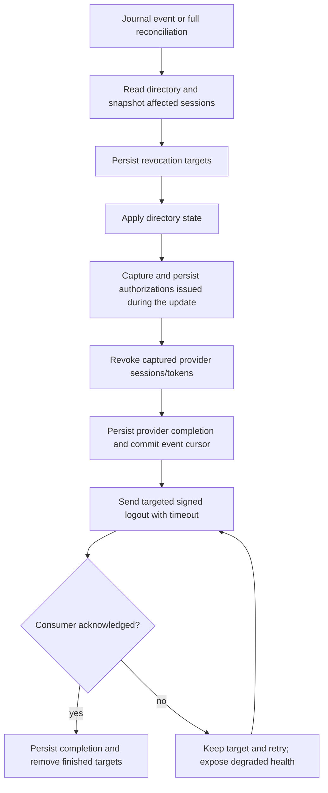

# Directory event journal

> Status: **partially implemented**. The Samba audit follower plus the
> `AUTHENTIK_DIRWATCH_*` and `CASDOOR_DIRWATCH_*` subscribers are implemented.
> The product contract now requires every IAM provider and every direct LDAP/LDAPS
> consumer to subscribe; the remaining consumers and full retention-gap acceptance
> are tracked in the directory-event-subscription plan.

A change in Active Directory reaches most consumers immediately, because they
query LDAP live. Consumers that keep a synchronized copy do not: they see the
change only at their next scheduled sync.

authentik and Casdoor both keep synchronized directory copies. authentik's
login path binds to LDAP to verify the password but never re-reads the account,
so group membership and attributes come from the last sync. Casdoor likewise
imports LDAP users into local shadow records. A Samba change can therefore be
authoritative and still remain invisible to either IAM until its next schedule.
That is exactly how an authentik-backed Nextcloud login failed on 2026-08-08:
the membership was written to AD at 12:46:12, the scheduled sync ran at
12:54:20, and every attempt in between was refused with the group already
correct in the directory.

The journal closes that window without polling harder.

## Shape

```text
samba_dc ──► /var/log/samba-audit/dsdb.json      (Samba's own format, private)
                    │ followed by the anchor worker, one reader, one cursor
                    ▼
             events.jsonl                        (ANAS_DIRECTORY_EVENTS_DIR)
                    │ tailed by each subscriber, each with its own cursor
                    ▼
             ├─ authentik dirwatch ──► Schedule.send()
             ├─ Casdoor dirwatch ────► local LDAP sync API
             └─ each IAM/LDAP Module ─► refresh, invalidate, or controlled sync
```

Publishing is a side effect of work the anchor worker already does. It follows
the dsdb audit log to stamp identity anchors on new objects; the same parsed
record now also feeds the journal, so the log keeps exactly one reader and one
cursor.

## Why a journal and not a callback

Subscribers pull. Nothing registers an endpoint, and the producer never calls
out.

- **No credential.** A callback into authentik would need an API token, which
  means a component sitting next to the domain controller holding a key that
  operates the identity provider. That widens the blast radius in the wrong
  direction.
- **No stable endpoint to call.** authentik's trigger is
  `/api/v3/tasks/schedules/{uuid}/send/`, and the uuid is generated at runtime.
  There is nothing a hook could render into a registration at config time.
- **No cross-module network.** samba_dc runs on the host network and declares no
  shared network with consumers.
- **Delivery survives downtime.** A subscriber that was stopped for an hour
  resumes from its cursor. A fire-and-forget POST would simply have been lost.

## Record format

```json
{"seq": 1, "ts": "2026-08-08T12:46:12.072033+0800", "op": "Modify",
 "dn": "CN=APP_nextcloud,OU=Apps,OU=Groups,DC=example,DC=com",
 "attributes": ["member"]}
```

`seq` is monotonic and is what a subscriber persists. It resumes from the tail
of the existing journal across producer restarts, and from the rotated file
when the current one is fresh — otherwise a restart just after a rotation would
restart the sequence at zero, leaving every stored cursor ahead of the stream
and silently swallowing events.

`attributes` carries names only, never values. The journal therefore exposes
nothing that LDAP does not already expose to the same consumers, which is why
the directory is world-readable and subscribers mount it read-only.

## Filtering happens twice

The audit stream is overwhelmingly noise: on 2026-08-08 it held 3977 records,
3958 of them `lastLogon`/`logonCount` churn from one machine account. Both
stages matter.

| Stage | Setting | Question it answers |
| --- | --- | --- |
| Producer | `SAMBA_DC_ANCHOR_EVENT_ATTRIBUTES` | Is this worth telling anyone about? |
| Subscriber | `AUTHENTIK_DIRWATCH_ATTRIBUTES` / `CASDOOR_DIRWATCH_ATTRIBUTES` | Is this worth a full source sync? |

The producer publishes `Add` and `Delete` for any in-scope object, and `Modify`
only when it touched a watched attribute. Each subscriber narrows further:
authentik ignores `displayName` and `mail`, which are worth syncing but not
worth syncing *now*, and acts on membership and account-state changes. Casdoor
does import those profile fields, so its filter also treats them as immediate.

## Debounce

Neither integration has a safe per-user refresh at this boundary. authentik's
entry point is a scheduled full source sync; Casdoor's subscriber fetches the
configured LDAP result set and posts it to the official sync API. Both
subscribers therefore coalesce:

| Setting | Default | Purpose |
| --- | --- | --- |
| `AUTHENTIK_DIRWATCH_DEBOUNCE_SECONDS` / `CASDOOR_DIRWATCH_DEBOUNCE_SECONDS` | 5 | Collapse a burst into one run |
| `AUTHENTIK_DIRWATCH_MIN_INTERVAL_SECONDS` / `CASDOOR_DIRWATCH_MIN_INTERVAL_SECONDS` | 60 | Floor between consecutive runs |

Adding five members to a group is one sync, not five.

The cursor is committed only after a trigger fires. A crash between reading an
event and acting on it replays it rather than losing it; events that could
never trigger anything advance the cursor immediately. Casdoor's subscriber
uses the Module-owned Application credential against the private service
network; the Samba producer never receives an IAM credential.

## Retention

Both files in the chain are capped, by different mechanisms, for different
reasons.

| File | Cap | Rotated by |
| --- | --- | --- |
| `dsdb.json` | `SAMBA_DC_MAX_LOG_SIZE` (KB), one `.old` generation | Samba |
| `events.jsonl` | `ANCHOR_EVENT_MAX_BYTES`, one `.1` generation | the anchor worker |

Samba's raw log is rotated by Samba. `check_log_size()` runs on every debug
write and walks each class holding its own `@PATH` target, so `max log size`
bounds the audit file and not just `log file`: past the limit Samba renames it
to `dsdb.json.old` and reopens the original name.

Leaving that to Samba is deliberate. Samba is multi-process, and only one
process performs the rename; the rest keep writing through descriptors they
already hold until their own check notices the path's inode has changed. That
inode comparison lives behind the same size check, so `max log size = 0` does
not merely uncap the file — it strips the mechanism that reunites the writers
after any rotation, whoever performed it. An external rotator would depend on
that check anyway, and would add a second actor racing Samba for the same
rename.

The cap is a bound, not an archive. Nothing reads `dsdb.json.old`; the anchor
worker republishes what matters into the journal, and one rotated generation
exists only so the reader can finish draining a file that has just been
renamed out from under it. `AuditFollower` handles that crossing by inode
rather than by size, which is why the rotation must be a rename —
`copytruncate` keeps the inode and would silently skip records once the
refilled file grew past the follower's offset.

The transaction audit is not written at all. Enabling
`dsdb_transaction_json_audit` produced a second file of begin/prepare/commit
records that nothing ever opened, describing the framing of changes this
deployment already observes individually.

## What this is not

It is an accelerator, not a source of truth. Each consumer that stores a directory
copy keeps a scheduled full sync or equivalent reconciliation, and the anchor worker
keeps its own periodic reconciliation. The fallback repairs missed history, but an
event subscriber is still mandatory: normal operation must not wait for the next
schedule or login to observe a Samba change.

It does not make syncing cheaper. Latency drops from up to two hours to a few
seconds, but each trigger is still a full source sync. What it does avoid is
the alternative of raising the schedule frequency, which would run that sync
288 times a day whether or not anything changed — and would multiply the
exposure of the source's `delete_not_found_objects` sweep by the same factor.

Samba's dsdb audit records only writes performed on the local DC. A second
domain controller needs its own producer.

## Casdoor session revocation proposal

**Status: OIDC implementation integrated in Casdoor r10; deployment acceptance in progress.** This section refines the Casdoor part of
`DIRSYNC-R-013` and reliable recovery in `DIRSYNC-R-008`–`R-010`. It extends the
existing helper and its persistent state directory; no extra service, message
broker, database or Samba-held consumer credential is proposed. The subject
selection experiment is separate: see [Casdoor directory subject feasibility](/research/casdoor-directory-subject).

### Verified limits before r10

- `casdoorLDAPSyncer.sync` writes profiles, account flags and groups, but does not
  terminate sessions or send logout requests. The existing journal is already
  the event source needed for this work.
- The current `delete-session` destroys Beego sessions. A Beego session ID can be
  shared across applications, so it cannot safely serve as an application-only
  group-revocation primitive.
- `SendBackchannelLogout` discovers all applications through the user's active
  tokens and starts asynchronous POSTs. It returns no delivery result. A successful
  deletion API response therefore proves neither application-specific scope nor
  receipt by a consumer. Looking up routes after renaming the user or deleting
  tokens can also lose the old routes.
- The pinned refresh grant checks `IsForbidden`, so a synchronized disabled user
  is already refused a refresh. It does not repeat the application's group
  admission check. It also issues renewed tokens through the wrapper that drops
  `sid`. Both omissions matter when implementing application-only revocation.
- A notification failure followed by an ordinary sync retry is insufficient:
  the user may already have been renamed or their groups cleared, erasing the
  pre-change evidence needed to reconstruct the targets.

### Implemented changes in r10

The Dockerfile applies subject and directory-revocation patches. The existing watcher persists
`pending-logouts.json` before mutation, revokes captured provider records before committing its
directory cursor, and retries back-channel delivery independently. The API accepts only the
module's built-in service client, restricts organization/application scope, and resolves receiver
URLs and signing keys from provider configuration. It acknowledges only HTTP 2xx, with five-second
timeouts and no redirects. File and parent-directory fsync protect state replacements.

Every authorization now has an independent OIDC sid; Token.SessionId records the Beego parent.
Token.UserId associates authorizations with the immutable internal user ID, including after a rename.
A second durable capture after shadow updates includes grants issued during the update. Directory
user updates, code issuance/redemption, refresh and revocation share a process-local mutex in the single
Casdoor instance deployed by this Module; this is not a multi-instance consistency mechanism.
Explicit central logout expires its parent grants as well. Unredeemed codes and retired grants
are deleted without another RP notice. Repeated captures keep one notification per issued target.
Refresh retains sid and rechecks identity plus application admission. Application-only revocation
preserves central login. Replay captures old sid and must preserve later authorizations. Startup
and 300-second reconciliation recover missing journal history. Name/anchor conflicts quarantine
only the conflicting identities and keep other synchronization running. Health reports pending
count and age; unsupported SAML logout remains an explicit gap. Source/helper tests have passed;
real protocol and consumer-session acceptance are recorded separately.

### Scope and execution

Compare current directory state with managed users by anchor, using the same
direct and recursive group calculation as the existing watcher. Group records
contain no member values, so reread memberships; do not infer affected users from
the event's group DN alone. Attribute-only changes update profiles without logout.

| Trigger | Revocation target |
| --- | --- |
| Disabled/deleted account, changed login name or anchor | The affected user's pre-change sessions across their applications |
| Membership change that fails one application's `ALLOW_GROUPS` | That user's sessions and tokens for that application only |
| Membership change that still meets admission, or display name/email change | No session revocation |

Snapshot targets **before** any rename, flag/group patch or token deletion:
immutable Casdoor user ID, old subject/anchor, old lookup name, application ID,
issued `sid` values and token-record IDs. Target the snapshot rather than whatever
sessions happen to exist at retry time. This prevents a delayed retry from logging
out newly created sessions after access is granted again. Do not fall back to a
subject-wide notification when a captured `sid` is missing; report that session
coverage as an unresolved capability gap.

Add a narrow, authenticated Casdoor API for the existing Module-owned helper. It
must validate the managed organization, user and application targets; it must
not accept a caller-supplied logout URL or signing key. It must revoke token rows
and application-session records by captured IDs. Destroy captured central Beego
sessions only for user-wide revocation. For application-only revocation, preserve
the central session and all other applications, recheck current admission on
refresh, and preserve the original `sid` when renewing a session's token.

Notifications use each configured OIDC client's endpoint and exact audience,
with the subject and `sid` issued to that old session. Reuse the controlled
signing path but return a bounded, synchronous delivery result. A repeated
request must still deliver the captured notification after its session row is
already absent; otherwise the first lost HTTP response prevents recovery.
The standard's session targeting and successful HTTP response rules provide the
protocol boundary, while protected-resource E2E provides the final evidence.
See [OIDC Back-Channel Logout](https://openid.net/specs/openid-connect-backchannel-1_0.html#BCLogout).

### Durable retry in the existing watcher

The added complexity is one durable pending-work file and explicit recovery
steps. A memory-only retry loses targets on a crash; rereading the directory
cannot recover old group membership or names after updates. Reuse
`/data/anas-dirwatch` rather than introduce another service or store.



Store a version, event high-water mark, target identity, target IDs, provider
completion, attempt count, next retry time and sanitized last error. Store no
password, client secret, private key or signed bearer JWT. Use `0600`, atomic
replacement and file/directory fsync before recording durable completion.
Generate a fresh, short-lived Logout Token with a new `jti` on each delivery attempt.

Persist every target before updating the user. On restart, finish prepared
provider revocations and reread live directory state; never replay an old grant
snapshot over newer directory state. Provider success plus durable notification
intent permits cursor advancement. Consumer acknowledgements remain separate:
a single unreachable application must not stop new directory events for other
users. Retry due targets with bounded work during each poll, while continuing
ordinary event consumption. A lost acknowledgement causes a safe repeated
notification to the same captured session, not a broader logout.

Use capped backoff, for example 2/5/10/30/60 seconds. Keep failed targets until
acknowledged; do not silently exhaust a retry count. If a target no longer has a
usable receiver, expose it as unresolved instead of treating it as delivered.
Health should include pending count, oldest pending age and the last sanitized
error. The existing 5-second debounce and 60-second minimum sync interval are
scheduling parameters, not evidence of a 5-second session-revocation guarantee.
Measure and declare the maximum propagation time with a reachable consumer;
outages beyond it must remain visible as failed/degraded acceptance.

### Reconciliation and acceptance

Periodic reconciliation must compare account status, identity and per-application
admission and use the same revocation path, including when no event arrives.
The upstream LDAP import alone cannot satisfy this fallback. Detect startup or
retention gaps, journal sequence rollback and malformed skipped records; reread
directory state before resuming the cursor. The existing five-minute sync cadence
is a starting point for measurement, not completed reconciliation acceptance.

Validate disabled/deleted accounts, direct and nested group removal, rename,
anchor change, duplicate events, crashes before/after every durable write, lost
HTTP responses, consumer outage/recovery, journal rotation and retention gaps.
Save real consumer cookies and refresh tokens before each event: the old cookie
must fail protected-resource access, refresh must fail, and unaffected users and
clients must keep working. Back-channel logout does not invalidate the signature
of an already issued offline JWT or automatically revoke application API keys;
record those consumer-specific limits separately.

The pinned Casdoor build has no verified SAML SLO endpoint. This OIDC proposal
must not be recorded as SAML session-revocation support; SAML and direct LDAP
consumer session termination remain separate implementation and E2E work.

Normative requirements and remaining milestones are in the
[directory-event requirements](https://github.com/anas-project/ANAS/blob/master/dev-docs/requirements/directory-event-subscription.md)
and [implementation plan](https://github.com/anas-project/ANAS/blob/master/dev-docs/plans/directory-event-subscription.md).
