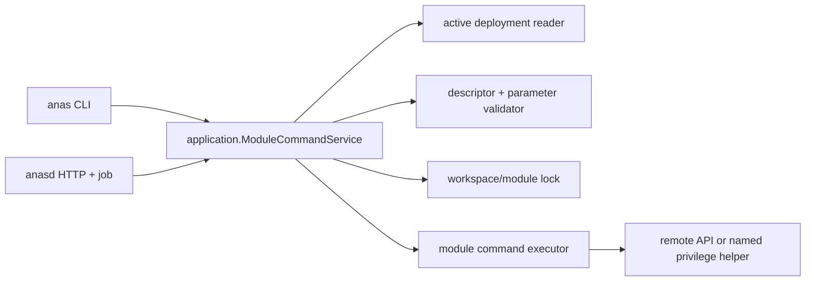

# Module 专属命令能力设计

> 状态：**当前模型与明确标注的演进方案**。Manifest/deployment 冻结、CLI 发现与调用、共享
> application service，以及 anasd 只读 list/detail 已实现；HTTP invoke/job 与 Forgejo/Incus
> 命令仍是提案，当前不可执行。更新：2026-08-28。

本文面向 ANAS Core 与 Module 维护者，说明 Module Command 的职责边界、领域模型、冻结机制、调用
ABI 和安全决策。它满足[需求矩阵](https://github.com/anas-project/ANAS/blob/master/dev-docs/requirements/module-command-capability.md)中的
`MCMD-R-001`—`MCMD-R-034`；稳定的用户与机器接口以[参考文档](/reference/module-commands)为准，
尚未完成的施工顺序只在[实施计划](https://github.com/anas-project/ANAS/blob/master/dev-docs/plans/module-command-capability.md)中维护。

## 1. 设计摘要与适用状态

Module Command 是由单个 Module 声明、可发现、带类型参数，并由 `anas` 与 `anasd` 共享应用服务的
管理面能力。Module 在 manifest 中声明命令元数据、参数 schema、风险与执行约束；Core 从活动
deployment 读取冻结定义并校验，再通过 `anas.module-command/v1` 结构化 ABI 调用冻结的 executor。
调用方只能提交命令 ID 和类型化参数，不能提交可执行文件、argv、shell、环境变量名或宿主路径。

当前实现包括 manifest/deployment 模型、artifact 完整性、list/describe/invoke 应用服务、CLI
`anas module commands|invoke` 和 anasd 只读 list/detail。anasd 的 POST invoke/job 以及 Forgejo/Incus
实际命令尚未实现；本文对应章节仅定义演进边界，不能作为当前操作指南。

Module Command 与相邻机制保持以下职责分离：

- `anas start|stop|restart` 是 Core 固定的通用 Module 生命周期，不允许 Module 增加命令；
- `anas module list|versions|install|sync|update` 管理 Module 包，不执行 Module 运维动作；
- `logic.hook` 只接受 Core 枚举的生命周期 phase，不能发布用户可调用的命令；
- Contract Provider operation 是 Module 之间的资源协议，不是管理员命令；
- `anasd` 的只读 list/detail 已接入共享模型；写调用必须等待认证、授权、job 和审计边界完成。

这是一种可选的 Module 管理面能力，不改变普通 Module 的职责，也不把 Incus 变成所有 Module 都必须
理解的通用生命周期。

## 2. 相邻机制与职责边界

| 边界 | 当前能力 | 与 Module Command 的分工 |
| --- | --- | --- |
| `internal/runner/runner.go` | Core 固定枚举 CLI 命令 | Module 不能注册子命令 |
| `internal/runner/module_cli.go` | Module 包发现、安装、同步、更新 | 管的是分发，不是部署实例的运维动作 |
| `logic.hook` / `anas.module-hook/v1` | `calculate`、`after_start`、凭据等固定 phase | phase 由 Core 触发；增加任意 phase 会被 manifest 校验拒绝 |
| Contract Provider operation | `compose_run` 执行类型化资源 operation | 调用方是 Consumer/Runner，不是管理员；语义属于跨 Module Contract |
| `internal/application` | 已提供共享的 Module Command list/describe/invoke use case | CLI 与 HTTP adapter 必须复用，不能分别实现校验、锁或执行 |
| `internal/api/httpapi` / OpenAPI | 已提供只读 list/detail | invoke 仍受认证、授权、job 与审计前置条件约束 |
| deployment manifest | 已冻结 descriptor、handler、executor 与摘要 | 发现和执行只读取活动 deployment，不回读源码或 Module cache |

因此不能把 Forgejo 的 Incus 运维塞进 `anas forgejo ...`、新增 Core 专用命令，或让
`anasd` 执行 `anas --json` 子进程。前两种会把产品特例固化进 Core，后一种违反 CLI/HTTP 共享
应用服务的既有约束。

## 3. 设计目标与非目标

### 3.1 目标

1. 能发现某个活动 Module 声明了哪些命令、命令说明、参数、风险、可用状态和不可用原因。
2. 同一条命令经 `anas` 与 `anasd` 调用时使用同一应用服务、校验器、锁和 executor。
3. 参数是有名字、有类型、有约束的结构化值；未知参数和不合法值在启动 executor 前拒绝。
4. 执行活动 deployment 中冻结且校验过摘要的定义，不能因当前源码或 Module cache 改变而漂移。
5. 支持只读诊断、普通变更和破坏性变更，以及超时、取消、进度、确认、审计和幂等键。
6. Module 不声明命令时行为完全不变。

### 3.2 非目标

- 不提供 `shell: true`、任意 argv、`docker compose exec` 透传或通用远程终端；
- 不把 Module Command 当成 Module 依赖、Capability 或 Contract；
- 不允许命令修改 `config.yml`、lock、deployment 制品或 active deployment 指针；这些仍由 Core
  的配置和部署 use case 管理；
- 不用命令替代可自动收敛的 lifecycle hook 或跨 Module Resource operation；
- v1 不从未锁定的源码目录执行命令，也不在没有活动 deployment 时提供 bootstrap 命令。

## 4. 领域模型

为避免与 ANAS 已有的 `capabilities` 混淆，机器模型命名为 `ModuleCommand`，而“具备 Module
专属命令能力”只是产品层描述。



核心对象：

- `ModuleCommandDescriptor`：可公开的稳定元数据；
- `EffectiveModuleCommand`：descriptor 加当前可用性、不可用原因、deployment/release 身份；
- `ModuleCommandInvocation`：命令 ID、类型化参数、actor、幂等键和确认信息；
- `ModuleCommandResult`：是否改变状态、结构化结果、警告和终态；
- `ModuleCommandEvent`：进度事件，不是命令的最终结果。

## 5. Manifest 规范

命令声明和统一 executor 位于既有 `management` 下。命令存在时，`abi.supports` 必须同时声明
`anas.module-command/v1`；不声明命令的旧 Module 仍只需要 `anas.module-hook/v1`。

```yaml
api_version: anas.module/v1
abi:
  supports:
    - anas.module-hook/v1
    - anas.module-command/v1

management:
  command_executor:
    command: [./command/bin/linux-amd64/anas-module-command]
  commands:
    - id: incus-daemon-status
      title: Inspect Incus daemon
      description: Read daemon and maintenance-endpoint status without changing it.
      handler: incus_daemon_status
      mode: query
      risk: normal
      runtime_state: any
      lock: module_read
      timeout_seconds: 20
      cancellable: true
      parameters: []
      env:
        - FORGEJO_ACTIONS_INCUS_ENDPOINT
      secrets:
        - FORGEJO_INCUS_MAINTENANCE_SSH_KEY

    - id: incus-daemon-stop
      title: Stop Incus daemon
      description: Drain managed runner VMs, then stop the configured remote Incus daemon.
      handler: incus_daemon_stop
      mode: change
      risk: destructive
      runtime_state: any
      lock: workspace_write
      timeout_seconds: 900
      cancellable: safe_points
      parameters:
        - name: drain_timeout_seconds
          title: Drain timeout
          description: Maximum time to wait for active runner jobs before failing.
          type:
            kind: int
            constraints: {minimum: 0, maximum: 3600}
          required: false
          default: 300
        - name: force
          title: Force stop
          description: Stop after the drain timeout even when managed runners remain.
          type: bool
          required: false
          default: false
      env:
        - FORGEJO_ACTIONS_INCUS_ENDPOINT
      secrets:
        - FORGEJO_INCUS_MAINTENANCE_SSH_KEY
```

### 5.1 命令字段

| 字段 | 规则 |
| --- | --- |
| `id` | Module 内稳定唯一；`^[a-z][a-z0-9-]{0,62}$`；发布后改名视为删除旧命令并新增命令 |
| `title` / `description` | 必填、非空、可公开；不得含 secret 或宿主路径 |
| `handler` | executor 内部的固定分派 ID；只进入 ABI，不作为进程 argv；不通过 HTTP 返回 |
| `mode` | `query` 或 `change`；query 必须无副作用 |
| `risk` | `normal` 或 `destructive`；destructive 必须确认，HTTP 必须重新认证/授权 |
| `runtime_state` | `running`、`stopped` 或 `any`，指 workspace 活动 deployment 的 Module 运行态 |
| `lock` | `module_read`、`module_write` 或 `workspace_write`；change 不得声明 `module_read` |
| `timeout_seconds` | 1–3600；Core 使用 `context` 强制截止时间 |
| `cancellable` | `false`、`true` 或 `safe_points`；破坏性命令默认只能在 executor 报告安全点时取消 |
| `parameters` | 调用方可提供的非敏感参数；按名字唯一 |
| `env` / `secrets` | Core 从活动 deployment 作用域注入的最小白名单；值不进入发现、job 或审计记录 |

`command_executor.command` 是 Module 包内固定相对路径。发布包应像 hook 一样为目标平台预编译并记录
摘要；正式 deployment 不得依赖 `go run`、shell 或宿主工具链。一个 Module v1 只允许一个 executor，
减少可执行面；由 `handler` 在进程内做白名单分派。

### 5.2 参数字段与类型

参数定义复用 `internal/configschema.Parameter` 的 `string`、`int`、`bool`、`enum` 及
`minimum`、`maximum`、`min_length`、`max_length`、`pattern`、`format` 约束，避免 CLI、HTTP 与
manifest 各自实现类型语义。每个参数另有：

- `name`：`^[a-z][a-z0-9_]{0,62}$`；
- `title`、`description`：发现和表单使用；
- `required`：是否必须由调用者提供；
- `default`：manifest 固定默认值，加载时即按同一 schema 校验；必填参数不得有默认值。

v1 参数必须是扁平对象，不支持自由 JSON、文件上传、宿主路径、环境变量展开或 secret 参数。Secret
只能来自命令声明的 `secrets` 白名单和 workspace Secret Store，调用者不能在 argv 或 HTTP body
中提交。以后如确需交互式 secret，应另行设计一次性 secret channel，不能把 `sensitive: true` 当成
日志系统会自动安全的承诺。

### 5.3 输出 schema

v1 结果是受限 JSON object：key 使用参数名规则，value 只允许 string、integer、boolean、null 或上述
值的数组；总编码大小默认不超过 1 MiB。descriptor 可选声明 `result_fields`（name、type、description、
sensitive），Core 对已声明字段严格校验；未声明结果字段时命令只能返回空对象。

`sensitive: true` 的结果不得进入普通命令。需要 reveal secret 的能力必须使用独立的高风险 Core use
case，因为 `anasd` 对 secret reveal 已有重新认证、短时响应和 `Cache-Control: no-store` 约束。

## 6. 发现语义

发现必须区分“Module 声明过”和“当前可以执行”。Core 从活动 deployment 的 `deployment.yml` 及冻结
Module 目录读取定义，返回：

```json
{
  "module": "forgejo",
  "release": "15.0.7-r2",
  "deployment_id": "20260822T120000Z-ab12cd34",
  "command": {
    "id": "incus-daemon-stop",
    "title": "Stop Incus daemon",
    "description": "Drain managed runner VMs, then stop the configured remote Incus daemon.",
    "mode": "change",
    "risk": "destructive",
    "parameters": []
  },
  "available": false,
  "unavailable_reason": "missing_secret"
}
```

稳定不可用原因至少包括：

- `no_active_deployment`、`module_not_active`、`runtime_state_mismatch`；
- `executor_missing`、`executor_digest_mismatch`、`executor_abi_unsupported`；
- `missing_env`、`missing_secret`、`insufficient_privilege`；
- `workspace_busy` 只表示当前调用要等待，不应让命令从发现结果中消失。

发现只做本地、只读前置检查，不连接远程 Incus，也不把“远端暂时不可达”永久解释成能力不存在。
远端健康由 `incus-daemon-status` 或 `incus-doctor` 之类 query 命令返回。

descriptor 的规范 JSON 应计算 `command_digest`。CLI 确认和 HTTP `If-Match` 使用该摘要，防止用户看到
旧说明后执行已经升级成不同语义的命令。

## 7. 调用 ABI

Core 启动冻结 executor 时 argv 只能是 manifest 中的固定 `command_executor.command`，请求经 stdin
发送：

```json
{
  "abi": "anas.module-command/v1",
  "invocation_id": "01K...",
  "module": {"name": "forgejo", "version": "15.0.7", "revision": 2},
  "deployment_id": "20260822T120000Z-ab12cd34",
  "command": "incus-daemon-stop",
  "handler": "incus_daemon_stop",
  "parameters": {"drain_timeout_seconds": 300, "force": false},
  "env": {"FORGEJO_ACTIONS_INCUS_ENDPOINT": "https://incus.example:8443"},
  "secrets": {"FORGEJO_INCUS_MAINTENANCE_SSH_KEY": "..."}
}
```

不得把 actor、HTTP header、任意 process env 或 workspace 绝对路径交给 Module。Core 使用干净环境启动
executor，不能继承 `anasd` 的会话密钥、代理变量或 `DOCKER_HOST`。如果 executor 需要 module runtime
目录，Core 以单独固定字段提供 deployment 内路径，不允许调用者选择。

executor stdout 是严格 JSON Lines：零到多个 `progress` / `warning`，最后必须恰好一个 `result`；未知
record、尾随数据、超限输出和终态缺失均失败。示例：

```json
{"type":"progress","phase":"draining","current":1,"total":2,"unit":"runners"}
{"type":"result","changed":true,"result":{"daemon_state":"stopped"}}
```

stderr 不构成协议，不直接返回 CLI、HTTP、job 或审计；敏感命令默认丢弃 stderr。executor 应通过协议
报告可公开 warning。Core 必须使用 `exec.CommandContext`，终止时处理整个进程组，并限制 stdout、运行
时间和并发数。

## 8. CLI 契约

新增两条命令，不把 Module 命令平铺到 Core 顶层：

```text
anas module commands [MODULE] [-w WORKSPACE] [--json]
anas module invoke MODULE COMMAND [-w WORKSPACE] [--param NAME=VALUE]... [-y] [--json]
```

- `commands` 是发现接口；省略 Module 时列出活动 deployment 中全部 Module Command；
- `invoke` 只接受 Module 与命令 ID；重复参数、未知参数、缺失参数在执行前失败；
- CLI 将 `--param` 字符串按 schema 规范化后传给应用服务，executor 收到原生 JSON bool/int/string；
- destructive 命令在 TTY 显示标题、说明、目标 deployment/release 和规范化参数；非 TTY 必须 `-y`；
- `--json` stdout 继续只输出一个 `anas.dev/cli/v1` 信封，进度走 stderr JSONL；不得把 executor
  的内部协议直接透传；
- 当前错误码为：`module_command_not_found`、`module_command_unavailable`、
  `module_command_invalid_parameter`、`module_command_confirmation_required`、
  `module_command_busy`、`module_command_timeout`、`module_command_failed`、
  `module_command_protocol_error`。

调用成功示例：

```json
{
  "api_version": "anas.dev/cli/v1",
  "ok": true,
  "workspace": "/srv/anas",
  "deployment_id": "20260822T120000Z-ab12cd34",
  "module": "forgejo",
  "command": "incus-daemon-stop",
  "changed": true,
  "result": {"daemon_state": "stopped"}
}
```

## 9. anasd 与 HTTP 契约

`anasd` 不执行 `anas module invoke --json` 子进程，而是调用同一个
`application.ModuleCommandService`：

当前已实现的只读端点：

```text
GET  /api/v1/workspaces/{ws}/modules/{module}/commands
GET  /api/v1/workspaces/{ws}/modules/{module}/commands/{command}
```

认证、授权、job 与审计基础设施完成后才可实现的提案端点：

```text
POST /api/v1/workspaces/{ws}/modules/{module}/commands/{command}/actions/invoke
```

POST body：

```json
{
  "parameters": {"drain_timeout_seconds": 300, "force": false},
  "command_digest": "sha256:...",
  "idempotency_key": "01K...",
  "confirmed": true
}
```

规则：

- query 命令可在明确小于同步请求期限时返回 `200`；change 或可能超过数秒的命令一律返回 `202`、
  `Location` 与 job；
- `command_digest` 不匹配返回 `412`；destructive 未确认返回 `409`，且必须经过角色授权和重新认证；
- HTTP DTO 只公开 descriptor，不公开 handler、executor 路径、env key、secret key 或 workspace 路径；
- job 保存脱敏参数、actor、Module/release/deployment、command digest、终态和事件，不保存注入值；
- 同一 `idempotency_key + actor + workspace + module + command + parameters digest` 返回同一 job；键相同
  而请求不同返回冲突；失败的破坏性命令不得由 anasd 重启后自动重试；
- `anasd` 的角色策略可以让命令“已声明但当前 actor 不可调用”；列表可显示
  `authorized: false`，不得靠返回 404 隐藏审计相关事实。

只读 GET list/detail 复用既有的安全 DTO；M1A 起只在 full 状态经 HTTPS 和 owner 会话开放。
POST invoke/job 必须等 Web 管理 API 具备任务与写操作审计边界之后才能出现。在那之前单独加一个
POST handler，等于绕开整体安全门槛。

## 10. 锁、并发、取消与幂等

1. 所有调用先取得现有 workspace 锁体系中的声明级别；HTTP job 队列不能替代底层锁，因为 CLI 可能
   同时执行。
2. `module_read` 允许同 Module 的 query 并发；`module_write` 串行化该 Module 的命令；
   `workspace_write` 与 apply、rollback、start、stop、配置变更和其他 workspace 写操作互斥。
3. executor 必须把重复调用设计为可观察的幂等操作：例如已经停止时返回 `changed: false`，不是失败。
   `force` 不等于允许跳过协议或 Core 守卫。
4. `context` 取消只在安全阶段终止。`safe_points` 命令由 executor 先发安全点事件；进入不可中断阶段后
   API 取消返回“取消已请求但当前不可中断”。
5. Core 在调用前后重新核对 active deployment ID；执行期间发生 deployment 切换应由锁阻止。若外部
   状态改变但最终结果未知，job 标记 `interrupted`/`unknown_outcome`，不得自动重试。

## 11. 权限与安全边界

- Module executor 以 `anas`/`anasd` 当前服务身份运行，**不因命令声明自动获得 root、sudo、Linux
  capability、Docker socket 或宿主 systemd 权限**。
- 需要本机高权限动作时，只能调用 Core 安装和审计的 named helper，例如
  `anas-helper service start incus`；helper 自己固定 unit 与动词白名单，不接受任意 unit、命令或参数。
- `anasd` 不应配置宽泛 ambient capability；该权限会继承到所有子进程。Module 命令需要的提升必须
  比“让整个 daemon 变成 root shell”更窄。
- 远程 Incus daemon 启停与 restricted project API 是两套权限。Forgejo controller 的 restricted
  Incus TLS certificate 只能管理指定 project，不能被复用为宿主 service-manager credential；远程
  daemon 维护需单独、显式、最小权限凭据。
- executor 摘要、descriptor、ABI 和 Module release 一起冻结进 deployment manifest，并包含在现有
  artifact 完整性校验中；发现和执行不能回读当前 `modules/forgejo` 源码。
- Core 在 fork 前完成所有参数校验，子进程环境从空白 allowlist 构造；错误消息和 warning 不允许回显
  stdin 请求、secret、原始 stderr 或配置摘要。
- Module 包是受信代码边界，但“包已签名”不代表所有命令都可由所有管理员执行；anasd 仍需按 mode、
  risk 和未来的 command-level role policy 授权与审计。

## 12. Forgejo / Incus 命令集提案

> 状态：**提案，当前不可执行**。发布条件与验收进度见[实施计划](https://github.com/anas-project/ANAS/blob/master/dev-docs/plans/module-command-capability.md)，本文不复制。

Forgejo 首批命令拆成两组，分别使用不同权限来源：

| 命令 | mode / risk | 语义 | 所需权限 |
| --- | --- | --- | --- |
| `incus-doctor` | query / normal | 检查 endpoint、证书固定、project、profile、image、配额和 controller 可达性 | restricted project TLS credential |
| `incus-runner-reconcile` | change / normal | 幂等对账 project 内 profile、固定 image 与遗留 one-job VM | restricted project TLS credential |
| `incus-daemon-status` | query / normal | 读取远程 service manager 与 daemon 状态 | 单独的只读维护凭据 |
| `incus-daemon-start` | change / normal | 启动远程 incusd，等待 API ready 后执行 doctor | 单独的 service start 权限 |
| `incus-daemon-stop` | change / destructive | 先阻止新作业并 drain；确认无 managed VM 后停止，`force` 需二次确认 | 单独的 service stop 权限 |

不得发布 `incus exec`、`incus config`、`systemctl` 或 `ssh` 透传命令。若 daemon 在 ANAS 本机，使用
Core named helper；若在设计要求的独立 KVM 宿主，Forgejo executor 应使用固定远程 service-manager
协议或受限 SSH subsystem，并在 Forgejo requirement matrix 中单独定义凭据创建、轮换、撤销和恢复。

`incus-daemon-stop` 的业务不变量至少包括：停止 controller 领取新 job、等待/拒绝仍在运行的 one-job
VM、执行 daemon stop、返回最终可验证状态。它不能只是把 `systemctl stop incus` 包一层命令描述。

## 13. 兼容性与版本

- 新 Core 读取旧 Module：无 `management.commands`，得到空命令集合；
- 旧 Core 读取新 Module：由于严格 `KnownFields` 会拒绝新字段，因此发布命令的 Module 必须提高
  revision，并在发行元数据中声明最低 Core/command ABI；不能静默忽略命令；
- `anas.module-command/v1` 与 `anas.module-hook/v1` 独立演进。只有声明命令的 Module 才必须支持前者；
- descriptor 的兼容变更（改说明、增加可选参数）提高 Module revision；删除/重命名命令、改变默认值、
  风险、权限或副作用都应视为可见行为变更并记录升级说明；
- deployment 必须保存完整 descriptor、executor 相对路径和摘要，使旧 deployment 在源码升级后仍能发现
  与执行原来的命令。

## 14. 演进边界

未落地部分只有两组：anasd 认证后的 invoke/job，以及 Forgejo/Incus 命令和独立 KVM 宿主验收。
二者都必须继续满足本文的共享应用服务、最小权限、冻结制品、脱敏和 fail-closed 决策；具体里程碑、
阻塞项与验证记录只在[实施计划](https://github.com/anas-project/ANAS/blob/master/dev-docs/plans/module-command-capability.md)中更新，本文不复制阶段进度。

## 15. 最终决策摘要

采用“声明式 Module Command”，不采用 Core 特判 Forgejo、任意 shell/argv、动态插件注册或 CLI
子进程桥接。v1 只从活动 deployment 执行冻结 executor，参数复用现有类型系统，secret 只按声明从
Secret Store 注入；CLI 已同步调用共享应用服务，anasd 的未来 job 也必须使用同一服务。Forgejo 的
runner project 维护与 incusd daemon 启停必须分开授权，后者在没有最小权限维护通道前保持不可用，
不能借用 controller certificate 或扩大 anasd 权限。
