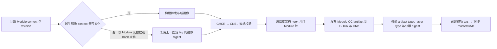

# Module 独立编译、发布与安装源

> **状态：分发与安装闭环已实施。** Module catalog、变更上下文、revision 计算、可复现
> 打包、双 Registry 发布、版本查询、下载、安全解包、内容寻址缓存、workspace 视图和
> OCI/content/installed-tree digest lock 已进入代码。签名/来源证明与第三方 source 是后续阶段。

## 目标与边界

ANAS Core 和 Module 使用不同的发布节奏：

- ANAS Core 使用 `v<semver>`，发布 Linux `amd64`、`arm64` 二进制；
- 每个 Module 独立使用 `<version>-r<revision>`；
- Module 代码继续放在 monorepo，但每个 Module 生成独立 OCI artifact；
- Module artifact、它引用的 ANAS 派生镜像和上游镜像 mirror 必须在同一次发布事务中完成；
- 用户可选择官方国际源或中国大陆源，最终选择的 artifact digest 写入 lock；
- deployment 仍然冻结完整 Module，不把恢复建立在 Registry 永久可用的假设上。

仓库布局与分发粒度是两件事。保留 monorepo 可以让跨 Module ABI、IAM、依赖关系和
横切测试原子变更；独立 OCI repository 则提供独立版本、独立查询和独立安装。

## 发布身份

Module manifest 声明：

```yaml
version: 34.0.2
app_version: 34.0.2
revision: 2
```

发布版本为 `34.0.2-r2`：

- `version` 是规范化 SemVer；
- `app_version` 保留上游展示形式；
- `revision` 是 ANAS 对同一版本的打包修订号，从 `1` 开始；
- 上游版本变化时 revision 重置为 `1`；
- 可发布上下文变化、版本不变时 revision 恰好加一；
- 固定 tag 永不覆盖，不发布 `latest`。

Registry repository 由 [`.github/modules.json`](../../.github/modules.json) 定义。例如：

```text
ghcr.io/anas-project/anas-module-nextcloud:34.0.2-r2
docker.cnb.cool/anas.dev/anas/anas-module-nextcloud:34.0.2-r2
```

Git tag 同时记录代码身份：

```text
module/nextcloud/34.0.2-r2
module-release/<run>-<attempt>
```

前者是单个 Module 的历史版本，后者是一次全部制品均发布成功的计算基准。

## Module 包包含什么

一个 Module release 只生成一个架构无关的 `tar.gz` bundle；有 hook 时，包内同时附带
Linux `amd64` 与 `arm64` 两个二进制，不按架构拆成两个 Module 版本。

### 必须包含

| 内容 | 用途 |
| --- | --- |
| `package.yml` | 包身份、源码 commit、兼容性、输入与内容 digest、镜像引用 |
| `module.yml` | Module ABI、版本、依赖、参数和生命周期契约 |
| `docker-compose.yml` | 固定镜像版本和运行拓扑 |
| `hook/` Go 源码 | 审计、开发回退和未覆盖平台的本地编译输入 |
| `hook/bin/linux-amd64/anas-hook` | x86-64 Linux 预编译 hook |
| `hook/bin/linux-arm64/anas-hook` | ARM64 Linux 预编译 hook |
| `command/` 与 `command/bin/<platform>/anas-module-command` | 声明 Module Command 时的可审计源码与双架构冻结 executor |
| Docker build context | Dockerfile、入口脚本、配置模板和本地构建输入 |
| `providers/` | capability provider 声明和实现脚本 |
| `contracts/` | Runner 所需的 Contract manifests 与 schema；workspace 视图按名称去重 |
| `assets/` 及其他运行文件 | Module 自己引用的静态资源 |

没有 hook 的 Module（当前为 `freeradius`）不生成 `hook/bin`。

`package.yml` 示例结构：

```yaml
api_version: anas.module-package/v1
name: nextcloud
version: 34.0.2
revision: 2
release: 34.0.2-r2
platforms: [linux/amd64, linux/arm64]
repository: anas-module-nextcloud
source:
  repository: https://github.com/anas-project/ANAS
  commit: <git-sha>
compatibility:
  module_api: anas.module/v1
  hook_abis: [anas.module-hook/v1]
  command_abis: [anas.module-command/v1]
context_digest: sha256:<发布输入摘要>
content_digest: sha256:<解包 payload 摘要>
images:
  - ${ANAS_IMAGE_REGISTRY:-ghcr.io/anas-project}/anas-nextcloud:34.0.2-r2
```

### 不包含

- `README.md` 和文档；
- `localization.yml`（它用于生成文档，不是 Runner 输入）；
- `*_test.go`、`test_*.py`、`__pycache__`；
- `.DS_Store`；
- 本地构建残留或误提交的宿主机二进制。

根 `go.mod`、`go.sum` 以及部分共享本地化代码是 hook 编译上下文，会进入
`context_digest` 并触发受影响 Module 新 revision，但不会复制到最终包。最终包已经携带
预编译 hook；保留的 Module 内 hook 源码不依赖把整个 ANAS 仓库一并安装。

### 四种 digest 不混用

| digest | 含义 |
| --- | --- |
| `context_digest` | 发布输入身份，包含 Module runtime 文件和声明的 shared context |
| `content_digest` | 解包后 payload 的规范化内容身份，不包含自引用的 `package.yml` |
| OCI manifest digest | Registry 中压缩制品的获取身份 |
| installed-tree digest | Runner 对完整解包树（包括 `package.yml`）的执行输入校验身份 |

lock 保存 OCI、content 和 installed-tree digest：依次保证取得正确 manifest/blob、payload
与包声明一致、Runner 最终执行树未变。`context_digest` 留在 `package.yml` 中证明发布输入。
打包器固定条目顺序、时间戳、uid/gid 和 gzip header，以便相同 commit 的相同输入产生
可复现文件。

## 什么变化才发布

权威清单是 [`.github/modules.json`](../../.github/modules.json)。每项声明 Module、OCI
repository、支持平台和 Module 目录之外的 shared context。

下列变化会发布该 Module：

- `modules/<name>/` 中任一可发布运行文件变化；
- 该 Module 声明的 shared context 变化；
- `.github/modules.json` 中该 Module 条目变化；
- `.github/images.json` 中该 Module 的派生镜像定义变化；
- `.github/mirrors.json` 中该 Module 使用的 mirror 定义变化；
- 打包器实现变化（影响全部 Module；首次引入不制造 revision）；
- manifest `version` 变化。

README、本地化文档、测试、缓存和本机构建残留不触发 revision。新增
`.github/modules.json` 本身也不为所有已有 Module 人工制造 revision；它只让已有版本
进入独立发布体系。

`scripts/ci/module-revisions.sh` 同时校验：

- 每个含 `module.yml` 的目录在 Module catalog 中恰好出现一次；
- Module 名、repository、平台和 shared context 合法；
- `module.yml`、`localization.yml` 和 Compose 固定 tag 与计算结果一致；
- 一个 Module 有多个派生镜像时仍只提升一次 revision。

## 与容器发布联动

Module 和容器共享 `.github/workflows/container-images.yml`，从 `image-release` 分支发布：



这样，修改 hook 会得到新 Module revision 和新的 Compose 镜像 tag，但不会无意义地重建
相同容器内容；流水线把上一版本镜像 manifest 复制为新固定 tag，保证新 bundle 引用始终
存在。只有两边制品都验证成功后才写成功 tag，失败不会成为下一次 revision 基准。

PR 只计算、构建和上传校验 bundle，不推送 Registry；`image-release` push 才发布。
`workflow_dispatch module=<name>` 可修复或补发单个 Module；`all` 用于首次发布。

## 安装源

配置顶层使用 `module_source`：

```yaml
module_source: official
```

内置 profile：

| 配置值 | Module 主源 | 同内容回退源 | 默认运行时行为 |
| --- | --- | --- | --- |
| `official` | GHCR | CNB | 不自动启用国内加速 |
| `official-cn` / `cn` | CNB | GHCR | 未显式设置时自动启用 `global.chinese_speedup: true` |

`cn` 在配置导入时规范化为 `official-cn`。使用 CN 源时，自动默认还会让已发布的运行镜像
走 `docker.cnb.cool/anas.dev/anas`，并启用当前运行时下载镜像；规范化后的托管
`config.yml` 会明确写出：

```yaml
module_source: official-cn
global:
  chinese_speedup: true
```

用户显式配置具有最高优先级，以下写法只让 Module 从 CNB 获取，不切换容器/运行时下载源：

```yaml
module_source: cn
global:
  chinese_speedup: false
```

源是“解析策略”，不是发布身份。解析完成后 lock 必须记录完整 OCI repository、固定
manifest digest、Module release 和内容 digest；以后即使修改 `module_source`，已有 lock
也不会静默漂移。

## 版本查询与指定安装接口

CLI 使用以下接口：

```bash
# 列出该源中的全部 Module
anas module list --source official-cn

# 列出一个 Module 的全部固定版本；Registry tag list 是唯一真相源
anas module versions nextcloud --source official-cn

# 预取并校验明确版本；只写用户缓存，不修改 workspace/lock
anas module install nextcloud@34.0.2-r2 --source official-cn

# 根据 config + lock 获取缺失包，不升级已有 digest
anas module sync -w /srv/anas

# 显式重新解析约束；这是唯一允许改变已锁版本的操作
anas module update nextcloud -w /srv/anas
```

配置写法为：

```yaml
module_source: official-cn
modules:
  nextcloud:
    version: 34.0.2-r2
```

省略 `version` 时，首次 `module update` 选择 catalog 声明的当前稳定 release，并在包校验
和依赖解析阶段验证 Module API、Contract 与版本约束；之后始终使用 lock 的 OCI digest。
不能在普通 render/apply 时偷偷追踪最新版本。需要选择历史版本时先用 `module versions`
查看 tag，再把精确 release 写入配置。

版本发现直接读取每个 OCI repository 的标准 tag list，过滤 `<semver>-r<N>` 后按 SemVer
和整数 revision 排序。OCI catalog 只提供 Module 名称、repository、平台和当前 release
提示，不复制全部历史版本，因此不会与 tag list 形成两套版本真相。官方 catalog 发布到：

```text
ghcr.io/anas-project/anas-module-catalog:stable
docker.cnb.cool/anas.dev/anas/anas-module-catalog:stable
```

每次完整发布还保留 `sha-<release-commit>` 不可变 catalog；`stable` 只是发现指针，lock
绝不记录它。第三方源以后使用同一 `anas.module-catalog/v1` schema。

## 本地缓存与安装

缓存位于用户级缓存目录：

```text
~/.cache/anas/modules/
  blobs/sha256/<oci-digest>
  unpacked/sha256/<content-digest>/
  records/sha256/<oci-digest>.json
  views/sha256/<view-digest>/
```

普通安装顺序固定为：解析固定 tag → 得到 OCI digest → 下载到临时文件 → 校验 OCI digest
→ 安全解包（拒绝绝对路径、`..`、重复路径、全部 link 和设备节点）→ 校验 `package.yml`
与内容 digest → 原子移入缓存 → 从缓存构建本次 registry → render 时冻结进 deployment。
`module sync` 不重新依赖当前 catalog/tag，而是直接按 lock 中的 `repository@sha256` 获取；
配置 source 只提供相同 digest 的镜像回退。

`--module-root` 和 `ANAS_MODULE_ROOT` 继续作为本地开发覆盖入口。来自本地目录的 lock source
仍写 `bundle:<name>`；来自 Registry 的 source 写不可变 OCI digest，两者不能被普通命令
互相替换。

## 实施阶段

### 已完成

- `.github/modules.json` 覆盖所有 first-party Module；
- 全 Module context/revision 计算和测试；
- 双架构 hook、`package.yml`、可复现 tar.gz 打包器；
- Module OCI artifact 的 GHCR/CNB 发布、修复、类型和 digest 校验；
- 双 Registry Module catalog 的不可变快照与 `stable` 发现指针；
- 与派生镜像构建/复用及 mirror 发布联动；
- `official`、`official-cn`/`cn` source profile；
- CN source 自动且可覆盖的 `CHINESE_SPEEDUP` 默认；
- `module list/versions/install/sync/update`、安全下载、内容寻址缓存与 workspace 视图；
- `modules.<name>.version` 精确选择，以及 OCI/content/installed-tree digest lock；
- ANAS Core 的独立二进制发布工作流和 `anas version`。

### 后续阶段

- Module artifact 签名、来源证明和安装时信任策略；
- 第三方 catalog/source 配置。
