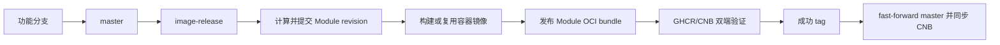

# ANAS、Module 与容器发布

ANAS 有两条发布链路：Core 二进制从专用 `anas-release` 分支按自动递增或人工指定的 SemVer 发布；Module bundle、
派生容器镜像和上游 mirror 从 `image-release` 按变更上下文发布。Module 与容器属于同一
事务，不能单独留下一个引用不存在镜像的 bundle。

## 变更记录

两条发布链路都会处理变更记录，规则见[Changelog 规范](/developer/changelog-standard)。发布相关的三条要点：

- **未发布内容写在 `master.md`。** Core 在 `docs/changelog/`，Module 在 `modules/<name>/changelog/`，中英文各一份。分支合并回 `master` 时由合并者总结该分支的用户可见变更，不要求每个提交都写。
- **改名由发布流水线执行，不要在本地改。** 目标文件名依赖发布身份：Module 的 `revision` 由 `prepare` 阶段计算，Core 的版本号由 `scripts/ci/anas-release-version.sh` 计算，推送发布分支之前都还不存在。流水线改名后重建空的 `master.md`，并把结果推回 `master`。
- **推发布分支之前先整理。** 通读本轮累积的条目，合并重复描述、统一措辞、删掉改了又回退的条目。各分支独立总结出来的条目不保证彼此协调。

本批发布的组件缺少条目且未被归类为重新打包时，发布会中止且不打 tag。只因 `shared_contexts`、打包器或 catalog 条目变化而重新打包的 Module 自动归类，无需人工撰写或豁免。

## ANAS Core 发布

工作流为 `.github/workflows/anas-release.yml`。第一次自动发布为 `0.1.0`；之后以最新的
稳定 `vMAJOR.MINOR.PATCH` tag 为版本真相源，自动发布默认递增 patch。版本计算由
`scripts/ci/anas-release-version.sh` 完成并有独立 fixture 测试。

自动发布只由 `anas-release` 分支触发：该分支上的 `cmd/anas/`、`cmd/anas-helper/`、`internal/`、
`install.sh`、`go.mod`、`go.sum` 或 Core 发布构建与安装测试脚本发生 push 时运行。`master`
push 和 Module/container 工作流均不会触发 Core
发布，因此 Core、Module 两条发布链路可以独立推进。
每次任务固定使用触发事件中的 commit SHA；即使分支在排队期间继续前进，也不会构建错 commit。

日常开发先进入 `master`；需要发布 Core 时，通过 PR 或快进把选定的 `master` commit
推进到 `anas-release`：

```bash
git fetch origin
git switch anas-release
git merge --ff-only origin/master
git push origin anas-release
```

`anas-release` 分支首次建立时从已验证的 `master` commit 创建；建立后不把它作为日常开发
分支，也不从该分支反向同步到 `master`。如果 `master` 包含尚不准备发布的提交，应先用
PR 把明确的候选 commit 合入 `anas-release`，不要直接执行上述整体快进。

若最新 Core tag 已指向目标 commit，或自上一个稳定 Core tag 后上述 Core 输入没有变化，
自动任务成功跳过，不制造空版本。并发任务串行执行，已存在的不可变 tag 不能被覆盖。

需要显式控制版本时，从 `anas-release` 手工运行 `ANAS release`：`version` 留空时按所选
`patch`、`minor` 或 `major` 递增；填写 `version` 时使用该精确 SemVer。稳定版本不得倒退，
也不得复用指向其他 commit 的 tag。例如：

```bash
# 当前没有 Core tag 时解析为首次版本 0.1.0
gh workflow run anas-release.yml --ref anas-release -f version= -f bump=patch -f prerelease=false

# 明确指定版本
gh workflow run anas-release.yml --ref anas-release -f version=0.2.0 -f bump=patch -f prerelease=false
```

发布任务运行 `go test ./...`，分别交叉编译 Linux `amd64`、`arm64` 静态二进制，生成
两个 `tar.gz` 和 `SHA256SUMS`，然后创建不可覆盖的 GitHub Release。每个归档包含 `anas`、
`anas-helper` 和 `release.json`；构建任务通过原生执行或 QEMU 实际运行 `anas version --json`，
并把版本、commit 和日期与清单及发布决策逐字段核对。成功后调用
`.github/workflows/anas-cnb-release.yml`：先确认 CNB 的同名 tag 指向相同 commit；新 tag
直接触发 CNB 的可信 `tag_push`，历史 tag 补发则临时创建同名 branch 触发
`branch.create`。CNB 流水线从 GitHub Release 下载并校验同一批附件，再用流水线临时令牌
创建 CNB Release 和上传附件，不重新编译。GitHub 侧最后通过只读 OpenAPI 再次下载或核对
SHA-256；不一致即失败。

CNB 缺失或发布中断时，可以对已有 GitHub Release 做幂等补发：

```bash
gh workflow run anas-cnb-release.yml \
  --ref anas-release \
  -f tag=v0.1.0 \
  -f commit=
```

`commit` 留空时从不可变 tag 解析；填写时还会校验 tag 必须指向该 commit。补发使用的临时
CNB branch 只在校验成功后删除；仓库级 `cnb-sync.yml` 在整个 Core workflow 成功后继续
补做完整 refs 镜像。

发布包名称：

```text
anas_linux_amd64.tar.gz
anas_linux_arm64.tar.gz
SHA256SUMS
```

构建通过 ldflags 写入版本、源码 commit 和 release commit 时间戳；该时间戳用于可复现的
制品身份，不表示 CI 实际开始构建的时刻：

```bash
anas version
anas version --json
```

Core release 不内嵌 Module。Module 有自己的版本、OCI digest 和更新节奏，安装器选择会
写入用户级源偏好，新建或导入配置再把它固化到 config/lock；本地 `modules/` + `contracts/`
只保留为源码开发覆盖。

## Module 与容器整体流程

工作流 `.github/workflows/container-images.yml` 从专用 `image-release` 分支同时处理：

- `.github/modules.json`：所有 first-party Module 的 artifact repository、平台和 shared context；
- `.github/images.json`：ANAS 派生容器构建；
- `.github/mirrors.json`：按上游 digest 固定、未经修改的镜像 mirror。

日常变更先进入 `master`，发布时把待发布 commit 合并到 `image-release`：



GitHub 是代码真相源，GHCR 是制品首发源，CNB 是国内代码与制品镜像。Registry 之间不会
自行同步；工作流使用 Crane 复制容器 manifest，使用 ORAS 复制 Module artifact。

## Module 发布身份

每个 `module.yml` 声明：

- `version`：规范化 SemVer；
- `revision`：同一版本的 ANAS 打包修订号，从 `1` 开始；
- `app_version`：上游原始展示版本。

固定发布身份为 `<version>-r<revision>`。固定 tag 不覆盖，也不发布 `latest`。

工作流找到最新 `image-release/*` 成功 tag 的 commit，以它为基准执行：

```bash
bash scripts/ci/module-revisions.sh --base "$LAST_SUCCESSFUL_RELEASE_SHA" --write
```

同一上游版本的发布上下文变化时 revision 恰好增加一次；`version` 变化或新增 Module 时
revision 为 `1`。生成值由 `github-actions[bot]` 同步写入 `module.yml`、存在时的
`localization.yml` 和 Compose 中的派生镜像 tag。随后生成器刷新参数表机器列、四份双语 Module
文档、全局 Module 目录、配置统计、架构表、localization 汇总和 inventory golden；工作流按生成器
输出的完整文件清单提交并推回 `image-release`，制品都从该提交构建。

全部制品成功后创建：

```text
image-release/<run>-<attempt>
module-release/<run>-<attempt>
module/<name>/<version>-r<revision>
```

前两个 tag 是下次计算使用的成功边界；第三个提供单 Module 版本到源码 commit 的历史
映射。生成后的候选提交在制品构建前进入 `image-release`，因此构建失败时会保留供幂等重试；失败
不会创建成功 tag，也不会同步 `master`。

## Module 打包内容

`cmd/package-module` 为一个 Module 生成一个可复现 `tar.gz`。一个包同时携带 Linux
`amd64` 和 `arm64` hook：

```bash
go run ./cmd/package-module \
  --module nextcloud \
  --platform all \
  --output dist/nextcloud-34.0.2-r2.tar.gz
```

包内包含 `package.yml`、`module.yml`、`docker-compose.yml`、Module hook 源码、两套
预编译 hook，以及声明时的 Module Command 源码和两套预编译 executor、Docker build context、provider、运行期 Contract schema、asset 和 Module 运行文件；不包含 README、
本地化文档、测试、缓存及本地构建残留。完整字段、digest 语义和安全边界见
[Module 独立编译、发布与安装源](../architecture/module-distribution-draft.md)。

OCI 目标：

```text
ghcr.io/anas-project/anas-module-<name>:<version>-r<revision>
docker.cnb.cool/anas.dev/anas/anas-module-<name>:<version>-r<revision>
```

artifact type 为 `application/vnd.anas.module.v1`，唯一 layer type 为
`application/vnd.anas.module.bundle.v1.tar+gzip`。发布后必须校验两边 artifact/layer type
和 manifest digest 完全一致。

完整发布还生成 `anas.module-catalog/v1`，以 `sha-<release-commit>` 保存不可变快照，并把
两边的 `anas-module-catalog:stable` 发现指针移动到同一 digest。catalog 只列 Module 和
当前 release；某个 Module 的全部历史版本仍以该 Module OCI repository 的 tag list 为准。

## 变更上下文

以下变化发布对应 Module：

- `modules/<name>/` 内的运行文件；
- `.github/modules.json` 声明的 shared context，例如根 `go.mod`、`go.sum`、`contracts/`；
- 该 Module 的 modules/images/mirrors catalog 条目；
- 已存在的 Module 打包器实现变化（影响全部 Module）；
- manifest `version`。

README、Module/Contract 技术文档、Contract `documentation.yml`、`localization.yml`、测试、
`.DS_Store`、`__pycache__` 和已知本机构建残留忽略。
一个 Module 有多个派生镜像时，任一 context 变化只提升一次 Module revision，并成组处理
全部相关镜像。

revision 计算会规范化 `module.yml` 的顶层 `revision` 和 Compose 中由 Module catalog 管理的
派生镜像 tag；这些字段是计算结果而不是发布原因。计算完成后，文档生成器从最终 inventory、
manifest 与 Compose 同步全部持久输出。普通模式可在保留人工“作用/Purpose”时刷新参数表机器列；
新增参数仍必须在发布前补齐四张表的中英文作用文本。工作流使用
`gen-module-docs --print-managed-files` 暂存完整输出闭集，Bot 提交后要求工作树为空并再次执行
`--check`。YAML service 视图还会逐一核对所有 catalog 自有镜像引用；注释中的 tag 不能代替活动
service。

本地预览和校验：

```bash
bash scripts/ci/module-revisions.sh --base <成功发布SHA> --print
bash scripts/ci/module-revisions.sh --base <成功发布SHA> --check
bash scripts/ci/module-revisions-test.sh
```

## 派生镜像与 Module revision 联动

派生镜像固定 tag 与 Module release 相同：

```text
ghcr.io/anas-project/anas-<软件>:<version>-r<revision>
docker.cnb.cool/anas.dev/anas/anas-<软件>:<version>-r<revision>
```

- Docker build context 变化：构建新镜像，首先推 GHCR，再复制到 CNB；
- 只有 hook、manifest、Compose 或 shared context 变化：不重建相同容器内容，把上一固定
  tag 的 manifest/digest 复制为新 Module revision tag；
- 目标只存在一侧：从已有侧恢复另一侧；
- 两侧都存在：验证后结束，不覆盖；
- 两侧都不存在且上一版本也不可取：回退为重新构建，避免发布悬空引用。

因此 Module 包生成前，它引用的每个固定镜像 tag 都已存在于两个 Registry。

## 上游镜像 mirror

未经修改的上游镜像使用：

```text
anas-mirror-<软件>:<固定版本>
```

`.github/mirrors.json` 同时保存上游引用、manifest digest 和运行平台。工作流先校验 digest，
筛选 `linux/amd64`、`linux/arm64` manifest，再复制到 GHCR 和 CNB；即使上游输入写了
`latest`，也必须附带 digest，ANAS 目标 tag 不得使用 `latest`。每个 mirror 必须由登记
Module 的 Compose 活动 service 直接引用，或作为该 Module 已登记派生镜像 Dockerfile 的
有效 `FROM` 基础镜像；注释和普通文本不算引用。

## CI 行为

- 普通 `master` push：不发布 Module 或容器；
- 目标为 `image-release` 的 PR：计算候选 revision、构建受影响镜像和 Module bundle，
  但不提交、不推 Registry；bundle 作为 Actions artifact 供检查；
- `image-release` push：自动提交 revision 与全部持久生成文档，发布自上次成功 tag 以来变化的
  Module；全部制品成功后安全快进 `master` 并同步 Git 到 CNB；
- 首次没有成功 tag：发布全部 Module、派生镜像和 mirror；
- `workflow_dispatch module=all`：完成首次/失败发布，并允许 finalize；
- `workflow_dispatch module=<name>`：只补发或恢复指定 Module，不推进全局成功基准；
- 发布期间分支又前进：当前 commit 仍可完成并打成功 tag，排队的下一轮负责后续变化；
- `master` 独立前进、无法 fast-forward：停止同步，不强推。

## 首次发布

从当前 `master` 创建 `image-release`：

```bash
git fetch origin
git switch -c image-release origin/master
git push origin image-release
```

在 GitHub Actions 从 `image-release` ref 运行 `Module and container artifacts`，选择
`module=all`。首次成功后，在 GitHub Packages/CNB 确认 Module artifact 和 container
package 可匿名拉取。以后通过 PR 把待发布 `master` 合并到 `image-release` 即可。

## 安装源与中国大陆默认

```yaml
module_source: official       # GHCR 主源，CNB 回退
# module_source: official-cn  # CNB 主源，GHCR 回退
# module_source: cn           # official-cn 的简写
```

使用 `official-cn` 或 `cn` 时，如果用户没有显式配置，ANAS 自动并在托管 config 中持久化：

```yaml
global:
  chinese_speedup: true
```

这会让正式运行镜像和运行期下载源一起走国内配置。显式
`global.chinese_speedup: false` 始终优先，只选择 CN Module 源但不切换容器/下载加速。
`global.chinese_build_speedup` 仍是独立开关，改变构建输入时必须重新构建镜像。

## 所需权限与 Secret

- Repository Actions workflow permission 允许写仓库和 Packages；
- `image-release` 禁止 force push，并允许 GitHub Actions App 提交自动 revision；
- `master` 允许同一 App 做安全 fast-forward；
- `GITHUB_TOKEN` 写 GitHub Release、GHCR container 和 Module artifact；
- `CNB_REGISTRY_TOKEN` 写 CNB Registry；
- GitHub Secret `CNB_TOKEN` 需要 CNB 仓库代码读写与 Release 只读权限，用于同步 ref 和
  双端校验；可信 CNB 流水线自动获得临时的 `repo-release:rw`，负责创建 Release 和附件。

工作流从不 force push。若分支规则不能给 GitHub Actions App bypass，应改用权限等价、范围
受限的 GitHub App installation token，不能关闭保护规则。
