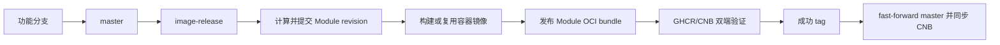

# ANAS、Module 与容器发布

ANAS 有两条发布链路：Core 二进制从 `master` 按人工确认的 SemVer 发布；Module bundle、
派生容器镜像和上游 mirror 从 `image-release` 按变更上下文发布。Module 与容器属于同一
事务，不能单独留下一个引用不存在镜像的 bundle。

## ANAS Core 发布

工作流为 `.github/workflows/anas-release.yml`，只允许从 `master` 手工触发。

1. 确认 `master` 是准备发布的 commit，并完成常规 PR、测试和文档检查。
2. 在 GitHub Actions 选择 `ANAS release`，输入不带 `v` 的 SemVer，例如 `0.4.0`。
3. 工作流拒绝非法版本和已存在的固定 tag，运行 `go test ./...`。
4. 分别交叉编译 Linux `amd64`、`arm64` 静态二进制。
5. 生成两个 `tar.gz` 和 `SHA256SUMS`，创建不可覆盖的 GitHub Release `v0.4.0`。

发布包名称：

```text
anas_0.4.0_linux_amd64.tar.gz
anas_0.4.0_linux_arm64.tar.gz
SHA256SUMS
```

构建通过 ldflags 写入版本、源码 commit 和 UTC 构建时间：

```bash
anas version
anas version --json
```

Core release 不内嵌 Module。Module 有自己的版本、OCI digest 和更新节奏，安装器根据
config/lock 获取；本地 `modules/` + `contracts/` 只保留为源码开发覆盖。

## Module 与容器整体流程

工作流 `.github/workflows/container-images.yml` 从专用 `image-release` 分支同时处理：

- `.github/modules.json`：所有 first-party Module 的 artifact repository、平台和 shared context；
- `.github/images.json`：ANAS 派生容器构建；
- `.github/mirrors.json`：按上游 digest 固定、未经修改的镜像 mirror。

日常变更先进入 `master`，发布时把待发布 commit 合并到 `image-release`：



GitHub 是代码真相源，GHCR 是制品首发源，CNB 是国内代码与制品镜像。Registry 之间不会
自行同步；工作流使用 Crane 复制容器 manifest，使用 ORAS 复制 Module artifact。

## Module 发布身份

每个 `module.yml` 声明：

- `version`：规范化 SemVer；
- `revision`：同一版本的 ANAS 打包修订号，从 `1` 开始；
- `app_version`：上游原始展示版本。

固定发布身份为 `<version>-r<revision>`。固定 tag 不覆盖，也不发布 `latest`。

工作流找到最新 `image-release/*` 成功 tag 的 commit，以它为基准执行：

```bash
bash scripts/ci/module-revisions.sh --base "$LAST_SUCCESSFUL_RELEASE_SHA" --write
```

同一上游版本的发布上下文变化时 revision 恰好增加一次；`version` 变化或新增 Module 时
revision 为 `1`。生成值由 `github-actions[bot]` 同步写入 `module.yml`、存在时的
`localization.yml` 和 Compose 中的派生镜像 tag。

全部制品成功后创建：

```text
image-release/<run>-<attempt>
module-release/<run>-<attempt>
module/<name>/<version>-r<revision>
```

前两个 tag 是下次计算使用的成功边界；第三个提供单 Module 版本到源码 commit 的历史
映射。失败不会创建这些 tag，也不会同步 `master`。

## Module 打包内容

`cmd/package-module` 为一个 Module 生成一个可复现 `tar.gz`。一个包同时携带 Linux
`amd64` 和 `arm64` hook：

```bash
go run ./cmd/package-module \
  --module nextcloud \
  --platform all \
  --output dist/nextcloud-34.0.2-r2.tar.gz
```

包内包含 `package.yml`、`module.yml`、`docker-compose.yml`、Module hook 源码、两套
预编译 hook、Docker build context、provider、运行期 Contract schema、asset 和 Module 运行文件；不包含 README、
本地化文档、测试、缓存及本地构建残留。完整字段、digest 语义和安全边界见
[Module 独立编译、发布与安装源](../architecture/module-distribution-draft.md)。

OCI 目标：

```text
ghcr.io/anas-project/anas-module-<name>:<version>-r<revision>
docker.cnb.cool/anas.dev/anas/anas-module-<name>:<version>-r<revision>
```

artifact type 为 `application/vnd.anas.module.v1`，唯一 layer type 为
`application/vnd.anas.module.bundle.v1.tar+gzip`。发布后必须校验两边 artifact/layer type
和 manifest digest 完全一致。

完整发布还生成 `anas.module-catalog/v1`，以 `sha-<release-commit>` 保存不可变快照，并把
两边的 `anas-module-catalog:stable` 发现指针移动到同一 digest。catalog 只列 Module 和
当前 release；某个 Module 的全部历史版本仍以该 Module OCI repository 的 tag list 为准。

## 变更上下文

以下变化发布对应 Module：

- `modules/<name>/` 内的运行文件；
- `.github/modules.json` 声明的 shared context，例如根 `go.mod`、`go.sum`、`contracts/`；
- 该 Module 的 modules/images/mirrors catalog 条目；
- 已存在的 Module 打包器实现变化（影响全部 Module）；
- manifest `version`。

README、`localization.yml`、测试、`.DS_Store`、`__pycache__` 和已知本机构建残留忽略。
一个 Module 有多个派生镜像时，任一 context 变化只提升一次 Module revision，并成组处理
全部相关镜像。

本地预览和校验：

```bash
bash scripts/ci/module-revisions.sh --base <成功发布SHA> --print
bash scripts/ci/module-revisions.sh --base <成功发布SHA> --check
bash scripts/ci/module-revisions-test.sh
```

## 派生镜像与 Module revision 联动

派生镜像固定 tag 与 Module release 相同：

```text
ghcr.io/anas-project/anas-<软件>:<version>-r<revision>
docker.cnb.cool/anas.dev/anas/anas-<软件>:<version>-r<revision>
```

- Docker build context 变化：构建新镜像，首先推 GHCR，再复制到 CNB；
- 只有 hook、manifest、Compose 或 shared context 变化：不重建相同容器内容，把上一固定
  tag 的 manifest/digest 复制为新 Module revision tag；
- 目标只存在一侧：从已有侧恢复另一侧；
- 两侧都存在：验证后结束，不覆盖；
- 两侧都不存在且上一版本也不可取：回退为重新构建，避免发布悬空引用。

因此 Module 包生成前，它引用的每个固定镜像 tag 都已存在于两个 Registry。

## 上游镜像 mirror

未经修改的上游镜像使用：

```text
anas-mirror-<软件>:<固定版本>
```

`.github/mirrors.json` 同时保存上游引用、manifest digest 和运行平台。工作流先校验 digest，
筛选 `linux/amd64`、`linux/arm64` manifest，再复制到 GHCR 和 CNB；即使上游输入写了
`latest`，也必须附带 digest，ANAS 目标 tag 不得使用 `latest`。

## CI 行为

- 普通 `master` push：不发布 Module 或容器；
- 目标为 `image-release` 的 PR：计算候选 revision、构建受影响镜像和 Module bundle，
  但不提交、不推 Registry；bundle 作为 Actions artifact 供检查；
- `image-release` push：自动提交 revision，发布自上次成功 tag 以来变化的 Module；
- 首次没有成功 tag：发布全部 Module、派生镜像和 mirror；
- `workflow_dispatch module=all`：完成首次/失败发布，并允许 finalize；
- `workflow_dispatch module=<name>`：只补发或恢复指定 Module，不推进全局成功基准；
- 发布期间分支又前进：当前 commit 仍可完成并打成功 tag，排队的下一轮负责后续变化；
- `master` 独立前进、无法 fast-forward：停止同步，不强推。

## 首次发布

从当前 `master` 创建 `image-release`：

```bash
git fetch origin
git switch -c image-release origin/master
git push origin image-release
```

在 GitHub Actions 从 `image-release` ref 运行 `Module and container artifacts`，选择
`module=all`。首次成功后，在 GitHub Packages/CNB 确认 Module artifact 和 container
package 可匿名拉取。以后通过 PR 把待发布 `master` 合并到 `image-release` 即可。

## 安装源与中国大陆默认

```yaml
module_source: official       # GHCR 主源，CNB 回退
# module_source: official-cn  # CNB 主源，GHCR 回退
# module_source: cn           # official-cn 的简写
```

使用 `official-cn` 或 `cn` 时，如果用户没有显式配置，ANAS 自动并在托管 config 中持久化：

```yaml
global:
  chinese_speedup: true
```

这会让正式运行镜像和运行期下载源一起走国内配置。显式
`global.chinese_speedup: false` 始终优先，只选择 CN Module 源但不切换容器/下载加速。
`global.chinese_build_speedup` 仍是独立开关，改变构建输入时必须重新构建镜像。

## 所需权限与 Secret

- Repository Actions workflow permission 允许写仓库和 Packages；
- `image-release` 禁止 force push，并允许 GitHub Actions App 提交自动 revision；
- `master` 允许同一 App 做安全 fast-forward；
- `GITHUB_TOKEN` 写 GitHub Release、GHCR container 和 Module artifact；
- `CNB_REGISTRY_TOKEN` 写 CNB Registry；
- `CNB_TOKEN` 同步成功分支与 tag 到 CNB Git 仓库。

工作流从不 force push。若分支规则不能给 GitHub Actions App bypass，应改用权限等价、范围
受限的 GitHub App installation token，不能关闭保护规则。
