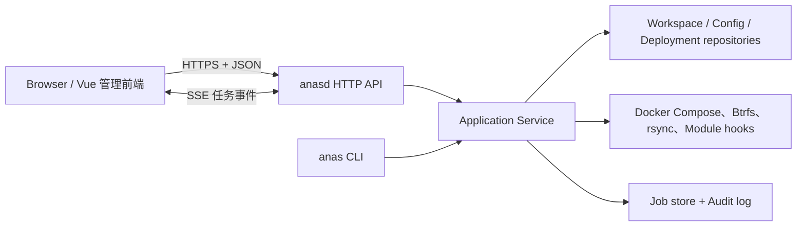

# ANAS Web API 与管理前端要求

本文是 ANAS 管理控制台（`anasd` 与嵌入式前端）的目标、范围、硬约束与验收标准，回答“什么算做对了”，不随实现顺序变化。

**[§10 需求矩阵](#_10-需求矩阵-规范来源)是规范来源，其余章节是解释。** 逐条要求带稳定 ID（`CONSOLE-R-<序号>`），
测试、检查表与提交都引用 ID 而不是章节号。

该特性**不单独建架构文档**：设计与被否决的替代方案写在 §3—§5 与 §9 决策记录里；
文中的 `/architecture/*` 链接指向相邻系统的既有约束，改到对应部分时才需要读。

落地顺序、里程碑与剩余工作见[Web API 与管理前端实施计划](/plans/web-api-admin-console)；
该计划按需求 ID 划分各阶段范围，并在其实现检查表中记录覆盖与执行证据。

「必须／不得」是约束，「应当」是有正当理由可偏离的默认。除计划文档标注为已实施的部分外，本文描述的能力**当前不可执行**，不是操作指南。

## 1. 范围与总体决策

### 1.1 目标

新增守护进程 `anasd`，提供 `/api/v1` HTTP API、管理认证、异步任务与审计日志，并以 `go:embed` 托管管理前端。`internal/runner` 的核心操作抽成带类型、`context.Context` 和事件回调的应用服务；**CLI 与 HTTP 都只是该服务层的适配器**，不各自维护一套部署逻辑。

首版按“单机、单 workspace、单管理员”交付，但 API、任务模型与权限字段预留多 workspace 与多角色。功能顺序：状态查看 → Module 启停 → 部署与配置预检 → 快照、备份、管理员凭据等高风险功能。

### 1.2 非目标

以下是经过评估后明确不做的，理由见 §9：

- `anasd` **不得**以反复执行 `anas ... --json` 子进程作为正式服务层（早期原型的只读命令除外）。
- **不**从 Web 创建 workspace；`anas init` 保持为终端操作。
- **不**做角色分层，MVP 只有一个角色。
- **不**拆分为「应急系统 + 完整系统」两个独立系统。
- **不**把控制台的前端或后端的任何部分容器化。
- **不**做管理端口与 Traefik 之间的端口移交，也**不**按 Traefik 或 IAM 的运行状态动态开关直连入口。

### 1.3 必须同步处理的文档冲突

[CLI 契约索引](/reference/contracts/)开篇称这些契约“面向非交互式调用方——将来的 web 服务、定时任务……”，与 §1.1 的共享服务层方向相反。**落地第一条切片的同一个 PR 必须改写那句话**，重述为：面向外部非交互式调用方；ANAS 自己的 web 层共享服务层，只把契约用作兼容基线与黑盒测试依据。

## 2. 前置改造

以下是 Web 化的阻塞项。左列是当前实现事实，右列是需求。

| 现状 | 要求 |
| --- | --- |
| `runner.Main`、`emitJSON`、`emitProgress` 直接用全局 `os.Stdout`/`os.Stderr`；`internal/` 下 34 处引用分布在 18 个文件 | 应用服务不得写全局流；输出经 `EventSink` 与返回值传递 |
| `exec.Command` 31 处，`exec.CommandContext` **0** 处；仅 `internal/modulestore` 使用 `context` | 所有外部命令改用 `exec.CommandContext`，`context` 贯穿请求与任务 |
| 命令函数同时做参数解析、workspace 解析、业务执行与输出格式化 | 拆出稳定的 Go 结果类型，HTTP 直接消费 |
| 进度是写到 stderr 的 JSON Lines | 任务事件必须持久化并可经 SSE 重放，刷新页面后可继续观察 |
| `status` 只读 `.anas/state/active.yml`，不等于容器实时运行与健康状态 | 新增运行态探测能力 |
| `config set` 是单字段语义 | 配置写入需支持一次提交多字段、预检、乐观锁、敏感值只写不读 |

### 2.1 运行时锁必须改为非阻塞

`acquireRuntimeLock`（`internal/runner/deployment.go`）有两条性质，CLI 下无害，守护进程下必须处理：

- **它是阻塞 flock**（`syscall.Flock(fd, LOCK_EX)`，无 `LOCK_NB`）。HTTP handler 里直接调用没有超时、不能被 `context` 取消，一个卡住的 apply 会无限期挂住 goroutine 及其 OS 线程。**必须改为 `LOCK_NB` + 退避重试**，把等待变成可取消、可超时、可观测的状态。
- **取排他锁本身有副作用**：顺带执行 `cleanStaleSnapshotTemp` 与 `compensateContainerTransactions`。这对崩溃恢复是好消息——补偿逻辑不需要重写——但必须显式依赖它，不得另建一套。共享锁无此副作用。

“谁持有锁、持了多久、为哪个任务”**必须**成为 API 可见状态（§4.2 的 workspace status）。

### 2.2 配置元数据

元数据回填之前是“机制存在、数据不足”：141 项公开参数中 Module 只有 12 项声明 `config.types`，17 项全局参数为 0 项（`globalSchema` 当时没有 `Types` 字段），且 `paramTypeDocument` 对“未声明”与“声明为 string”返回同一个 `"string"`，消费者无法区分。

当前状态与精确基线见[实施计划](/plans/web-api-admin-console)的落地快照。对后续实现的约束：

- 配置 GET/validate/PUT **必须**消费与 CLI 相同的应用层 schema，**不得**为每个 Module 编写独立 HTTP 适配，也**不得**从 CLI JSON 反解析元数据。新增 Module 参数只改声明与统一投影，不改 handler 分支。
- CLI 投影**不是** JSON Schema：两者的 `required` 与 `default` 语义不同，前端不得不经转换直接当作 JSON Schema 使用。
- 条件必填、跨字段关系与依赖运行态的规则继续由 resolver、plan 或 Hook 校验，不得伪装成单字段 schema。

### 2.3 子进程环境继承在守护进程下语义改变

`internal/compose/compose.go` 的 `RunFile`/`OutputFile` 使用 `cmd.Env = os.Environ()`；`applyWorkspaceEnv` 从 `os.Getenv("DOCKER_HOST")` 推导 `DOCKER_SOCKET_PATH`。CLI 下这是“当前 shell 说了算”，守护进程下变成两件事：systemd unit 的环境**永久**决定所有 workspace 打到哪个 Docker 端点；`anasd` 自己的环境（会话密钥等）原样泄进每个 compose 子进程与 module hook。需求见 §7.3。

### 2.4 特权模型的前提被守护进程改变

`cmd/anas-helper` 是 root 拥有、`setcap cap_net_admin+ep` 的受限 helper；[特权 helper 草案](/architecture/privilege-helper-draft)中 `btrfs send` 与 `subvolume delete` 仍是草案，靠读 `CapEff` 探测。常驻服务改变了这套设计的全部前提，需求见 §7.4。

## 3. 架构



### 3.1 进程与发布形态

- `cmd/anasd` 作为 systemd 管理的**宿主机**服务运行，**不得**属于被 ANAS 管理的 Compose 部署——否则 `stop`、失败回滚或 Traefik 故障会把管理面一起带走。这条同时决定了 §5 的入口策略。
- 前端使用 Vue 3 + TypeScript + Vite，生产构建产物由 `embed.FS` 嵌入 `anasd`；交付物是一个后端二进制加一个 systemd unit。
- 后端使用 Go 标准库 `net/http`。`go.mod` 基线为 `go 1.26.5`，直接使用带方法与路径参数的 `ServeMux`，首版不引入 Web 框架。
- API 采用 OpenAPI 3.1 文档先行，前端类型从规范生成。CLI 的 `anas.dev/cli/v1` 与 HTTP 的 `anas.dev/api/v1` 分别版本化；**不得**把 CLI 信封原样作为 HTTP 响应。

### 3.2 代码边界

```text
cmd/anas/               现有 CLI 适配器
cmd/anasd/              HTTP 服务入口
internal/application/   用例：Plan、Apply、Restart、CreateSnapshot…
internal/api/httpapi/   路由、DTO、认证、错误映射、SSE
internal/jobs/          队列、持久化、事件流、恢复
internal/audit/         安全相关操作审计
internal/platform/      compose/btrfs/命令执行，支持 context 与显式子进程环境
internal/runner/        迁移期保留 CLI flag 与文本输出
web/src/{api,i18n,pages,components,stores}/
api/openapi.yaml
```

`web/` **必须**是独立 npm 工程，不得并入仓库根目录 VitePress 文档站的依赖树，否则 `npm run docs:build` 与前端构建互相牵制。

应用层操作统一为下列形态；CLI 把结果渲染为现有 JSON/文本契约，HTTP 映射为响应或任务结果，因而现有 CLI contract 测试继续保护兼容性：

```go
type EventSink interface {
    Progress(ProgressEvent)
    Warning(WarningEvent)
    Log(LogEvent)
}

type DeploymentService interface {
    Status(ctx context.Context, workspace string) (Status, error)
    Plan(ctx context.Context, req PlanRequest) (PlanResult, error)
    Apply(ctx context.Context, req ApplyRequest, events EventSink) (ApplyResult, error)
}
```

## 4. API

### 4.1 通用约定

- 基础路径 `/api/v1`。只读且快速的请求同步返回 `200`；改变宿主机或可能超过数秒的请求创建任务，返回 `202`、`job` 与 `Location`。
- 错误使用 `application/problem+json`，保留现有枚举（`guarded_changes`、`confirmation_required`、`lock_stale` 等）。
- 配置写入**必须**携带 `If-Match`，冲突返回 `412`。**ETag 直接使用 `internal/runner/config_import.go` 的 `managedConfigState.Digest`**（`config.yml` 的 sha256，`validateManagedConfig` 已用它拒绝 ANAS 之外的手工修改），不得新造——这样“浏览器并发写入”与“有人 vim 改过”落在同一条错误路径。
- 可能因网络重试而重复执行的 POST 支持 `Idempotency-Key`。
- 列表从第一版就支持 `limit`、`cursor`。
- 响应中的文件系统路径只暴露必要部分；API 输入**不得**接受未注册的 workspace 路径。

### 4.2 端点

| 领域 | 方法与路径 | 说明 |
| --- | --- | --- |
| 服务 | `GET /healthz` | 进程存活，不读 Docker |
| 服务 | `GET /api/v1/system` | 版本、能力、工具可用性、当前证书签发者、监听形态 |
| 认证 | `POST /api/v1/auth/login`、`POST /auth/logout`、`GET /auth/session` | 本地会话；登录路由只存在于直连监听器（§5.5） |
| Workspace | `GET /api/v1/workspaces` | 首版通常只有一个注册项 |
| Workspace | `GET /api/v1/workspaces/{ws}/status` | 活动部署、配置摘要、运行健康摘要、运行时锁持有者 |
| 部署 | `POST /api/v1/workspaces/{ws}/plans` | 只计算，不写入 |
| 部署 | `GET /api/v1/workspaces/{ws}/deployments`、`/{id}` | 历史、制品与状态 |
| 部署 | `POST /api/v1/workspaces/{ws}/actions/apply` | apply 任务；`allow_risky` 为显式布尔字段 |
| 部署 | `POST /api/v1/workspaces/{ws}/actions/rollback` | 明确目标、风险确认后创建任务 |
| Module | `GET /api/v1/workspaces/{ws}/modules` | 配置态、版本、运行态、健康、入口地址 |
| Module Command | `GET /api/v1/workspaces/{ws}/modules/{module}/commands`、`/{command}` | 活动 deployment 冻结的公开 descriptor 与本地可用性；不含 handler、路径或输入键 |
| Module Command | `POST /api/v1/workspaces/{ws}/modules/{module}/commands/{command}/actions/invoke` | 认证/job/审计完成后启用；M0 未认证监听器禁止开放 |
| Module | `POST /api/v1/workspaces/{ws}/modules/actions/{start\|stop\|restart}` | body 传目标列表；返回依赖 chain 预览或任务 |
| 配置 | `GET /api/v1/workspaces/{ws}/config` | 规范化配置、字段 schema、ETag；敏感值只报 set/unset |
| 配置 | `POST /api/v1/workspaces/{ws}/config/validate` | 校验候选配置并返回变更计划，不写入 |
| 配置 | `PUT /api/v1/workspaces/{ws}/config` | 原子写入，要求 `If-Match` |
| Module 市场 | `GET /api/v1/catalog/modules`、`POST /api/v1/workspaces/{ws}/actions/update-modules` | 目录；同步/更新任务 |
| 快照 | `GET`/`POST /api/v1/workspaces/{ws}/snapshots` | 列表与健康状态；创建任务 |
| 快照 | `POST /api/v1/workspaces/{ws}/snapshots/{id}/actions/{pin\|unpin\|verify\|restore}` | restore 必须二次确认 |
| 快照 | `DELETE /api/v1/workspaces/{ws}/snapshots/{id}` | 先返回影响摘要并二次确认；需 `CAP_SYS_ADMIN`（§7.4） |
| 备份 | `POST /api/v1/workspaces/{ws}/backup-plans`、`GET /…/backups` | 能力探测与计划；列表 |
| 备份 | `POST /api/v1/workspaces/{ws}/actions/{backup\|restore-backup\|verify-backup}` | 异步高风险任务 |
| 管理员 | `GET /api/v1/workspaces/{ws}/local-admins` | 不返回密码 |
| 管理员 | `POST /…/local-admins/{module}/{account}/actions/rotate` | 轮换任务，**只支持随机生成** |
| 管理员 | `POST /…/local-admins/{module}/{account}/reveal` | 重新认证后短时返回，`Cache-Control: no-store` |
| 任务 | `GET /api/v1/jobs`、`GET /api/v1/jobs/{id}` | 历史与最终结果 |
| 任务 | `GET /api/v1/jobs/{id}/events` | SSE，支持 `Last-Event-ID` 续传 |
| 任务 | `POST /api/v1/jobs/{id}/cancel` | 仅可取消声明为可取消的阶段 |
| 审计 | `GET /api/v1/audit-events` | 谁在何时对哪个 workspace 做了什么 |

**凭据轮换只支持随机生成。** `anas admin local rotate --prompt` 要求真实 TTY 无回显读取并二次确认，不接受密码参数、环境变量或 YAML 明文。API **不得**提供“在浏览器里输入新密码”的路径——那会绕开该规则并把明文送进请求体与中间日志。

### 4.3 异步任务

```text
queued -> running -> succeeded | failed | canceled | interrupted
```

任务至少保存 `id`、`kind`、`workspace_id`、`status`、`created_by`、`created_at`、`started_at`、`finished_at`、脱敏后的请求、进度、警告、最终结果或结构化错误。事件带递增序号供 `Last-Event-ID` 续传。

每个 workspace 同时只允许一个变更任务，其余排队；只读请求可并发。底层保留 workspace 文件锁（按 §2.1 改为非阻塞），避免 CLI 与 Web 绕过队列。服务重启后 `running` 任务标记为 `interrupted`，下次取得排他锁时由既有补偿逻辑清理；**不得**在不知道外部命令是否已完成时自动重试高风险任务。

### 4.4 任务持久化

两条约束排除了直接选用 SQLite：`scripts/ci/build-anas-release.sh` 以 `CGO_ENABLED=0` 交叉编译 amd64/arm64（cgo 驱动会破坏该路径）；当前直接依赖只有 `yaml.v3`、`semver/v3`、`x/crypto` 三个，`modernc.org/sqlite` 会一次性引入数十个包并扩大一个近 root 服务的攻击面。

**MVP 使用 `.anas/console/` 下的 append-only JSONL 存放任务、事件与审计，并把存储层放在接口后面**；确有审计检索需求时再换 `modernc.org/sqlite`（保持 `CGO_ENABLED=0`）。无论哪种，控制面元数据都**不得**替代 workspace 中的 YAML 状态或成为部署真相源；密码哈希与加密密钥使用独立 0600 文件。

## 5. 访问路径、证书与认证

### 5.1 两条不可让步的约束

1. **管理面的可达性必须是静态的、管理员声明的属性，永远不能是被管理系统状态的函数。** 管理面必须在被管理系统停机时仍然可达——Traefik 配错、apply 失败回滚、IAM 故障，正是最需要控制台的时刻。可以随状态变化的只有 §5.2 的**能力分级**：降级能做什么不会把人锁在门外，降级可达性会。
2. **lego 是部署唯一的证书签发者，不得再造第二个。** `anasd` 与 Traefik 一样只是 `ANAS_TLS_*` 的消费者。

关于 lego 行为的两处精确表述，照错的心智模型实现会出问题：它的兜底**不是“自签名”而是内部 CA 签发**（一个 CA 装一次覆盖全部服务，而非每个服务各自自签——`ca.sh` 注释写明当年正是后者导致“谁也不信谁”）；顺序上**不是“ACME 失败才兜底”**，而是 `ca.sh bootstrap` 总是先跑拿到内部证书，之后才尝试 ACME 并由 `cert.sh` 的 `adopt` 在同一组路径原地替换（`verify_published` 拒绝“签发成功但仍是自签名”，`.issuer` 记录当前签发者）。因此**任何时刻都有可用证书，原地升级，中间没有空窗**。

### 5.2 能力分级

引导窗口——从 `install.sh` 结束到 lego 第一次运行——宿主机上没有任何可信证书。能开放的能力绑定到当前通道的可信度，边界由一条构造规则确定：

> **引导级只包含“为了到达完整级所必需”的操作，此外一律不含。**

| | 引导级 | 完整级 |
| --- | --- | --- |
| 通道 | LAN 明文 HTTP（默认），检测到证书后自动升 HTTPS | lego 签发的证书（ACME 或内部 CA） |
| 认证 | 一次性 bootstrap token，无持久账户 | 持久本地账户，或经 Traefik 的 OIDC（§5.5） |
| 可做 | `GET /system`；选择 Module；填写并 `validate` 初始配置；首次 `apply`；SSE 任务进度；证书状态与跳转指引 | 全部 |
| 不可做 | 凭据 reveal、`admin rotate`、快照/备份的写操作与 restore、审计查询、日常配置改写、第二次及以后的 apply | —— |

**单向棘轮**：到达完整级后引导级永久关闭——token 作废，引导级端点返回 404，重新开启只能从 CLI 且需先移除现有管理员账户。同理，一旦提供过 HTTPS 就不得回退明文，证书事后消失或损坏应报错而非降级。若无此约束，攻击者只要让 `anasd` 相信“证书没了”就能把认证降级回一枚 token。

**引导期默认 LAN 明文 HTTP。** 这与同类产品（Synology、TrueNAS、Unraid、OMV、Home Assistant）一致，也避免训练管理员点掉证书警告——那个习惯会泛化到真正的钓鱼场景。升级判断是纯本地的：检测到 `ANAS_TLS_*` 或手动生成的临时证书即启用 HTTPS 并在 HTTP 侧提示跳转。没有任何证书时要开 HTTPS，必须显式执行 `anas console tls --self-signed`（生成临时自签证书并在当前 SSH 会话打印 SHA-256 指纹供带外核对）；这是可选项，不是默认流程。`ssh -L` 隧道 + loopback 监听始终是等价可用的替代路径。

**残余风险必须如实记账**：初始配置包含 `modules.lego.config.dns_provider` 对应的 DNS 厂商 API 凭据，拿到它可为该域名签发任意证书，明文 HTTP 上它对 LAN 主动中间人可见。这是有界的、被接受的取舍，处理方式是：

- 引导页在任何 `sensitive: true` 字段获得焦点时显示当前连接未加密，并给出 `anas console tls --self-signed` 作为替代；
- 安装文档明写“引导窗口不具备机密性”，不得含糊成“建议使用可信网络”；
- 到达完整级后提示管理员轮换引导期输入过的 DNS 凭据——这是唯一能真正消除该暴露的动作。

**升级到完整级**：不存在“把证书放进后端”这个动作，`GetCertificate` 回调在下一次握手就用上新证书，管理面只需**发现**并提示跳转。跳转是跨源的（`http://<ip>:<port>` → `https://anas.<base_domain>:<port>`），会话不携带过去是设计而非缺陷——管理员在新源上做的第一件事正是创建持久管理员账户，该长期凭据因此从一开始就只存在于已加密通道。**门槛是“证书可信”而非“ACME 成功”**：`virtual_domain=true` 部署永远没有 ACME 证书，但 `apply` 后有内部 CA 签发的通配证书，管理员安装一次 `anas-internal-ca.crt` 即可；这是一等公民模式，**必须**能到达完整级。判定数据源是 `.issuer` 加证书自身校验，由 `GET /api/v1/system` 返回，界面如实显示签发者，不得把内部 CA 说成“证书有问题”。

**引导期的临时证书是丢弃品**，lego 的内部 CA 一旦出现即弃用，**不得**提升为 lego 的 CA（理由见 §9）。

### 5.3 证书消费的实现要求

1. **必须热重载**，不得启动时一次性 `LoadX509KeyPair`。`ca.sh`/`cert.sh` 用 `install` 覆盖同一组路径，文件在 `anasd` 运行期间被原地替换；使用 `tls.Config.GetCertificate` 回调加 mtime/内容变化检测，每次握手取当前证书。
2. **通配证书覆盖 `<base_domain>` 与 `*.<base_domain>`，不覆盖 IP**，因此完整级**必须按名字访问**。代价是管理员设备要能解析该名字（部署内有 samba_dc 时它就是 DNS，否则需 hosts 记录或路由器配置），这条要写进安装文档。**不得**为管理面在 `ca.sh` 里加 `IP:` SAN——ACME 无法为私网 IP 签发，会让内部证书与 ACME 证书形状不同，破坏 lego“消费者看不出区别”的核心不变量。本条不适用于引导期：明文 HTTP 与可选的临时自签证书都不依赖 DNS，可按 IP 访问。
3. **私钥是 0600 且由容器内 root 写出**，`anasd` 必须以能读取它的身份运行。鉴于它本就需要 Docker socket（权限近似 root），这不是新增提升，但必须写进 systemd unit 与文档，不能等运行时报 permission denied。

### 5.4 端口与入口

**`anasd` 永久独占一个固定管理端口，从不让出，并自己终结 HTTPS。** 该端口与 `traefik.base_port` 无关，记录在 `anasd` 自己的服务配置里，**不得**出现在 workspace 的 `config.yml` 中。

直连监听范围是**静态策略**，取值不随任何被管理组件的状态变化：

| 模式 | 直连监听 | LAN 访问路径 | 恢复路径 |
| --- | --- | --- | --- |
| `lan`（默认） | 绑 LAN 地址 | 直连 + Traefik 路由（可用时） | 直连地址 |
| `loopback` | 只绑 `127.0.0.1` | 仅经 Traefik | `ssh -L` 隧道 |

`loopback` 就是“关掉直连”，是站得住的姿态；关键在于它是一次性配置决定，而非运行期动态判断。

Traefik 运行时**可以额外**提供 `https://anas.<base_domain>/`，与直连地址并存。这条路不需要新机制：`modules/traefik/traefik/anas-entrypoint.sh` 已有面向非 Docker 宿主进程的 `ANAS_TRAEFIK_ROUTE__<NAME>__{RULE,URL,MIDDLEWARES,ENTRYPOINTS,TLS}` 声明，管理面正属于这一类。

**但存在一个当前不存在的缺口**：该路由生成器不输出 `serversTransport`，Traefik 反连 `anasd` 会因证书名不匹配握手失败。打通需要扩展 entrypoint，增加 `__SERVERS_TRANSPORT` 字段并定义一个信任 `anas-trust-bundle.crt`、覆盖 `serverName` 为 `anas.<base_domain>` 的 transport。**因此首版只做直连固定端口，Traefik 路由与该扩展一起作为 P2。**

### 5.5 认证与角色

两条路径使用不同的认证提供方，这是**同一个 `anasd` 进程上的两个监听器，不是两套系统或两套功能**：

| 性质 | 由什么决定 | 直连监听器 | 经 Traefik 的监听器 |
| --- | --- | --- | --- |
| 认证方式 | 门 | 本地 `admin` 凭据 | `oauth2_proxy` forwardauth → OIDC |
| 是否解析代理身份头 | 门 | 否，一律剥离 | 是，且来源地址在允许列表内 |
| **能力** | **不由门决定**，由 §5.2 分级决定 | 完整级即完整能力 | 完整级即完整能力 |

第三行最容易实现错：**直连不是“应急阉割版”**。若直连永远只有有限功能，则 Traefik 或 IAM 故障时管理员只剩一个残废的控制台，而那恰是最需要完整能力去修复的时刻。能力分级与入口选择互相正交；引导期事实上只有直连门，那是时序结果而非规则。

两个监听器共享应用服务层、任务队列与 SSE、审计日志、API 面、嵌入的 SPA、i18n 与分级判定——一份代码、一个进程、一个版本。仅有的区别是：TLS 终结位置（直连自己终结；经 Traefik 的监听器可在回环或网桥上跑明文）、认证方式、代理头信任标志、本地登录路由是否存在。会话按 origin 天然隔离，Cookie 不跨源携带，无需额外机制。

**因此不需要探测 IAM 状态**：经 Traefik 的源上 forwardauth 在请求到达 `anasd` 之前就拦截，`anasd` 永远看不到未认证请求也不渲染登录页；直连源始终渲染本地登录表单。真正要解决的是**恢复地址的带外可发现性**——`anas console status` 在 CLI 打印两个地址并标注哪个是恢复入口，控制台“证书与访问”页展示直连地址供收藏，安装文档同时记录两者。故障时管理员拿到的是 502 或 IdP 报错，那一刻控制台本身不可用，所以恢复地址必须在不依赖控制台的前提下可获得。**不得**在经 Traefik 的源上放“改用本地账号登录”的链接——那等于在对外可达的路由上发布 OIDC 绕过路径。

**本地 break-glass 账号**：与 Samba 的 `admin` **同名但密码独立**，Argon2id 哈希存于 `anasd` 自己的 0600 文件，与 workspace 的 secret store 无关。它**始终可用**，不得按 OIDC 健康状态开关，其登录路径只存在于直连监听器。代价用限流、审计与可选二次因素来控，不得用可用性来控；本地登录尝试全部进审计，成功登录额外产生高危事件记录。

**角色模型：MVP 只有 `owner` 一种角色**，`Admins` 组成员即 `owner`。ANAS 面向家用与小型公司 NAS，这个规模引入分层只增加配置负担。该决定与既有姿态一致——`oauth2_proxy` 的 `allow_groups` 默认就是 `Admins`，`ddns_updater` 一类管理界面今天已这样守。

但它**确实扩大了 `Admins` 的含义**：[管理员账户体系](/architecture/admin-account-system)定义该契约“不把用户加入 `Domain Admins`、`FS Admins`，也不授予宿主机或数据库超级权限”，而控制台能控制 Docker、恢复数据、读取凭据。这是知情取舍，配套两条：

- [管理员账户体系](/architecture/admin-account-system)已同步补充该扩大范围的说明（2026-08-21）；
- 授予 `owner` 时审计记录写明授权来源是目录组，而不是只记用户名。

**即使只有一个角色，每个 handler 仍必须显式声明所需权限**（`requirePermission(perm.ConfigWrite)` 一类），不得依赖“登录即全权”。将来分层时只需加一张映射表，不必逐页面回补鉴权。分层触发信号：第一次有人想让非管理员看状态页。

**OIDC 接入方式**：`modules/oauth2_proxy` 已是完整 OIDC 客户端（`requires_capabilities: iam`、`provides: forward_auth`、`exports: ANAS_FORWARD_AUTH_*`、`allow_groups` 默认 `Admins`，且组判定由 IAM 通过 `ANAS_IAM_CLIENT__*__ALLOW_GROUPS` 完成）。控制台只需在自己的 Traefik 路由上挂 `ANAS_FORWARD_AUTH_*` 中间件，**不得**在 `anasd` 内实现 OIDC 客户端，也不得为此容器化任何部分。OIDC 属于 P2，排在本地账号与 §5.2 分级之后；但角色模型与监听器的“是否受信代理”标志必须在引入认证的同一阶段就设计进去，不得事后按页面回补。

**代理身份头的信任边界**：若无条件信任 `X-Forwarded-User` 一类的头，任何能访问直连端口的人自带该头即成管理员。因此身份头只在标记为“经受信代理”的监听器上解析，直连监听器一律剥离；受信来源地址必须显式声明（不得是“任何 RFC1918 地址”）。

### 5.6 应急 UI 包

主 SPA 构建损坏或与 API 版本不兼容时，恢复入口也会渲染不出来。因此**应急 UI 必须是独立的小型嵌入包，而不是完整 SPA 的一个路由**。它与 §5.5 正交：直连监听器平时提供的就是完整 SPA，应急包只在主 SPA 无法渲染时接管。配套：引导级/应急端点集在路由层用显式允许列表强制，不散落在各 handler；应急模式运行在不含 `CAP_SYS_ADMIN` 操作的缩减能力集下。

## 6. 管理前端

### 6.1 页面

| 页面 | 主要内容 | 优先级 |
| --- | --- | --- |
| 引导 | token 输入、未加密提示、Module 选择、初始配置、首次 apply、证书就绪后的跳转指引 | P0 |
| 登录/初始化 | 在完整级通道上创建管理员、登录、会话过期 | P0 |
| 总览 | 服务能力、活动部署、Module 健康、配置待应用、最近任务/快照/备份、当前签发者与监听形态 | P0 |
| Module | 版本、运行状态、健康、依赖、入口地址、启停/重启 | P0 |
| 配置 | schema 驱动的分组表单、敏感字段 set/unset、变更效果 | P0 |
| 部署 | plan、apply、部署历史、详情、回滚 | P0 |
| 任务中心 | 实时进度、日志、警告、失败详情、历史 | P0 |
| 快照 | 创建、固定、验证、删除、恢复 | P1 |
| 备份 | 目标、能力探测、计划、执行、验证、恢复 | P1 |
| 本地管理员 | 账户列表、轮换、重新认证后显示凭据 | P1 |
| 证书与访问 | 当前签发者、有效期、内部 CA 下载、监听地址与 Traefik 路由状态、恢复地址 | P1 |
| 系统与审计 | API/CLI 版本、工具能力、登录与高危操作记录 | P1 |

“证书与访问”页**必须**提供 `anas-internal-ca.crt` 下载：它是公开材料（0644），而在 `virtual_domain` 部署里，管理员在设备上安装它是浏览器不报警的唯一途径。

**创建 workspace 不在 Web 范围内**（§7.2 规定 workspace 只由服务配置注册，API 不接受路径）。安装文档必须写明先跑 `anas init`；无注册 workspace 时登录页要显式说明下一步命令，而不是显示空列表。

### 6.2 关键交互

- 配置编辑流程为“编辑草稿 → 服务端 validate → 展示变更效果/依赖/风险 → 保存 → 可选 apply”；改一个输入框**不得**立即改变运行环境。
- **`credential_rotate`、`data_migrate`、`immutable` 三类字段在 Web 上同样不可写入。** `config set` 对它们直接拒绝（usage 错误），没有绕过开关；能绕过的是 apply 阶段的 `--allow-risky`（`guarded_changes`，退出码 4）。这是两个不同的闸门：配置页对这三类字段只读并显示其 `apply` 指向的迁移流程，二次确认只出现在 apply 的 `allow_risky` 上。若 Web 允许重新认证后写入 immutable 值，Web 适配器就比 CLI 权限更大，推翻 §1.1 的共享服务层前提。
- `allow_risky` 确认需要再次输入管理员密码和简短确认词，不得只用普通确认框，并须原样展示 `error.detail.blocked` 每一项。
- 快照恢复、备份恢复与删除先展示 workspace、目标 ID、是否触碰 `data/`、是否触碰 `userdata/`、是否可撤销。
- Module 启停先显示 runner 展开的依赖 chain；用户确认的是“实际将操作的 Module”，不是最初点选项。
- 任务抽屉跨页面切换持续显示；刷新后通过任务 API 恢复，不依赖浏览器内存。
- secret 永不进入普通配置 GET、浏览器持久存储、URL、前端错误上报或任务日志；reveal 响应 `no-store`，页面失焦或超时后清空。

### 6.3 双语（P0，不是加固期工作）

[CLI 契约索引](/reference/contracts/)规定“CLI 自己持有一张枚举 → 中文的映射表；**web 层持有自己的映射表**”。前端**必须**自带 `code → 文案` 映射，不得直接显示 API 返回的英文 `message`。仓库对面向用户的内容强制中英双语（CONTRIBUTING 与[文档写作标准](/developer/documentation-standard)），`web/src/i18n/` 从第一天就要有 zh 与 en 两套；映射表完整性要有测试，缺一个 code 就回退到裸枚举值。

## 7. 安全

`anasd` 能控制 Docker、读写 workspace、恢复数据和读取管理员凭据，权限接近宿主机管理员，不得按普通 CRUD 后台处理。

### 7.1 网络与认证

访问路径、证书、分级与角色的完整要求见 §5。此处只列不在该节的补充项：

- 密码使用 Argon2id；会话使用随机服务端 token，Cookie 设 `Secure`、`HttpOnly`、`SameSite=Strict`、`Path=/`，写操作附加 CSRF token。
- bootstrap token 单次使用、TTL 15–30 分钟、只能由 CLI 生成；走可选的 `anas console tls --self-signed` 时与临时证书指纹一同打印。
- 限制请求体大小、登录频率、并发任务数与 SSE 连接数；设置 HTTP header/read/write/idle timeout。

### 7.2 输入边界

- workspace 由服务配置注册为 `id -> canonical absolute path`，客户端只提交 ID；备份目的地同样使用服务端预配置的目标 ID，**禁止**浏览器提交任意宿主机路径。
- `anasd` **不接受**任意 CLI 参数、环境变量、compose 参数或 shell 字符串；外部程序调用只经类型化参数构造器。

### 7.3 子进程环境隔离

- `internal/platform` 的命令执行器**不得继承 `os.Environ()`**，改为按白名单显式构造（`PATH`、`HOME`、`LANG`，以及部署渲染出的变量）。
- Docker 端点作为 workspace 注册项的字段由服务配置固定，**不得**从进程环境推导。

### 7.4 特权能力集

常驻服务改变了[特权 helper 草案](/architecture/privilege-helper-draft)的前提，必须在实现快照与备份写操作之前先决策：

- file capability（`setcap`）**不传给子进程**，systemd `AmbientCapabilities=` **会传**。给 `anasd` 配 `AmbientCapabilities=CAP_NET_ADMIN` 会让它派生的每个 `ip`/`btrfs`/hook 都带上该能力——这是把 CLI 时代的“显式、一次性提权”变成“隐式、常驻提权”。
- 快照 `delete`/`prune`（及 apply 后的保留策略、中断清理）需要 `CAP_SYS_ADMIN`，除非挂载带 `user_subvol_rm_allowed`。
- 草案把“会产生用户事后要面对的特权产物”的操作（备份与恢复）划为**必须保持显式、由操作者选择**；一个 Web 按钮天然违反该原则。

**要求：首版只做不需要 `CAP_SYS_ADMIN` 的子集**（快照创建、列表、pin/unpin、verify；备份的 capabilities/plan/list）。`delete`、`prune`、`restore`、`btrfs send` 在页面上标为“需在终端执行”并给出确切命令，不得留一个必然失败的按钮。是否授予 ambient capability 作为独立决策处理。

两条工程细节：`findHostNetHelper` 先在自身可执行文件所在目录查找 helper，再看 `/usr/local/lib/anas`（即 `install.sh` 的安装位置），安装脚本必须保证这一点不被破坏；`probeCommand` 在配置了 `NETWORK_NAMESPACE_PATH` 时调用 `sudo nsenter`，而 `anasd` 下无 TTY 应答 sudo，服务必须明确拒绝此类操作而不是挂起。

### 7.5 审计

- 登录、凭据 reveal、密码轮换、配置写入、部署、恢复与删除全部进入**不可由 API 修改**的审计日志；请求体先脱敏。
- systemd unit 使用最小权限和明确的可写路径。Docker socket 权限近似 root，部署文档必须明确这一事实，**不得**把加入 `docker` 组描述成安全沙箱。

## 8. 测试要求

- **应用服务**：表驱动单元测试，使用 fake filesystem/compose/command runner/event sink。
- **CLI 回归**：保留 `internal/runner/contract_test.go` 与 `test-env/scripts/test-contract.sh`，确保抽取服务层不改变 CLI。
- **API contract**：OpenAPI 校验、每个错误码的 HTTP 状态映射、响应快照、敏感字段负面断言。
- **并发**：CLI 与 API 同时持锁、两个 apply 排队、读写并发、SSE 重连、非阻塞取锁的超时路径。
- **崩溃恢复**：在 stop containers、写配置、seal、activate、restore 等阶段注入进程退出，验证任务状态与既有补偿事务。
- **环境隔离**：`anasd` 进程环境中的自定义变量不得出现在 compose 子进程与 hook 环境中。
- **证书**：内部 CA → ACME 原地替换后无需重启即在下次握手提供新证书；`virtual_domain` 部署停留在内部 CA 且能升到完整级。
- **分级**：引导级访问完整级端点返回 404 而非 403（不泄露端点存在）；持久管理员建立后 token 与引导级端点立即失效；删除或损坏证书文件不会让服务退回引导级，也不会让 HTTPS 退回明文。
- **代理身份头**：向直连监听器发送伪造 `X-Forwarded-User` 必须得到未认证结果；只有标记为受信代理且来源在允许列表内时才解析该头。
- **破玻璃**：停掉 IAM 后本地 `admin` 仍可在直连监听器登录；本地登录路径在经 Traefik 的源上返回 404；本地 `admin` 密码与 `samba_dc.admin_password` 无关联，轮换任一方不影响另一方。
- **权限声明**：每个变更类 handler 在缺少对应权限时拒绝，即使 MVP 只有一个角色也要有此断言，防止将来分层时发现某些端点从未声明过权限。
- **前端**：组件测试覆盖配置表单与风险确认；Playwright 覆盖登录、plan/apply、刷新后恢复任务、错误重试；两种语言的错误码映射完整性。
- **安全**：未授权/越权、CSRF、路径穿越、超大 body、日志脱敏、Cookie 属性、凭据缓存策略、无管理员时拒绝非 loopback 监听。

## 9. 决策记录

每行是一个已定的决策与它的理由，用于避免重新讨论。

| 决策点 | 结论与理由 |
| --- | --- |
| 子进程包装还是共享服务层 | 共享服务层。子进程难以正确处理取消、进程树、并发、实时日志、类型复用与事务恢复；子进程只可作为早期只读过渡（§1.1、§1.3） |
| 单 workspace 还是多 workspace | MVP 单 workspace，API 仍用 workspace ID，禁止路径直传（§7.2） |
| 控制台放 Compose 里还是宿主机 | 宿主机。放进 Compose 时 `stop`、回滚或 Traefik 故障会把管理面一起带走（§3.1） |
| 是否拆成两个独立系统 | 不拆。“增删 Module”需要 workspace 与 Docker socket 访问，无法真正降权：要么造出两个近 root 组件，要么退化为“后端 + 容器化前端”并引入版本漂移。只采纳其中有价值的一条——独立的小型应急 UI 包（§5.6） |
| 是否容器化控制台的一部分以获得 OIDC | 不需要。`oauth2_proxy` 已是完整 OIDC 客户端且默认 `allow_groups: Admins`，控制台只需在 Traefik 路由上挂 `ANAS_FORWARD_AUTH_*`（§5.5） |
| 任务存储选型 | MVP 用 `.anas/console/` 下的 JSONL 并放在接口后。SQLite 与 `CGO_ENABLED=0` 静态交叉编译及三个直接依赖的极简姿态冲突（§4.4） |
| 管理面证书从哪来 | 完整级消费 lego 的 `ANAS_TLS_*` 并热重载，不自建长期签发者；引导期默认 LAN HTTP，可显式生成短期自签证书并带外核对指纹（§5.1—§5.3） |
| 引导期临时证书是否提升为 lego 的 CA | 不。四条都不允许：CA 私钥按设计留在 `LEGO_DATA_PATH` 不外流；lego 的 CA 是 60 年（`CA_DAYS=21900`）且刻意不轮换，而临时证书应短命可弃；管理员核对一次指纹是单主机单用途的窄授权，提升即在未再次同意时大幅拓宽；lego 是唯一签发者，让可选组件成为信任根颠倒归属（§5.2） |
| 引导期用 HTTP 还是 HTTPS | 默认 LAN 明文 HTTP，与同类产品一致，且避免训练管理员点掉证书警告；有证书即单向升级。残余风险（DNS 凭据）如实标注并在升级后提示轮换（§5.2） |
| 完整级门槛是 ACME 还是任意可信证书 | 任意可信证书。内部 CA + 管理员安装根证书同样算，否则 `virtual_domain` 部署会被永久困在引导级（§5.2） |
| 管理端口与 Traefik | 固定独占端口，永不移交。移交违反可达性约束、存在无法消除的绑定竞态、会切断正在驱动该操作的连接与 SSE 流，且 `base_port` 是用户可改配置——让入口成为被管理配置的函数等于可能把自己关在门外（§5.4） |
| Traefik 起来后是否关直连 | 不按状态动态开关。“Traefik 在运行” ≠ “管理面经 Traefik 可达”（路由缺失、Host 规则不匹配、`serversTransport` 缺失、中间件配错都可能同时成立），关掉直连会把管理员锁在他要修的那个错误外面；且这要求控制台读 Docker 状态来决定是否关闭通往自己的唯一路径。直连范围改为静态策略 `lan`/`loopback`（§5.4） |
| 引导期开放多少功能 | 两级。引导级只含“到达完整级所必需”的操作，用一次性 token 认证；拿到可信证书后升到完整级并单向锁死（§5.2） |
| 直连是否为“阉割版” | 不是。门决定认证方式，不决定能力；完整级下两个门能力相同，否则故障期只剩一个残废的控制台（§5.5） |
| 如何判断走 OIDC 还是本地登录 | 不判断、不探测。两个监听器各只有一种认证方式，门即答案；要解决的是恢复地址的带外可发现性（§5.5） |
| Web 登录是否复用 IAM | 经 Traefik 走 OIDC（P2），直连永久保留本地 break-glass。IAM 是唯一入口时，它故障即管理员登不进来（§5.5） |
| 本地应急账号与 Samba admin 的关系 | 同名不同密码。破玻璃时 Samba 不可用，本地无论如何都要有可验证副本，因此独立凭据是零成本的隔离；共享则意味着控制台需能读目录管理员凭据，且 `rotate-samba-admin-password` 后两边失步（§5.5） |
| 本地登录是否按 OIDC 健康状态启用 | 不。OIDC 可能“在线但配错”导致锁死管理员；健康检查本身会变成可被利用的降级攻击面。破玻璃的含义是玻璃随时能砸（§5.5） |
| `Admins` 组映射成什么角色 | MVP 单角色，直接映射 `owner`。这扩大了 `Admins` 的既有含义，作为知情取舍记录，并须同步更新管理员账户体系文档；handler 层仍显式声明权限以便将来分层（§5.5） |
| 是否允许 Web 读取 secret | 普通 API 绝不读取；凭据 reveal 是单独、重认证、短时、`no-store` 的高危操作（§4.2、§6.2） |
| 凭据轮换是否支持自定义密码 | 不。CLI 要求真实 TTY 无回显输入，Web 提供输入框会绕开该规则并把明文送进请求体与日志（§4.2） |
| 守卫字段能否在 Web 上写入 | 不能。`credential_rotate`/`data_migrate`/`immutable` 在 CLI 是直接拒绝；能绕过的只有 apply 期的 `allow_risky`。否则 Web 适配器权限大于 CLI（§6.2） |
| REST 与 CLI 命令的关系 | 查询以资源建模，长耗时变更以 action + job 建模，不暴露任意命令字符串（§4.1） |
| 是否立即支持取消 | 先让核心调用链接受 `context`，只对明确安全的阶段开放取消（§4.3） |
| `anasd` 的能力集 | 首版只做不需要 `CAP_SYS_ADMIN` 的子集；是否授予 ambient capability 作为独立决策（§7.4） |
| Web 能否创建 workspace | 不能。`anas init` 写宿主机路径而 API 不接受路径输入，保持为终端操作（§6.1） |
| 配置元数据够不够驱动表单 | 够。172 项参数已回填显式类型，并分离输入必填、解析后必有、默认来源与单字段 constraints，建立了 release gate；配置 HTTP API 直接复用统一 schema，不按 Module 适配（§2.2） |

## 10. 需求矩阵（规范来源）

**本矩阵是规范来源，正文是解释。** 两者冲突以矩阵为准。正文可以为了读得顺随意改写，不影响契约。

ID 一经分配即固定，章节重排、措辞修改都不改动它；废弃的需求保留行并标 `已废弃`，编号不复用。实施进度与执行记录不在本文，见[实施计划](/plans/web-api-admin-console)的实现检查表。

验证方式：`单元` = Go 单元/表驱动测试；`契约` = OpenAPI 或 CLI contract 测试；`e2e` = `test-env/` 中需要真实 Docker/Btrfs/主机的脚本；`审阅` = 无法自动判定，PR 中人工确认。

### 10.1 服务层与范围

| ID | 要求 | 验证 |
| --- | --- | --- |
| `CONSOLE-R-001` | CLI 与 HTTP 共享同一 `internal/application` 服务层，不各自维护部署逻辑 | 审阅 |
| `CONSOLE-R-002` | `anasd` 不得以反复执行 `anas ... --json` 子进程作为正式服务层 | 审阅 |
| `CONSOLE-R-003` | 抽取服务层后 CLI 的 `anas.dev/cli/v1` 输出零变化 | 契约 |
| `CONSOLE-R-004` | Web 不提供 workspace 创建；`anas init` 保持为终端操作 | 审阅 |
| `CONSOLE-R-005` | 控制台的前端与后端均不得容器化，不得拆分为两个独立系统 | 审阅 |
| `CONSOLE-R-006` | 第一条切片的同一 PR 修正 [CLI 契约索引](/reference/contracts/)中“面向……将来的 web 服务”的措辞 | 审阅 |
| `CONSOLE-R-007` | `cmd/anasd` 不得属于被 ANAS 管理的 Compose 部署 | 审阅 |
| `CONSOLE-R-008` | 前端产物由 `embed.FS` 嵌入，交付物是一个二进制加一个 systemd unit | 审阅 |
| `CONSOLE-R-009` | 不得把 CLI 信封原样作为 HTTP 响应；两套 API 版本独立 | 契约 |
| `CONSOLE-R-010` | `web/` 是独立 npm 工程，不并入 VitePress 文档站依赖树 | CI |

### 10.2 前置改造

| ID | 要求 | 验证 |
| --- | --- | --- |
| `CONSOLE-R-020` | 应用服务不得写全局 `os.Stdout`/`os.Stderr`，输出经 `EventSink` 与返回值传递 | 单元 |
| `CONSOLE-R-021` | 所有外部命令使用 `exec.CommandContext`，`context` 贯穿请求与任务 | 单元 |
| `CONSOLE-R-022` | 任务事件持久化并可经 SSE 按 `Last-Event-ID` 重放 | 单元 |
| `CONSOLE-R-023` | 提供容器运行态与健康探测，不以活动部署状态冒充 | 单元 |
| `CONSOLE-R-024` | 运行时锁改为 `LOCK_NB` + 退避重试，等待可取消、可超时 | 单元 |
| `CONSOLE-R-025` | 崩溃补偿复用既有 `cleanStaleSnapshotTemp`/`compensateContainerTransactions`，不另建一套 | 单元 |
| `CONSOLE-R-026` | 锁持有者、持有时长与所属任务是 API 可见状态 | 契约 |
| `CONSOLE-R-027` | 配置 GET/validate/PUT 消费与 CLI 相同的应用层 schema，不按 Module 增加 handler 分支 | 审阅 |
| `CONSOLE-R-028` | 不得从 CLI JSON 反解析配置元数据 | 审阅 |
| `CONSOLE-R-029` | CLI 投影不得不经转换直接当作 JSON Schema 使用 | 审阅 |
| `CONSOLE-R-030` | 条件必填与跨字段规则由 resolver/plan/Hook 校验，不伪装成单字段 schema | 审阅 |

### 10.3 API 与任务

| ID | 要求 | 验证 |
| --- | --- | --- |
| `CONSOLE-R-040` | 改变宿主机或可能超过数秒的请求返回 `202` 加 `job` 与 `Location` | 契约 |
| `CONSOLE-R-041` | 错误使用 `application/problem+json` 并保留现有错误枚举 | 契约 |
| `CONSOLE-R-042` | 配置写入必须携带 `If-Match`；冲突返回 `412` | 契约 |
| `CONSOLE-R-043` | ETag 使用 `managedConfigState.Digest`，不得新造摘要 | 单元 |
| `CONSOLE-R-044` | workspace 外手工修改 `config.yml` 同样触发 `412` | e2e |
| `CONSOLE-R-045` | 列表端点支持 `limit` 与 `cursor` | 契约 |
| `CONSOLE-R-046` | API 不接受未注册的 workspace 路径，只接受 registry ID | 契约 |
| `CONSOLE-R-047` | 凭据轮换只支持随机生成；不得提供浏览器输入新密码的路径 | 契约 |
| `CONSOLE-R-048` | 每个 workspace 同时只允许一个变更任务，其余排队；只读请求可并发 | 单元 |
| `CONSOLE-R-049` | 服务重启后未完成任务标记为 `interrupted` 并触发补偿检查 | e2e |
| `CONSOLE-R-050` | 不得在外部命令完成状态未知时自动重试高风险任务 | 审阅 |
| `CONSOLE-R-051` | 控制面元数据不得替代 workspace 中的 YAML 状态或成为部署真相源 | 审阅 |
| `CONSOLE-R-052` | 密码哈希与加密密钥存于独立 0600 文件 | 单元 |

### 10.4 访问路径与证书

| ID | 要求 | 验证 |
| --- | --- | --- |
| `CONSOLE-R-060` | 管理面可达性是静态的、管理员声明的属性，不得是被管理系统状态的函数 | 审阅 |
| `CONSOLE-R-061` | `anasd` 不自建长期证书签发者，只消费 lego 的 `ANAS_TLS_*` | 审阅 |
| `CONSOLE-R-062` | 证书经 `tls.Config.GetCertificate` 每次握手取用；不得启动时一次性加载 | 单元 |
| `CONSOLE-R-063` | lego 原地替换证书后无需重启即在下次握手生效 | e2e |
| `CONSOLE-R-064` | 不得为管理面在 `ca.sh` 中加 `IP:` SAN；完整级按名字访问 | 审阅 |
| `CONSOLE-R-065` | 引导期生成的临时证书不得提升为 lego 的内部 CA，出现 lego 证书后即弃用 | 审阅 |
| `CONSOLE-R-066` | `anasd` 永久独占一个固定管理端口，从不让出，且自己终结 HTTPS | 审阅 |
| `CONSOLE-R-067` | 管理端口记录在 `anasd` 服务配置中，不出现在 workspace 的 `config.yml` | 审阅 |
| `CONSOLE-R-068` | 直连监听范围是静态策略 `lan`/`loopback`，不随 Traefik 或 IAM 状态变化 | 单元 |
| `CONSOLE-R-069` | `virtual_domain` 部署经内部 CA 可到达完整级，不被困在引导级 | e2e |
| `CONSOLE-R-070` | `GET /api/v1/system` 返回当前证书签发者，界面不得把内部 CA 显示为“证书有问题” | 契约 |

### 10.5 能力分级

| ID | 要求 | 验证 |
| --- | --- | --- |
| `CONSOLE-R-080` | 引导级端点是路由层的显式允许列表，只含到达完整级所必需的操作 | 单元 |
| `CONSOLE-R-081` | 引导级访问完整级端点返回 `404`（不是 `403`），不泄露端点存在 | 单元 |
| `CONSOLE-R-082` | 建立持久管理员账户后 bootstrap token 立即失效 | 单元 |
| `CONSOLE-R-083` | 建立持久管理员账户后引导级端点永久返回 `404`，重开只能从 CLI 且需先移除管理员 | 单元 |
| `CONSOLE-R-084` | 删除或损坏证书文件不得使服务回退引导级 | 单元 |
| `CONSOLE-R-085` | 提供过 HTTPS 后不得回退明文 HTTP；证书消失应报错 | 单元 |
| `CONSOLE-R-086` | 无任何证书时启用 HTTPS 必须经显式 `anas console tls --self-signed` | 审阅 |
| `CONSOLE-R-087` | 引导页在任何 `sensitive: true` 字段获得焦点时显示当前连接未加密并给出替代方式 | 单元 |
| `CONSOLE-R-088` | 到达完整级后提示管理员轮换引导期输入过的 DNS 凭据 | 审阅 |
| `CONSOLE-R-089` | 完整级门槛是“证书可信”而非“ACME 成功” | 单元 |
| `CONSOLE-R-090` | bootstrap token 单次使用、TTL 15–30 分钟、只能由 CLI 生成 | 单元 |

### 10.6 认证与角色

| ID | 要求 | 验证 |
| --- | --- | --- |
| `CONSOLE-R-100` | 能力不由入口决定；完整级下直连与经 Traefik 两个门给出相同能力 | 单元 |
| `CONSOLE-R-101` | 本地登录路径只存在于直连监听器；经 Traefik 的源上返回 `404` | e2e |
| `CONSOLE-R-102` | 本地 `admin` 与 `samba_dc.admin_password` 无关联，轮换任一方不影响另一方 | e2e |
| `CONSOLE-R-103` | 本地登录始终可用，不得按 OIDC 健康状态开关 | e2e |
| `CONSOLE-R-104` | 停掉 IAM 后本地 `admin` 仍可在直连监听器登录 | e2e |
| `CONSOLE-R-105` | 恢复地址可在不依赖控制台时获得（`anas console status` 与安装文档各一份） | 审阅 |
| `CONSOLE-R-106` | 不得在经 Traefik 的源上发布“改用本地账号登录”的链接 | 审阅 |
| `CONSOLE-R-107` | 身份头只在标记为受信代理的监听器上解析；直连监听器一律剥离 | 单元 |
| `CONSOLE-R-108` | 向直连监听器发送伪造 `X-Forwarded-User` 必须得到未认证结果 | 单元 |
| `CONSOLE-R-109` | 受信代理来源地址显式声明，不得是“任何 RFC1918 地址” | 审阅 |
| `CONSOLE-R-110` | 不得在 `anasd` 内实现 OIDC 客户端；经 Traefik 的认证挂 `ANAS_FORWARD_AUTH_*` 中间件 | 审阅 |
| `CONSOLE-R-111` | `Admins` 组成员映射为 `owner`，审计记录写明授权来源是目录组 | 单元 |
| `CONSOLE-R-112` | 每个变更类 handler 显式声明所需权限，缺少权限时拒绝 | 单元 |
| `CONSOLE-R-113` | 应急 UI 是独立的小型嵌入包，主 SPA 无法渲染时仍可用 | e2e |

### 10.7 前端

| ID | 要求 | 验证 |
| --- | --- | --- |
| `CONSOLE-R-120` | 配置编辑走草稿 → validate → 展示变更计划 → 保存；改输入框不得即时改变运行环境 | e2e |
| `CONSOLE-R-121` | `credential_rotate`/`data_migrate`/`immutable` 三类字段在 Web 上只读，不可写入 | 单元 |
| `CONSOLE-R-122` | `allow_risky` 需再次输入管理员密码与确认词，并原样展示 `error.detail.blocked` 每一项 | e2e |
| `CONSOLE-R-123` | 快照/备份恢复与删除前展示 workspace、目标 ID、是否触碰 `data/`、是否触碰 `userdata/`、是否可撤销 | 审阅 |
| `CONSOLE-R-124` | Module 启停先展示 runner 展开的依赖 chain，用户确认的是实际将操作的 Module | e2e |
| `CONSOLE-R-125` | 任务抽屉刷新后经任务 API 恢复，不依赖浏览器内存 | e2e |
| `CONSOLE-R-126` | secret 不出现在配置 GET、浏览器持久存储、URL、前端错误上报或任务日志 | 单元 |
| `CONSOLE-R-127` | 凭据 reveal 响应 `Cache-Control: no-store`，页面失焦或超时后清空 | 单元 |
| `CONSOLE-R-128` | 前端自带 `code → 文案` 映射，zh 与 en 两套齐全；缺一个 code 回退裸枚举值 | 单元 |
| `CONSOLE-R-129` | “证书与访问”页提供 `anas-internal-ca.crt` 下载 | 审阅 |
| `CONSOLE-R-130` | 无注册 workspace 时登录页显式提示下一步命令，不显示空列表 | 审阅 |

### 10.8 安全与特权

| ID | 要求 | 验证 |
| --- | --- | --- |
| `CONSOLE-R-140` | 密码使用 Argon2id；会话使用随机服务端 token | 单元 |
| `CONSOLE-R-141` | Cookie 设 `Secure`、`HttpOnly`、`SameSite=Strict`、`Path=/`；写操作附加 CSRF token | 单元 |
| `CONSOLE-R-142` | 限制请求体大小、登录频率、并发任务数与 SSE 连接数；设置 header/read/write/idle timeout | 单元 |
| `CONSOLE-R-143` | workspace 由服务配置注册为 `id -> canonical absolute path`，客户端只提交 ID | 契约 |
| `CONSOLE-R-144` | 备份目的地只接受服务端预配置的目标 ID，禁止提交任意宿主机路径 | 契约 |
| `CONSOLE-R-145` | `anasd` 不接受任意 CLI 参数、环境变量、compose 参数或 shell 字符串 | 审阅 |
| `CONSOLE-R-146` | 命令执行器不继承 `os.Environ()`，按白名单显式构造子进程环境 | 单元 |
| `CONSOLE-R-147` | `anasd` 进程环境中的自定义变量不出现在 compose 子进程与 module hook 环境中 | 单元 |
| `CONSOLE-R-148` | Docker 端点是 workspace 注册项的字段，由服务配置固定，不从进程环境推导 | 单元 |
| `CONSOLE-R-149` | 首版只实现不需要 `CAP_SYS_ADMIN` 的快照与备份子集 | 审阅 |
| `CONSOLE-R-150` | 需要 `CAP_SYS_ADMIN` 的操作在页面上给出确切终端命令，不留必然失败的按钮 | 审阅 |
| `CONSOLE-R-151` | 配置了 `NETWORK_NAMESPACE_PATH` 的 workspace 上，需要 sudo 的操作明确拒绝而不是挂起 | 单元 |
| `CONSOLE-R-152` | 登录、reveal、轮换、配置写入、部署、恢复与删除全部进入审计日志，且审计日志不可由 API 修改 | 单元 |
| `CONSOLE-R-153` | 审计与任务记录中的请求体先脱敏 | 单元 |
| `CONSOLE-R-154` | systemd unit 使用最小权限与明确的可写路径；部署文档写明 Docker socket 权限近似 root | 审阅 |
| `CONSOLE-R-155` | `userdata/` 默认不恢复的既有语义保持不变 | e2e |

### 10.9 发布

| ID | 要求 | 验证 |
| --- | --- | --- |
| `CONSOLE-R-160` | 发布流水线新增 Node 阶段产出前端；`scripts/ci/build-anas-release.sh` 增加 `anasd` 目标 | CI |
| `CONSOLE-R-161` | Vite 产物可复现：同一 commit 两次构建产生相同的归档 | CI |
| `CONSOLE-R-162` | `install.sh` 覆盖 `anasd` 二进制、systemd unit、服务用户与管理端口的安装/升级/卸载 | e2e |

## 11. 参考资料

- [CLI JSON 契约索引](/reference/contracts/)、[部署与配置命令契约](/reference/contracts/commands)、[快照契约](/reference/contracts/snapshot)、[备份契约](/reference/contracts/backup)
- [特权操作与 helper（草案）](/architecture/privilege-helper-draft)
- [管理员账户体系](/architecture/admin-account-system)
- [IAM 能力设计](/architecture/iam-capability-design)
- [文档写作标准](/developer/documentation-standard)
- [Go 1.22 标准库 HTTP 路由增强](https://go.dev/blog/routing-enhancements)
- [Vue 官方 TypeScript 指南](https://vuejs.org/guide/typescript/overview)
- [Vite 生产构建指南](https://vite.dev/guide/build.html)
- [OWASP Session Management Cheat Sheet](https://cheatsheetseries.owasp.org/cheatsheets/Session_Management_Cheat_Sheet.html)
