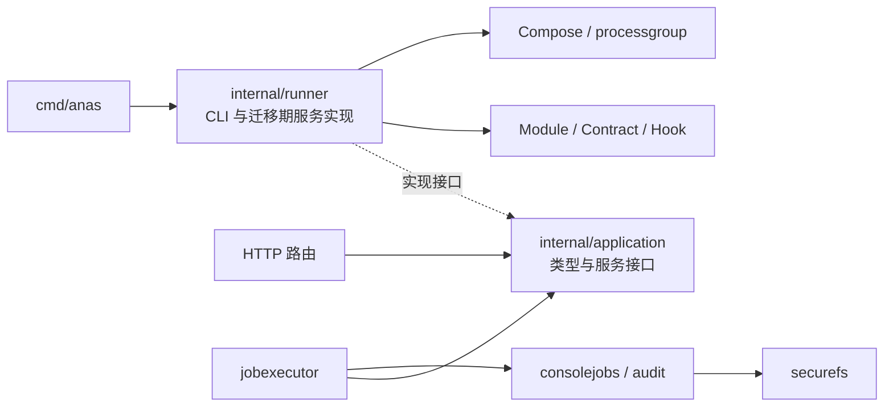

# GPT‑6 / GPT‑5.6 混用配置与项目质量评估

## 1. 结论与范围

**保留并整理根目录 `AGENTS.md`，两代模型共用一份项目约束；先修执行边界和验证门禁，再逐步拆分 Runner。没有必要因升级 GPT‑6 删除项目规范，也没有必要重写现有架构。**

本报告按本次用户请求，合并官方建议核实、项目配置审查和代码质量评估，交付在 `docs/research/`；它是修改建议，不是已批准的实施计划。后续实施仍由配套需求矩阵与计划驱动。

审查基线为 2026-09-05 本地工作树，HEAD `455770b`（`feat(console): complete M5 release and pagination`）。审查时已有约 220 条 Git 状态记录，含修改、删除和未跟踪文件；结论覆盖这些工作树内容，不能等同于 master 或已发布版本。没有修改现有实现、Agent 配置或需求状态，也没有提交、合并或操作远端服务。

检查覆盖：项目与本机指令入口、需求/计划索引、文档规范与主要架构文档、CI、Go 包结构、HTTP 权限与任务执行路径、Compose/进程环境/恢复路径、compute 共享客户端、持久存储安全抽象、代表性 Module 和 Vue 控制台。属于广度扫描加重点调用链审查，未逐行审完所有代码；没有重新执行 Docker、KVM/Incus 和远端浏览器 E2E，也没有重新扫描依赖漏洞。

## 2. OpenAI 到底建议什么

GPT‑6 官方指南指出模型对 skills、`AGENTS.md` 等文件里的指令更敏感，建议审计会影响其行为的内容，并明确继续执行、澄清、输出与验证边界；页面没有要求统一删除这些文件。[GPT‑6 官方指南](https://developers.openai.com/api/docs/guides/latest-model#instruction-following)

Codex 官方文档仍明确支持 `AGENTS.md`，并说明全局、项目和子目录的加载顺序。`AGENTS.override.md` 会优先于同目录 `AGENTS.md`；空文件会跳过。标准入口是复数大写的 `AGENTS.md`，`agent.md` 等其他名称需要配置为 fallback 才参与该发现机制。[AGENTS.md 官方文档](https://learn.chatgpt.com/docs/agent-configuration/agents-md)

GPT‑5.6 同样建议减少重复指令、示例和工具说明，并用代表性任务验证效果。因此，“一份精确的项目规则”适合本项目的混用方式。[GPT‑5.6 官方指南](https://developers.openai.com/api/docs/guides/latest-model?model=gpt-5.6#prompting-best-practices)

以下配置组织与工程整改方案是针对 ANAS 的判断，不是 OpenAI 对所有项目的强制要求。

## 3. Agent 配置审查与修改方案

### 3.1 实际发现

| 配置面 | 当前情况 | 建议 |
| --- | --- | --- |
| 根 `AGENTS.md` | 39 行、3274 字节；包含执行授权、提交合并、回复、需求与计划、文档同步规则 | 保留。体量本身不大，重点解决歧义和组织位置 |
| 项目 `.codex/`、`.agents/` | 当前工作树不存在 | 无需为了混用模型新建规则体系 |
| 项目子目录指令/skills | 常规文件扫描未发现额外 `AGENTS*`、`SKILL.md` 或 Copilot/Cursor 指令；忽略的 `.claude/worktrees/` 不作为当前项目入口审计 | 不需要批量删除，也不建议预先给每个目录复制规则 |
| 本机全局 `~/.codex/AGENTS.md` | 空白；未发现全局 override | 可保留；删除空文件没有实质收益 |
| 本机 Codex 配置 | 抽取到 `model = "gpt-6-astra"`、`model_reasoning_effort = "high"`、`personality = "pragmatic"`；未见指定额外指令文件的所查配置键 | 模型/思考强度留在运行配置。工作树规则不随切换模型改写 |
| `.claude/settings.local.json` | 已被 Git 忽略；有宽泛 `Bash(ssh *)` 本地许可及一条历史 grep 许可 | 属于 Claude 本机权限，不是 Codex 提示词。若仍使用 Claude，按实际测试入口收窄 SSH 许可；不作为 GPT‑6 迁移前置条件 |
| 插件提供的 skills | 本会话由应用提供；没有仓库自建技能集合 | 本次读取了 OpenAI Docs 技能，未全面审计所有已安装插件内容；不建议手改插件缓存 |
| `dev-docs/*/ai-agent.md` 与编排架构文档 | ANAS 将来产品功能的需求/设计，当前为提案 | 保留，与指导本次编码的 `AGENTS.md` 分开理解；不能当作当前编排器已实现 |

本机信息仅检查与行为有关的设置，未把令牌、连接凭据或完整个人配置复制进报告。桌面应用注入的指令、当前任务设置和用户消息也会影响实际行为，不能仅凭一个 TOML 默认值推断所有任务的生效配置。

### 3.2 根规则应具体怎样改

1. **保留项目特有约束。** 研究报告位置、需求 ID、计划进度、生成索引、功能与文档同步、复用已有实现，都直接影响交付正确性。
2. **缩窄“有不确定就确认”。** 改成：明确指令直接执行；可逆的实现细节自行判断；涉及产品范围、外部副作用或重大取舍才提问，且先完成不依赖答案的工作。用户只要审查/方案时，交付方案，不自动落实代码修改。
3. **保留现有“git 提交后合入 master”约定，同时明确提交范围。** 只提交当前任务相关改动；如果工作分支夹带其他任务提交，先说明范围问题，不把整条混合分支当作本任务。这是收窄歧义，不是取消既有授权。
4. **区分最终答复与过程更新。** 当前“每次响应都加下一步”容易使进度更新机械重复。建议只要求最终答复有“下一步”；这是对现有表达偏好的建议变更，尚未应用。
5. **把工程流程移出 `Response style` 小节。** 需求/计划/索引生成规则目前放在回复风格标题下，应有独立小节；`module`/`anas` 同步规则使用准确路径 `modules/`、`cmd/`、`internal/`、`web/`。
6. **补上验证选择与停止规则。** 运行影响范围内的检查和既有强制门禁；通过后没有新证据就不重复扩大全量验证。报告必须区分通过、失败、未运行、环境阻塞；历史报告不能代替当前证据。

建议改稿如下，仅用于评审，尚未替换真实文件：

```markdown
# Repository instructions

## Scope and execution

- Execute clear implementation requests directly. Resolve routine, reversible
  implementation details using repository conventions. Ask only when missing
  information materially changes scope, product behavior, or external effects;
  complete independent authorized work first.
- For review or proposal requests, deliver findings and recommendations without
  applying implementation changes unless requested.
- Preserve unrelated working-tree changes. When the user explicitly requests
  "git 提交", commit this task's changes and merge its working branch into master.
  If the branch includes unrelated work, explain the scope conflict first.
- Prefer existing repository abstractions. Explain any new dependency.

## Requirements and documentation

- Deliver research reports under docs/research/ as Markdown unless another
  format is explicitly requested.
- Read dev-docs/requirements/index.md and dev-docs/plans/index.md before opening
  documents under them. Follow the relevant topic plan for implementation;
  acceptance criteria belong to the paired requirement matrix with stable IDs.
- Keep milestone checklists and blockers current. After changing requirements,
  milestone status, or document membership, regenerate the affected indexes with
  npm run docs:requirement-status and npm run docs:plan-status.
  Validate with docs:check-requirements, docs:check-requirement-status,
  and docs:check-plan-status as applicable.
- Changes to modules/, cmd/, internal/, or web/ that affect behavior must update
  the relevant documentation in the same change. Follow the documentation
  standard for source generation and bilingual pages; edit generator inputs,
  not generated mirrors.

## Verification and review

- Run relevant tests and required repository gates. Once they pass, repeat or
  broaden validation only when changes, failures, or unresolved risks justify it.
- Verify old review findings against current call paths. Distinguish observed
  defects, design debt, and unverified hypotheses. Report checks that failed or
  were not run; do not infer real-host acceptance from unit tests.
- Keep research and proposed architecture separate from implemented behavior.

## Responses

- Default to concise Chinese answers, leading with the result. Include material
  findings, verification limits, and outstanding agreed work.
- End final responses with a concise "下一步"; if no action is needed, say so.
```

这份改稿的目标是减少行为歧义，不以行数或 token 降幅作为成功指标。不要再把同一组规则复制到两份模型专用文件，也不需要把整篇架构文档塞进根指令。

### 3.3 GPT‑6 / 5.6 混用的验收方式

模型由任务设置选择；项目规则、需求 ID、测试入口和权限边界保持一致。先保持现有合理的思考强度，使用相同起点、相同任务、相同检查对比，再决定是否调整。用户尚未指定 GPT‑5.6 的具体档位，不能把 Sol/Terra/Luna 的效果视为相同；测试记录写明实际模型名。

| 回归任务 | 应观察的行为 |
| --- | --- |
| 只请求代码审查 | 有当前代码证据、严重度与建议，不修改业务实现 |
| 明确的小修复 | 不先要求确认方案；完成相应测试和文档 |
| 修改生成的 Module 文档 | 找到源文件，更新生成结果及中英文，不手改镜像 |
| 改需求与里程碑 | 保持稳定 ID，更新计划和生成状态，检查通过 |
| 工作树已有他人修改 | 保留无关修改，报告准确的任务范围 |
| 必须依赖真实 Incus 宿主的验收 | 如实报告未验证项，不把单测当 E2E，也不阻塞独立工作 |

上述是拟执行的模型行为回归，不是本次已经跑过的双模型 benchmark。不建议仅为本轮审查增加 Agent SDK、框架依赖或新的自动编排系统。

## 4. 文档评价

**文档覆盖面和生成机制较好，主要问题是同一状态重复维护后发生矛盾，以及已有门禁只检查了其中一层。** 需求与计划分开、稳定 ID、双语生成器、时点审计、明确标注提案，这些机制值得保留。

| 编号 / 优先级 | 当前证据 | 修改意见与完成判据 |
| --- | --- | --- |
| D1 / P2 | `docs:check-requirement-status` 实测失败；`dev-docs/requirements/index.md` 的升级测试是 `13/29`，源文档计算为 `13/30` | 由负责该功能的修改同步运行生成器，提交源矩阵与索引；检查必须通过，不手改数字 |
| D2 / P2 | `dev-docs/plans/incus-module.md:17` 称仅剩宿主 E2E 与 M8，但表格还有 M10/M10bis/M10ter/M11/M12/M13；M4/M5 表格已完成，正文 `:97`、`:114` 却写未开始 | 以里程碑表为状态来源，正文标题不重复写状态；概述列出全部剩余范围。当前写法会让 Agent 错误重做 M4/M5 或漏掉宿主供给 |
| D3 / P2 | `dev-docs/plans/index.md` 把 `ai-agent.md` 提案放在“已归档”表中，但 `docs:check-plan-status` 仍通过 | 移回活跃表；校验章节、链接路径与状态三者一致，增加错放提案的负例 |
| D4 / P3 | 条件依赖、无序依赖、Vikunja 需求分别为 19/19、15/15、28/28，而计划仍 implementing | 复核全部里程碑后归档；Module 的 developing→release 要单独检查发布条件，不能仅因文档数字满格自动升级 |
| D5 / P2 | `docs/developer/repository-layout.md:5` 仍把 anasd 概括为 M1A；实际包含持久任务、写操作与维护路由 | 更新为当前职责；保留 application 是接口/用例边界、runner 仍承载迁移期实现的真实说明 |
| D6 / P2 | 旧综合审计把 `CheckCompensation` 当空操作，也把若干 CLI-only 的裸命令算作 daemon 缺陷；旧报告还出现 P4—P8 的不一致分级 | 保留历史快照，追加指向本次复核的勘误；统一 P1/P2/P3 为严重度，F1/F2 等仅作编号，不直接照旧报告批量修代码 |

不要继续通过增加更多说明段落解决状态矛盾。优先删除重复状态、补语义检查，并把“当前可用”“设计已定但未实现”“外部资源未验证”分清。现有 AI Agent 设计虽较长，但开头清楚标注提案，这是优点；后续可按权限、执行、排程拆分稳定主题，保持一个入口和交叉链接。

## 5. 架构与代码结构评价

**当前适合继续采用模块化单体。** Go Core 负责声明、调度和事务，Module 承担产品集成，Contract 表达跨 Module 语义；HTTP 与 CLI 经共享类型边界调用同一实现。这个方向合理，当前问题主要是迁移未完成和少数边界依赖运行时标志。



图中省略启动时工厂装配；HTTP 和 executor 通过注入的服务调用实现，不应直接 import runner。

值得保留的实现：

- `internal/application/layering_test.go` 将依赖方向变成测试；`cmd/anasd/subprocess_inventory_test.go` 将新增裸命令/继承环境的调用点纳入审查。
- `securefs` 统一任务与审计存储的权限、属主、单链接、已打开描述符核验，修复不必在两份安全助手里重复。
- `computeclient` 共享实例操作、限定命令入口、固定服务端证书并通过 stdin 交付一次性数据；Provider 与消费者的私钥边界已有设计和测试。
- HTTP 权限由 RoutePolicy 显式表达；持久任务有 FIFO、执行租约、终态和恢复状态；Vue 按 config/deployment/jobs/maintenance 等能力拆分。

需要逐步改善的结构：

| 位置 | 观察 | 建议 |
| --- | --- | --- |
| `internal/runner/` | `deployment.go` 2071 行、`manifest.go` 1657 行、`config_application.go` 1480 行；CLI、服务实现、文件状态和进程调度仍共处 | 先抽“进程执行上下文”和“恢复结果”两条真实边界，再逐主题迁移部署/配置服务实现；不要只切文件或把全部复杂度搬到 application |
| `consolejobs/store.go`、`jobexecutor/executor.go` | 分别约 1496、926 行；状态持久化、校验、转换和多个操作分发需要一起理解 | 保持一个状态机事实源；按 admission、transition、recovery、event storage 拆职责，避免每种操作另造任务框架 |
| `restrictedProcessEnvironment` 等标志 | 安全差异由 bool 分支选择；inventory 测试验证调用点清单，不证明每条请求都设置了正确标志 | 用构造器要求显式传入不可省略的执行上下文；daemon 与 CLI 的差异在装配处确定，增加代表性 HTTP→子进程行为测试 |
| 镜像共享代码 | `images.json.shared_paths`、`modules.json.shared_contexts`、Dockerfile COPY 和 Compose context 要保持一致 | 实施现有 Incus R-038 校验，至少检查路径存在、重建/版本触发和实际 COPY 的关键对应关系；不要新增第二份共享目录清单 |
| Vue 控制台 | App 同时管理认证流程、语言、导航和会话，多个页面约 400 行；现有 59 项前端测试主要覆盖 API/模型层 | 先补现有浏览器 fixture 的关键流程，再按实际重复提取会话/任务订阅逻辑；目前不需要引入新的全局状态库 |

文件行数仅是维护热点线索，不代表文件越长就越差。应以依赖方向、故障注入可行性、变更所需共同修改的文件数判断重构收益。

## 6. 代码问题与优先级

### C1 / P1：恢复失败后仍可能确认补偿完成（已复现）

准确调用链：

```text
jobexecutor.finishCanceled
  → deploymentFactory(..., NopEventSink{})
  → CheckCompensation
  → acquireRuntimeLockWithRecovery
  → compensateContainerTransactionsWithOptions
       恢复失败：warning + continue，函数无 error 返回值
  → CheckCompensation 返回 nil
  → AcknowledgeCompensation 清除 NeedsCompensationCheck
```

证据：`internal/jobexecutor/executor.go:524`、`:529`、`:533`；`internal/runner/deployment_application.go:560`；`internal/runner/deployment.go:1854`；`internal/runner/backup_txn.go:160`、`:184`；`internal/consolejobs/store.go:907`。

**不能说它“仅空转加锁”**：锁获取确实调用配置、快照、容器和凭据恢复。问题是容器恢复保留了 CLI 的 best-effort 行为，错误不返回；取消后的检查又使用 NopEventSink，连该 warning 也不进入任务事件。未恢复事务仍在磁盘上，而队列的补偿阻塞标记可能已经清除，服务可能仍未启动。

本次用 Go overlay 在 `/tmp` 注入测试，不改仓库测试源：创建 stopped 容器事务，让 fake Docker/Compose 固定失败，调用真实 daemon 模式 `CheckCompensation`。实测返回 nil，同时未完成事务仍存在。测试名 `TestAuditCompensationFailureStillReturnsSuccess`；它通过表示成功复现缺陷，不表示实现正确。完整 HTTP 取消→队列放行链未做端到端复现，后半段由上述代码确认。

建议：复用原恢复实现，让它返回结构化结果或 error；CLI 如需 best-effort，在 CLI 适配层明确处理。daemon 补偿检查必须在未完成恢复时保留标记，并持久化安全的恢复事件。快照清理的 warning-only 路径也要区分“可延后垃圾清理”和“阻止继续变更的恢复失败”。不要另建补偿扫描器，也不能只把日志名称改好看。

验证：故障注入覆盖恢复失败、成功、超时、事务不可读；失败保持标记并阻止后续危险任务，成功才清除；重复重启恢复保持幂等。对齐 `CONSOLE-R-025`、`CONSOLE-R-057` 与现有 Compose 恢复需求。

### C2 / P1：Docker ownership 检查与实际调用缺少统一 endpoint（静态证据）

`internal/runner/compose_scope.go:90` 的 ownership 检查使用 `a.commandEnvironment(nil)`，`:62` 的实际 Compose 使用 `a.commandEnvironment(env)`；`process_environment.go` 只禁止 workspace 覆盖 PATH/HOME/LANG，其余键仍会加入。CLI 一侧也分别从父环境与合并后的 Module 环境取值，执行边界没有冻结唯一 endpoint。

当部署环境带有 Docker endpoint 选择变量时，两次调用可能选到不同 daemon；检查 A、变更 B 会削弱 owner guard 的保证。这是已有 `COMPOSE-R-003`—`R-009` 所针对的缺口。本次没有构造用户配置到双 daemon 的完整复现，因此不将其表述为已证实的远程越权漏洞。

建议直接推进现有 Compose M1：顶层解析一次 endpoint，ownership、查询、Compose、恢复均显式使用它；部署业务变量不能覆盖 endpoint。保留默认 Docker context、rootless 和非 Unix endpoint 语义，不硬编码系统 socket。通过 fake Docker 记录每次调用的 endpoint，覆盖 CLI 与 daemon 两个入口。

### C3 / P2：前端验证没有进入 PR/master 常规 CI

`.github/workflows/ci.yml` 只有 Go、文档、Shell 和漏洞扫描；前端的安装与完整构建位于 `anas-release.yml:150` 的 web job，该 workflow 由发布分支/手动入口触发。普通 PR 或直接合入 master 可以没有 Vue 类型检查、Vitest 和前端构建结果。

本次把 OpenAPI 生成到临时文件后比较，当前 `schema.d.ts` **一致**，旧审计的“当前类型过期”已不适用；但一致性门禁仍缺。两次构建结果相同的 reproducibility test 也不等价于“提交的源与生成类型一致”。

建议在常规 CI 增加 web job：`npm --prefix web ci`、测试、类型检查、API 生成结果比较和构建。复用现有脚本；生成前后比较只针对目标文件，不拿整个已有脏工作树判失败。发布流程保留产物可复现性检查。

### C4 / P2：共享构建声明缺少完整的一致性校验

这是仓库结构文档已明确承认、Incus M8/R-038 已登记的债务。共享库代码修改必须同时触发消费者镜像重建和 Module 发布版本判断；当前多个声明由人维护，写错路径可导致使用旧产物。

建议先实现路径存在和关键映射检查，再通过“只改 internal/computeclient”的 fixture 验证 Forgejo/Incus 的重建集合；缺路径、漏 shared context 必须失败。无需替换现有镜像 CI 架构。

### C5 / P2：首因与恢复失败的诊断信息仍需结构化

普通 Compose 路径多返回进程退出错误，daemon 变更路径又有意丢弃输出。安全动机合理，但当前错误很难区分拉取失败、启动失败、候选停止失败和恢复失败。现有 Compose M2/M3 已给出方向，应在同一主题内落实。

保留敏感 quiet 路径的输出丢弃；普通路径保存有界安全摘要，分别记录 primary 与 recovery。不要为排障把凭据环境或完整子进程输出写进任务/审计。

### C6 / P3：补少量高价值测试与仓库卫生项

- `modules/lego/hook`、`internal/deploymentaudit` 没有包内测试文件；前者增加参数解析、DNS Provider 选择和敏感值边界，后者增加审计拒绝时不提交任务状态的行为测试。缺少包内测试不等于完全无间接覆盖，不以测试数量作为完成标准。
- 根目录未跟踪 `actions-controller` 构建产物尚未忽略。统一输出到已忽略的 `.bin/`，或添加精确根路径忽略规则，防误提交。
- 漏洞扫描 job 明确 `continue-on-error: true`，所以它是报告项而非阻断门禁。是否升级为门禁需约定漏洞处置规则，本次不宣称依赖安全或存在已知漏洞。

## 7. 本次验证结果与旧审计勘误

| 检查 | 结果 |
| --- | --- |
| `go test ./...` | 通过；部分包使用缓存，runner 本次执行约 48 秒 |
| `go vet ./...` | 通过 |
| `npm --prefix web test` | 17 个测试文件、59 项通过 |
| `npm --prefix web run typecheck` | 主工程和 emergency 工程通过 |
| `npm run docs:check-requirements` | 通过：15 份活动文档、495 项需求；另校验 5 个归档主题；3 个用例主题、30 个活动用例有效 |
| `npm run docs:check-requirement-status` | 失败：升级测试索引 13/29，应为 13/30 |
| `npm run docs:check-plan-status` | 通过：22 份计划；但没有发现 AI 提案错放归档区的语义问题 |
| `npm run docs:check-status` | 通过：69 份文档状态声明有效 |
| Module/Contract 生成器 `--check` | 均通过 |
| `npm run docs:build` | 通过，包含本报告与中英文索引；VitePress 有超过 500 kB 的 chunk 提示，非构建失败 |
| OpenAPI 临时生成结果与 `schema.d.ts` 比较 | 一致；没有重写真实生成文件 |
| overlay 恢复失败探针 | 成功复现 C1 的错误成功返回值；仓库实现未改 |
| Docker / Incus / 远端浏览器 / 漏洞扫描 | 本轮未执行；不引用旧报告的通过结论冒充当前结果 |

旧审计需保留的结论：前端 CI 缺口、计划误归档、构建产物、lego 专属测试缺口和 Incus 宿主验收欠缺。需纠正的结论：当前 API 类型并未过期；CheckCompensation 有恢复副作用；不少裸命令是 CLI-only，不能按全文搜索结果判定 daemon 取消失效。应保留现有 subprocess inventory，再补行为测试，不把全部 `exec.Command` 机械替换。

## 8. 建议修改顺序

| 批次 | 工作范围 | 复用的跟踪入口 | 完成证据 |
| --- | --- | --- | --- |
| 第一批：指令和事实整理 | AGENTS 改稿；D1/D2/D3/D5；已完成计划复核；构建产物忽略 | Agent 规则整理若单独实施，先建立对应需求/计划；其他项回到原主题 | 规则无模型分叉；文档门禁通过；两代模型代表任务行为一致 |
| 第二批：执行正确性 | C1、C2、C5；补偿失败不得被当成功 | Compose 执行边界计划；关联 CONSOLE-R-025/057；必要时在原矩阵新增稳定 ID | 恢复失败、超时、主因/补偿多重失败、双 endpoint 注入测试通过 |
| 第三批：合入门禁 | C3、C4；补有限的行为测试 | Web 已归档主题如补实现，应明确追加/重开里程碑；Incus M8/R-038 | PR/master 获得前端检查；共享库变更触发正确重建和版本判断 |
| 第四批：渐进重构与真实验收 | 抽执行上下文/恢复结果，再迁移 Runner 服务；Incus/Forgejo 真机闭环 | 现有 Incus、Forgejo、Module command 计划 | 对外契约不变、CLI/HTTP 行为一致；真实宿主隔离和生命周期证据齐全 |

第一批可与执行缺陷修复分别推进，不应等完整文档整理结束才处理 P1。暂不建议新增微服务、替换任务持久化方案、引入新的 Agent 框架或提前实现全部 AI 编排提案；这些都会扩大范围，却不能直接解决本次已确认的问题。

下一步：先审阅 AGENTS 改稿与分批范围；确认进入实施后按原需求/计划逐项落实，本次尚未替换配置或修复代码。
