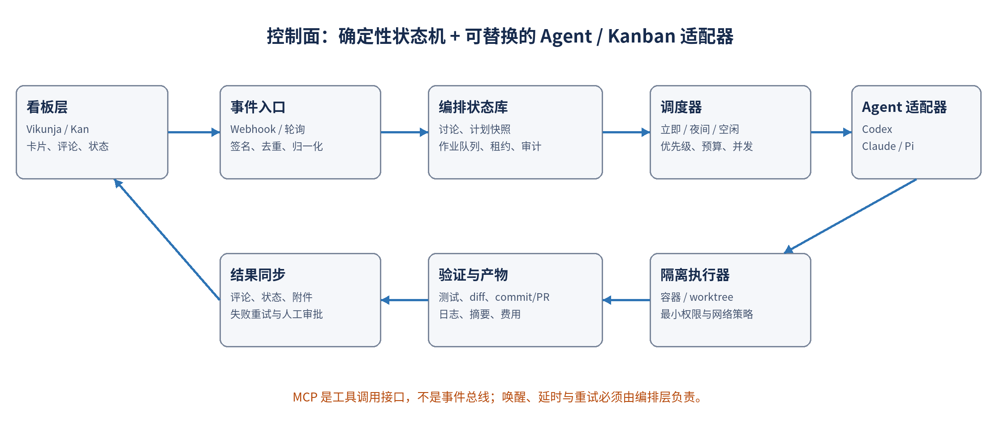

> 技术研究报告

# 看板应用接入 Codex、Claude Code 与 Pi Agent

*从“主题讨论”到“夜间 / 空闲时自动实现”的事件驱动架构、选型与落地路线*

- **决策对象：** ANAS 历史 Kanban 候选及其 AI Agent 接入方式
- **基线：** [自托管开源 Kanban 研究](self-hosted-open-source-kanban-research.md)（证据截至 2026-08-13）
- **事实截点：** 2026-08-15；上游动态能力在实施前仍需按锁定版本复核
- **目标场景：** 新卡片发布主题 → AI 参与讨论 → 形成计划 → 人工或策略批准 → 夜间 / 空闲执行 → 结果回写

> **一句话结论：** 生产落地优先“Vikunja + 编排服务 + Codex SDK/App Server”；最快 AI 原型可用“Kan + 原生 MCP + 轮询/补充事件桥”；Scrumboy 同时具备 HTTP MCP 与 webhook，但项目过新，只适合实验。

## 1. 执行摘要

- 看板层首选 Vikunja：它的 task.created、task.comment.created 等 webhook 能直接覆盖“新卡片”和“讨论回复”，支持 HMAC-SHA256 签名；REST/OpenAPI 和 API token 适合做确定性回写。
- Kan 是最快的 AI 读写 PoC：官方 MCP 暴露 46 个工具，覆盖卡片、评论、清单、标签与成员；但 MCP 不会主动唤醒 Agent，当前公开上游仍把 Integrations 标为 coming soon，因此事件触发需轮询、数据库 outbox 补丁或自建事件桥。
- Agent 层首选 Codex：App Server 为产品内深度交互提供线程、流式事件、审批与认证；SDK 适合后台作业；codex exec --json 适合第一阶段的一次性任务。Go 编排服务可直接以 stdio JSONL/JSON-RPC 驱动 App Server。
- Claude Agent SDK 是成熟的同级备选：Python/TypeScript SDK 具备会话续接、流式消息、MCP、权限回调与 hooks；生产托管仍需要把每个 Agent 当作有本地状态的长进程，并在容器中隔离。
- Pi 最适合低成本、多模型与强扩展实验：同一包提供 SDK 和 JSONL RPC，能切换多家模型并通过 TypeScript extension 增加工具；但治理、审批和系统级隔离需要宿主自行补齐。
- 关键设计原则：讨论结束与执行授权应由显式状态/标签控制，Agent 只提出建议；调度器决定何时运行。MCP 是工具面，不是事件总线，也不是可靠队列。

## 2. 场景拆解与评价口径

目标不是简单地让 AI 能“看到卡片”，而是把协作讨论、计划审批、延时调度、代码执行和结果审计组成一条可恢复的业务流程。为了避免把产品能力混在一起，本报告分成三层评价：

1. 看板适配层：是否能可靠收到卡片/评论事件，是否能读写评论、状态、标签、附件，是否支持最小权限服务账号。
1. 编排层：是否有持久状态、延时队列、租约、幂等、预算、取消、审批和失败重试；该层必须由 ANAS 自己掌控。
1. Agent 运行层：是否支持线程/会话、流式事件、结构化结果、工具权限、沙箱、暂停/取消、成本观测和在不同语言中嵌入。

> **范围说明：** 本文把“新卡片”视为主题入口，把“评论”视为讨论媒介，把“Ready for plan / Approved”视为可审计的控制点。所谓“空闲时”由主机策略判定，不由语言模型自行判断。

## 3. 哪个 Kanban 更好接入

| 候选 | 事件触发 | AI 读写接口 | 当前判断 |
| --- | --- | --- | --- |
| Vikunja | 原生项目/用户 webhook；卡片、评论、附件事件；HMAC 签名 | REST/OpenAPI v1/v2；API token；n8n | 生产首选：事件完整、成熟、ANAS 适配高 |
| Kan | 未见稳定公开 webhook 契约；需轮询或补丁 | 官方 @kan/mcp，46 tools；卡片/评论/清单完整 | 最快 AI PoC；事件面是主要缺口 |
| Scrumboy | Full 模式 outbound webhook；签名、重试、事件 id | 原生 Streamable HTTP MCP + token/OAuth | 接口最贴场景，但 2026 年新项目，仅实验 |
| Wekan | 成熟 integrations/webhook 路径，需锁版验证事件粒度 | REST 覆盖 card/comment/checklist | 成熟但 MongoDB/Meteor 运维较重 |
| Nextcloud Deck | 可借助活动/轮询；缺少与本场景同等清晰的事件契约 | OCS REST；复用 Nextcloud 身份与文件 | 现有 Nextcloud 的最低运维选择 |
| Kaneo | 公开 OpenAPI 强，事件面需专项验证 | OpenAPI API；无等价官方 MCP 证据 | 年轻、可 PoC，不是首个自动化基座 |
| Kanboard | Webhook/自动动作 + JSON-RPC | 成熟 JSON-RPC；MCP 多依赖第三方 | 低资源、可控，但 maintenance mode |

### 3.1 生产优先：Vikunja

Vikunja 的优势不是“AI 功能最多”，而是事件和数据契约最适合做可靠编排。项目 webhook 可以订阅 task.created、task.updated、task.comment.created、附件与关系事件；payload 带 event_name、time 与完整对象，接收端可以在解析前验证 X-Vikunja-Signature。API token 用 Bearer 方式访问；从 2.4.0 起 v2 使用标准 REST verbs 和 OpenAPI 3.1。

- 优点：无需让模型决定如何调用看板；编排服务可用确定性 HTTP 客户端完成拉取、状态更新和评论回写。
- 缺点：webhook 失败不重试，因此接收端必须快速落库后返回 2xx，并用周期性对账弥补事件丢失。
- 建议：用单独 bot/API token，限定目标项目；事件桥执行签名校验、去重和 origin 过滤。

### 3.2 原型最快：Kan

Kan 的官方 MCP 可以直接让 Codex、Claude 或其他 MCP client 获取完整卡片详情（含评论与清单），并创建/移动卡片、添加评论、设置截止日期、标签和成员。对于“让 AI 参与卡片讨论”，它的工具覆盖面几乎不需要再写业务适配。

- 优点：AI 工具面最短；从首个 PoC 到能读写评论通常只需配置 KAN_BASE_URL 与 KAN_API_TOKEN。
- 缺点：官方 MCP 是 stdio 工具服务器，本身不会监听卡片变化，也不负责延时调度；上游 README 仍把通用 Integrations 标为 coming soon。
- 建议：PoC 用 30–60 秒增量轮询；生产前若仍无 webhook，优先向上游贡献 outbox/webhook，不要监听应用数据库表或依赖 UI 自动化。

### 3.3 契约最完整但过新：Scrumboy

Scrumboy 当前同时提供项目 webhook、HMAC 签名、失败重试、事件 id，以及标准 Streamable HTTP MCP（/mcp/rpc）和 token/OAuth。接口形态与目标场景最接近，且 Go + SQLite 的部署面很小。问题是项目创建时间很短、社区与升级历史不足，不能因为“接口刚好”就越过生产成熟度门槛。建议作为同批实验基准，用来验证理想接口，而不是直接替代 Vikunja。

## 4. Agent 接入方式与选型

| Agent | 嵌入方式 | 会话/流式 | 权限与隔离 | 适合本项目 |
| --- | --- | --- | --- | --- |
| Codex | TS/Python SDK；App Server JSON-RPC；codex exec JSONL；MCP Server | 线程 start/resume/fork；增量 item/turn 事件；可 interrupt | 内置 sandbox preset、命令/文件/MCP 审批；仍建议容器隔离 | 首选。Go 可直接驱动 App Server stdio；后台用 SDK/exec |
| Claude | Python/TS Agent SDK；claude -p stream-json | session resume/fork；部分消息与工具流；可中断 | allow/deny、dontAsk/plan/acceptEdits、canUseTool/hooks；容器隔离是生产要求 | 同级备选。SDK 完整，第三方产品默认用 API key |
| Pi | TS SDK；pi --mode rpc JSONL；print/json | AgentSession + 事件订阅；持久 session；steer/followUp | 工具 allowlist/exclude 与 extensions；系统级沙箱/审批需宿主补齐 | 多模型和本地实验最佳；治理工作最多 |

### 4.1 Codex：推荐的第一实现

OpenAI 官方把不同入口的边界划分得很清楚：SDK 用于 CI/CD、内部工具和自动化；App Server 用于产品内深度集成，包含认证、会话历史、审批和流式 Agent 事件；codex exec 用于脚本、CI 与定时任务。对 ANAS 而言，最稳妥的演进方式是先 exec、后 App Server，而不是第一天就实现完整 UI 协议。

| 路径 | 推荐阶段 | 用途 | 注意事项 |
| --- | --- | --- | --- |
| codex exec --json | PoC | 单卡片一次性规划/实现；JSONL 事件落库 | 默认只读；写入显式 workspace-write；API key 只注入单次进程 |
| Codex SDK | MVP/生产 | 后台 worker；启动/续接线程；结构化封装 | TS 需 Node 18+；Python SDK 通过本地 App Server JSON-RPC |
| codex app-server | 深度 UI | 卡片讨论映射为线程/turn；审批、steer、interrupt、事件流 | 生产用 stdio/Unix socket；公开 WebSocket 仍属 experimental/unsupported |
| Codex as MCP | 多 Agent 编排 | 把 Codex 作为代码专家交给更上层 Agent 调用 | 适合多专家工作流，不替代作业队列 |

```text
// Go 编排服务侧的概念协议（省略错误处理）
spawn: codex app-server --listen stdio://
send:  {"method":"initialize", ...}
send:  {"method":"thread/start", "params":{"cwd":"/work/job-42","sandbox":"workspaceWrite"}}
send:  {"method":"turn/start", "params":{"threadId":"...","input":[{"type":"text","text":"执行已批准计划"}]}}
recv:  item/*, turn/completed, approval requests
```

### 4.2 Claude Agent SDK：成熟备选

Claude Agent SDK 提供 Python/TypeScript 库，复用 Claude Code 的工具循环、会话管理、MCP 与 hooks。会话可以 continue、按 id resume 或 fork；流式输出可返回 text_delta 和工具调用事件。权限配置较细，但生产宿主仍需把每个 Agent 当作带本地工作目录和 session 文件的长进程。

- 推荐使用 permissionMode=dontAsk + 明确 allowedTools 做无人值守任务；对任何必须覆盖所有工具调用的策略，使用 PreToolUse hook。
- 多租户/多卡片必须隔离 cwd、设置源、会话目录与网络；官方托管指南明确建议容器沙箱、资源限制和 egress allowlist。
- 第三方产品不能默认把 claude.ai 登录或订阅额度提供给最终用户；应使用 Anthropic API key 或正式许可的企业路径。

### 4.3 Pi：模型中立与高可塑性

Pi 是极简 coding harness，当前上游/包名已迁移到 earendil-works/pi 与 @earendil-works/pi-coding-agent。它同时提供 AgentSession SDK 和严格 LF 分隔的 JSONL RPC，适合 Go 进程以子进程方式控制；SDK 能订阅事件、steer/followUp、持久化/恢复 session，并用 extension 注册新工具。

- 优势：OpenAI、Anthropic、Google、Bedrock 等模型可由同一适配器切换；自定义工具和资源加载最直接。
- 风险：默认只是 coding harness；工具 allowlist 不等于 OS 沙箱，也没有 Codex App Server 同等级的产品审批协议。必须用容器、只读挂载、网络白名单和外部审批补齐。
- 定位：第二个 AgentAdapter 实现，用于本地模型/多模型成本比较，不建议作为首个生产默认。

## 5. 推荐参考架构



*图 1  推荐架构：看板是协作界面，编排服务是控制面，Agent 只是可替换执行器。*

该架构刻意不让 Agent 直接拥有整个系统的控制权。看板适配器只负责确定性 I/O；Agent 在隔离工作区内讨论、规划或执行；编排状态库保存业务事实。即使更换 Codex/Claude/Pi，卡片状态机、延时队列和审计仍保持不变。

### 5.1 组件职责

| 组件 | 职责 | 建议实现 |
| --- | --- | --- |
| Kanban Adapter | 统一 card/comment/label/status API；订阅或轮询事件；过滤 bot 回写 | Vikunja REST + webhook 首实现；Kan MCP 作为第二实现 |
| Event Ingress | 验签、去重、快速持久化、事件归一化、对账游标 | Go HTTP 服务；PostgreSQL event inbox |
| Orchestrator | 讨论、计划、审批、队列、租约、取消、重试、预算 | 显式状态机；事务内写 job/outbox |
| Scheduler | 立即/夜间/空闲策略；优先级；并发和资源门槛 | 数据库延时队列起步；规模扩大再用专用工作流引擎 |
| Agent Adapter | start/resume/turn/interrupt；规范化事件、用量、结果 | Codex App Server/SDK 首实现；Claude/Pi 插件化 |
| Sandbox Runner | repo clone/worktree、权限、网络、测试、artifact | 每 job 独立容器或受控用户；只挂载目标 repo |
| Result Sync | 评论摘要、状态、附件、PR 链接；失败重试与补偿 | 事务 outbox + adapter；不在模型输出路径直接写卡片 |

## 6. 业务状态机：讨论、计划与执行必须分离

| 状态 | 进入条件 | 允许动作 | 退出条件 |
| --- | --- | --- | --- |
| DISCUSSING | 新卡片带 ai:discuss，或评论 @ai | AI 澄清、总结、提出选项；只读仓库/看板写评论 | 人类设置 ready-for-plan；不得靠静默超时自动授权 |
| PLANNING | 显式 ready-for-plan | 读取冻结的卡片快照，生成结构化计划、风险、验收标准 | 人类批准，或符合低风险自动批准策略 |
| QUEUED | 计划获批并绑定 repo/ref | 选择立即、not_before、夜间窗口或空闲策略 | 获得租约且资源门槛满足 |
| RUNNING | worker 租约成功 | 隔离 worktree 中修改、测试、记录事件；可暂停/取消 | 成功→REVIEW；失败→FAILED/RETRY |
| REVIEW | 生成 diff/commit/PR 与验证证据 | AI 自审 + 人工审查；只允许受控修订 | 接受→DONE；退回→QUEUED/PLANNING |
| DONE / FAILED | 终态 | 回写摘要、耗时、费用、产物链接；保留审计 | 新要求创建新 plan version，不篡改旧运行 |

> **重要：** “讨论结束”是业务授权点，不是模型的自然语言判断。推荐使用标签、按钮或移动到专门列；AI 可以建议结束讨论，但不能自行把高风险任务改为 Approved。

### 6.1 最小数据模型

| 实体 | 关键字段 | 目的 |
| --- | --- | --- |
| card_binding | provider, board_id, card_id, repo_url, default_branch | 把协作对象绑定到代码仓库 |
| discussion | agent, session_id, last_human_event_id, summary, status | 保持对话上下文但不把 transcript 当唯一事实 |
| plan_snapshot | version, card_snapshot_hash, commit_sha, steps_json, risk, approval | 不可变计划与授权证据 |
| job | not_before, policy, priority, lease_owner, lease_until, attempts | 可延时、可重试、避免重复执行 |
| run_event | seq, type, payload, redaction, created_at | 标准化不同 Agent 的流式事件和审计 |
| artifact | kind, uri, sha256, size, retention | diff、日志、测试、commit/PR、总结 |
| outbox/inbox | provider_event_id, idempotency_key, delivery_state | 弥补 webhook 至多一次、避免评论回写循环 |

## 7. 端到端接入流程

1. 用户创建卡片并标记 ai:discuss；Vikunja webhook（或 Kan 增量轮询）把标准化 card.created 事件写入 inbox。
1. 编排器创建 discussion，调用 AgentAdapter.start；Agent 只获得卡片快照、相关附件和只读代码上下文。
1. 每次人类评论触发新的 turn/resume；编排器将 AI 的最终答复回写为一条评论，细粒度 token/tool 事件只进运行日志。
1. 人类点击“形成计划”或移动到 Ready；系统冻结 card snapshot 与 repo commit SHA，要求 Agent 输出符合 JSON Schema 的 plan。
1. 审批后创建 job。立即执行直接可租赁；夜间策略写 not_before；空闲策略还需满足 CPU、内存、备份/升级锁和并发预算。
1. worker 在独立容器/worktree 执行；更新事件转成卡片上的低频进度摘要。任何需要额外权限的动作进入 approval_request。
1. 测试结束后生成 diff、commit/PR、验证摘要和费用；Result Sync 以 outbox 方式回写并移动到 Review。

### 7.1 建议的统一接口

```typescript
interface KanbanAdapter {
  watchEvents(cursor): AsyncIterable<NormalizedEvent>
  getCardSnapshot(cardRef): Promise<CardSnapshot>
  appendComment(cardRef, body, idempotencyKey): Promise<CommentRef>
  setWorkflowState(cardRef, state): Promise<void>
  attachArtifact(cardRef, artifact): Promise<void>
}

interface AgentAdapter {
  start(context, policy): Promise<SessionRef>
  resume(sessionRef, input): AsyncIterable<AgentEvent>
  run(planSnapshot, workspace, policy): AsyncIterable<AgentEvent>
  interrupt(runRef): Promise<void>
}
```

标准化 AgentEvent 至少包含 session.started、message.delta、tool.started/completed、file.changed、approval.requested/resolved、usage、run.completed/failed。供应商特有字段保存在 raw_payload，但控制面不得依赖它们才能完成恢复。

## 8. 夜间与空闲调度策略

Agent 自己不能安全地“决定今晚做什么”。排程是确定性资源治理问题，应由 scheduler 根据已批准计划、预算和主机状态选择作业。建议支持四种策略：

- manual：只入队，不自动租赁；适合高风险、数据库迁移和外部系统变更。
- immediate：审批后立即执行；适合文档、测试补充和明确的小修。
- window：在用户时区的固定窗口运行，例如 00:30–06:00；跨窗口未完成可继续或按策略暂停。
- idle：窗口内且主机负载、可用内存、磁盘、备份/升级锁、网络预算均满足时执行；不应只看 load average。

| 控制项 | 推荐默认 |
| --- | --- |
| 并发 | 每主机 1 个写任务；只读讨论可单独限流 |
| 租约 | 短租约 + heartbeat；worker 失联后可恢复，但提交前必须检查幂等 |
| 预算 | 每卡片 token/金额/最长墙钟时间；超过进入 Needs attention |
| 资源门槛 | CPU、内存、磁盘、温度/电源、备份/升级互斥锁；阈值可配置 |
| 取消 | 卡片移入 Cancelled 或人类命令触发 Agent interrupt + 进程树终止 |
| 公平性 | priority + aging，避免低优先级永久饿死 |

## 9. 安全与可靠性底线

| 风险 | 控制措施 |
| --- | --- |
| 卡片提示注入 | 把卡片/评论标记为不可信数据；系统提示禁止其扩大权限；危险工具需审批；禁止从评论直接拼接 shell。 |
| 服务 token 越权 | 每个看板项目/仓库单独 bot token；只授予必要读写；不把管理员 token 暴露给 Agent。 |
| 密钥泄漏 | API key 由 runner 注入单次进程；不写入卡片、日志或 repo；stdout/stderr 统一脱敏。 |
| 重复执行 | inbox 去重、job 租约、idempotency key、计划版本与 commit SHA；创建 PR/评论前做外部幂等检查。 |
| 事件丢失 | webhook 快速落库；Vikunja 失败不重试，因此必须周期性按 modified 时间/游标对账。 |
| AI 回写循环 | bot 评论带 origin/run_id 元数据；事件入口忽略自身回写；只响应显式 @ai 或状态变化。 |
| 跨任务污染 | 每 job 独立 worktree/session/cwd；不共享未审查的用户设置、插件、MCP 或凭据。 |
| 任意网络访问 | 默认 deny；通过 egress proxy 只允许模型 API、Git 与明确 MCP/依赖源；记录域名和批准。 |
| 不可审计 | 保存卡片快照 hash、计划版本、Agent/模型、权限、tool 事件、diff、测试、费用与审批者。 |

## 10. 分阶段落地建议

### 阶段 0：一周内验证闭环

- 部署/选择 Vikunja 测试项目；注册 task.created 与 task.comment.created webhook。
- Go 编排服务只做 inbox、discussion、job、outbox 四张表；接收后立即 202。
- Agent 首先使用 codex exec --json；只实现只读讨论、结构化计划和一个隔离写任务。
- 用标签 ai:discuss、ready-for-plan、approved、needs-review 驱动状态；不做隐式 NLP 状态判断。
- 验收：重复事件不重复评论；取消可终止；断电后 job 可恢复；最终有 diff、测试和回写摘要。

### 阶段 1：2–4 周形成可用 MVP

- 将 Codex 适配升级为 SDK 或 App Server stdio；保存 thread/session id，支持 steer、interrupt 和审批请求。
- 增加 window/idle 调度、预算、heartbeat、重试和周期对账；引入每 job 容器/worktree。
- 实现 KanAdapter 作为第二适配器：PoC 可轮询，若要生产则补稳定 webhook/outbox。
- 实现 Claude Agent Adapter 做 A/B；Pi 放在 feature flag 下验证本地/多模型。
- 建立 golden tasks：文档修改、单元测试补充、小型 bug、依赖升级、危险迁移五类，比较成功率、成本和人工介入。

### 阶段 2：生产治理

- 细化 RBAC、审批矩阵、网络出口、审计保留、配额、告警与灾难恢复。
- 只在低风险、可自动验证任务上开放自动批准；部署、删除、数据库迁移与 secrets 变更始终人工审批。
- 用实际 30–50 个任务数据评估 Kanban/Agent 组合，不以 Star、演示或单次成功做生产决策。

## 11. 最终决策

> **推荐组合 A（生产）：** Vikunja + Go Orchestrator + PostgreSQL inbox/job/outbox + Codex SDK/App Server + 每 job 容器/worktree。它在可靠事件、ANAS 部署/IAM、Agent 深度控制之间最平衡。

> **推荐组合 B（最快原型）：** Kan + @kan/mcp + codex exec/SDK + 30–60 秒轮询。它能最快演示“卡片里与 AI 讨论并回写”，但在获得可靠事件契约前不要宣称为生产自动化。

> **观察组合 C（实验）：** Scrumboy + HTTP MCP + webhook + 任一 Agent。接口最贴合，但成熟度不足；用它验证理想体验和协议，不承担首个生产实例。

**Agent 选择上，Codex 是本项目的默认首选；Claude Agent SDK 作为性能/成本/模型偏好的并列备选；Pi 作为模型中立与本地化实验层。无论选择哪一个，都通过 AgentAdapter 隔离供应商差异，避免把卡片状态机写进某个 SDK。**

## 12. PoC 验收清单

- [ ] 新卡片与新评论在 5 秒（webhook）或配置轮询周期内进入 inbox；签名错误拒绝。
- [ ] 同一事件重复投递 10 次只产生一次 discussion/评论副作用。
- [ ] AI bot 的回写不会再次触发自身；人类 @ai 可继续同一 session。
- [ ] 未经 ready-for-plan / approved 的任务不能写代码。
- [ ] 计划绑定 card snapshot hash 与 repo commit SHA；卡片变化后旧批准自动失效或要求确认。
- [ ] 夜间/空闲策略能在备份或升级锁存在时跳过，在窗口内恢复运行。
- [ ] Agent 只能写目标 worktree，不能读取宿主 secrets；出网被 allowlist 限制。
- [ ] 任务取消会调用 interrupt 并终止子进程树；状态最终一致。
- [ ] 失败重试不会创建重复 PR、commit 或评论；所有外部写操作带 idempotency key。
- [ ] 卡片最终得到摘要、测试结果、diff/PR、耗时、费用和人工待办，而不是完整 token 流。
- [ ] 重启编排器与 worker 后，可从数据库状态继续，无需依赖内存中的 SDK 对象。
- [ ] Codex/Claude/Pi 任一适配器替换时，看板状态机和历史数据无需迁移。

## 13. 主要证据来源

以下均为上游官方文档或官方仓库，访问/核对日期为 2026-08-15。动态接口应在实施时锁定版本并生成契约测试。

**[S1]** [OpenAI Codex SDK](https://learn.chatgpt.com/docs/codex-sdk) — SDK 用途、TS/Python 包、线程续接与 sandbox presets。

**[S2]** [OpenAI Codex App Server](https://learn.chatgpt.com/docs/app-server) — 产品嵌入、JSON-RPC/JSONL、线程/turn、事件、审批、认证与 WebSocket 限制。

**[S3]** [OpenAI Codex non-interactive mode](https://learn.chatgpt.com/docs/non-interactive-mode) — codex exec、JSONL、结构化输出、沙箱与自动化认证。

**[S4]** [Anthropic Claude Agent SDK overview](https://code.claude.com/docs/en/agent-sdk/overview) — Python/TypeScript SDK、MCP、会话、权限、hooks 与第三方认证限制。

**[S5]** [Claude Agent SDK sessions](https://code.claude.com/docs/en/agent-sdk/sessions) — continue/resume/fork、跨主机会话与 SessionStore。

**[S6]** [Claude Agent SDK permissions](https://code.claude.com/docs/en/agent-sdk/permissions) — allow/deny、dontAsk、plan、acceptEdits、callback 与 PreToolUse。

**[S7]** [Hosting the Claude Agent SDK](https://code.claude.com/docs/en/agent-sdk/hosting) — 子进程/本地状态、容器沙箱、资源和 egress 建议。

**[S8]** [Claude Code programmatic usage](https://code.claude.com/docs/en/headless) — claude -p、stream-json、structured output 与 bare mode。

**[S9]** [Pi SDK](https://github.com/earendil-works/pi/blob/main/packages/coding-agent/docs/sdk.md) — AgentSession、事件、工具、extensions、session 与嵌入方式。

**[S10]** [Pi RPC mode](https://github.com/earendil-works/pi/blob/main/packages/coding-agent/docs/rpc.md) — stdio JSONL、请求关联、streamingBehavior 与语言无关集成。

**[S11]** [Pi coding agent README](https://github.com/earendil-works/pi/blob/main/packages/coding-agent/README.md) — 当前包名、支持模型、四种模式与项目哲学。

**[S12]** [Kan official repository](https://github.com/kanbn/kan) — 评论、API key、OIDC、官方 @kan/mcp 与 46 个工具；Integrations 当前状态。

**[S13]** [Vikunja Webhooks API](https://vikunja.io/docs/webhooks/) — 事件 payload、HMAC 签名、认证、投递一次且不重试。

**[S14]** [Vikunja webhook events](https://vikunja.io/help/webhooks/) — task.created、task.comment.created 等事件清单。

**[S15]** [Vikunja API documentation](https://vikunja.io/docs/api-documentation/) — API token、v1/v2 与 OpenAPI。

**[S16]** [Vikunja OpenID](https://vikunja.io/docs/openid/) — 通用 OIDC 与身份声明。

**[S17]** [Scrumboy official repository](https://github.com/markrai/scrumboy) — outbound webhooks、HTTP MCP、OIDC、角色和当前成熟度证据。

**[S18]** [Wekan REST API](https://wekan.github.io/api/) — card、comment、checklist 与 integrations API。

**[S19]** [Kanboard official documentation](https://docs.kanboard.org/) — JSON-RPC、webhook、automatic actions 与插件机制。

## 附录 A：与历史 Kanban 研究的关系

历史报告以“开源、自部署、IAM、运维与一般 API 能力”为主轴，结论是 Vikunja 默认、Kan 现代纯看板、Deck 最低增量成本。本报告不推翻该结论，而是增加了“事件唤醒、对话线程、计划审批、延时队列、沙箱执行和结果回写”这组新需求。因此：

- Vikunja 因完整 webhook 事件而从“默认稳健方案”进一步成为本场景的生产首选。
- Kan 的原生 MCP 使其成为 AI 原型首选，但事件面缺口在新场景下权重更高。
- Scrumboy 的 webhook + HTTP MCP 方向值得跟踪，但成熟度硬门槛仍保留。
- Deck 的零新增服务优势仍成立，但如果目标是自主代码执行编排，专用事件/API 契约更重要。
