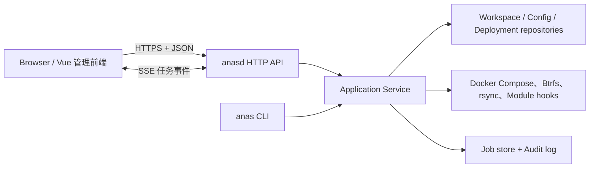

# ANAS Web API 与管理前端实施规划

日期：2026-08-16

状态（2026-08-19，基线提交 `3dea4cf`）：**M0 部分实施（只读开发骨架），M0.5/M0.6 已实施并完成边界加固**。仓库已完成共享应用层、`anasd`、首批 `/api/v1` 端点和 OpenAPI 契约；139 项内置配置参数也已补齐类型、输入/解析要求、默认来源和单字段约束，并让 set/import/plan/lock/apply、Hook 与 Secret Store 进入同一通用校验边界。它们用于验证架构与契约，尚不是可安装的生产管理面。认证、前端、任务系统、配置 HTTP API、写操作以及安装/发布集成仍未实现。本文除明确标注的 M0/M0.5/M0.6 范围外仍描述目标形态与实施顺序，不是操作指南。

## 0. 当前落地快照（2026-08-19）

| 范围 | 已完成 | 尚未完成 |
| --- | --- | --- |
| M0 只读骨架 | `internal/deployment`、`internal/application`、`internal/api/httpapi`、`cmd/anasd`、workspace registry、OpenAPI；health/system/status/deployment list/detail 共用类型化服务，不调用 CLI 子进程 | 认证、前端、SSE 任务、写操作、安装与 systemd 集成 |
| M0.5 元数据 | 17 个 global + 122 个 Module 参数全部显式声明类型；`unknown=0`；生成器、四份 Module 参数表和 release gate 共用 inventory | M3 配置 HTTP schema/表单投影 |
| M0.6 约束语义 | `input_required`、legacy `required`、`must_resolve` 三阶段语义；默认值存在性/来源；范围、长度、pattern、format；所有配置入口的统一规范化与校验 | 条件/跨字段规则继续由 resolver、plan 或 Hook 执行，不伪装成单字段 schema |

当前只读 `anasd` 只接受 registry 中的 workspace ID，HTTP DTO 不返回 workspace、deployment
或 Secret 的本机路径；daemon 启动和请求 Host 都限制为数值 loopback。生产目录
`cmd/anasd`、`internal/api/httpapi`、`internal/application`、`internal/deployment` 与
`internal/configschema` 不包含任何内置 Module 名称或 Module 分支。未来 M3 必须继续消费
统一 schema，不能破坏这个边界。

配置实现的当前精确基线：

- 139 项参数的类型分布为 `string: 79`、`bool: 22`、`int: 24`、`enum: 14`；
- `input_required`/CLI `required` 只有 `global.base_domain`、`global.email` 2 项，最终
  `must_resolve` 共 22 项；有静态默认值或无条件来源的参数不是 caller-input required；
- 11 项已声明且有运行证据的单字段约束包括 IANA timezone、language/locale、3 个 IPv4、
  3 个 `1..65535` 端口、`samba_dc.max_log_size >= 1` 和非空白 group pattern；schema 本身还
  支持 `min_length`/`max_length`；
- `config set`、import/reimport、`config plan`、deployment lock/plan/materialize 和 remote lock
  都使用同一声明、地址、类型和 constraints 校验；失败发生在持久化前并保持配置、摘要、
  Secret Store 与 lock 原子不变；
- 只有 Secret Store 的 `lifecycle_managed` 记录可以在私有视图中满足 caller input；所有
  kind 都只作为等值来源的脱敏 taint，不能经错误、list 或 plan 投影明文；
- calculate/render Hook 的 Env 与 Secret patch 先整包校验键、ownership、exports、碰撞和
  schema 再应用；Hook 只能刷新本 Module 已拥有的 `generated/module-hook` Secret。

该基线已经通过 `go test ./...`、关键包 `go test -race`、`go vet ./...`、参数 inventory/effect
脚本、`gen-module-docs --check`、VitePress 构建与版本测试、Module revision 检查，以及
Linux amd64/arm64 的静态 `anasd` 构建。后续里程碑不得把这些结果解释为 M1—M3 已完成。

## 1. 结论

建议新增独立守护进程 `anasd`，由它提供 `/api/v1` HTTP API、管理认证、异步任务、审计日志，并通过 `go:embed` 直接托管管理前端。现有 `anas` CLI 与 `anasd` 不应各自维护一套部署逻辑，而应逐步把 `internal/runner` 中的核心操作抽成带类型、`context.Context` 和事件回调的应用服务；CLI 和 HTTP 仅作为两种适配器。

第一阶段按“单机、单 workspace、单管理员”交付，但 API、任务模型和权限字段预留多 workspace 与多角色能力。首个可用版本先覆盖状态查看、模块启停、部署与配置预检，再接入快照、备份、管理员凭据等高风险功能。

不建议把正式架构做成 `anasd` 反复执行 `anas ... --json`：现有 JSON 契约很适合作为迁移时的兼容边界和黑盒测试依据，但子进程包装难以正确处理取消、进程树、并发、实时日志、类型复用和事务恢复。可以在早期原型中短暂用于只读命令，不能成为最终服务层。

> **与既有契约文档的冲突必须同 PR 处理。** [CLI 契约索引](/reference/contracts/)开篇写着这些契约“面向非交互式调用方——将来的 web 服务、定时任务……”。本文主张 web 层共享 Go 服务层而非消费 CLI 子进程，两者对同一问题给出相反指引。落地第一条切片时，必须同时修改契约索引那句话，把“面向将来的 web 服务”重述为“面向外部非交互式调用方；ANAS 自己的 web 层共享服务层，只把契约用作兼容基线与黑盒测试依据”。

## 2. 现状判断

### 2.1 已具备的基础

- `cmd/anas` 只是薄入口（21 行），主要逻辑集中在 `internal/runner`。
- 所有主命令已经支持 `anas.dev/cli/v1` JSON 信封，错误码、退出码、进度 JSON Lines、警告和敏感值规则已经文档化。
- 部署、配置、Module、快照、备份、本地管理员账户已有相对清晰的领域边界。
- workspace 有真实的排他/共享文件锁（`internal/runner/deployment.go` 的 `acquireRuntimeLock` / `acquireRuntimeSharedLock`，`syscall.Flock`），可作为第一版串行化变更操作的底层保护——但需要改造，见 §2.2。
- `config list --json` 已经输出完整类型、输入/解析要求、默认值及来源、单字段 constraints、
  `set`、`effect`、`apply` 和 `sensitive`；139 项内置参数进入同一 release gate，足以作为
  M3 表单的统一元数据基础，见 §2.2。
- 部署制品不可变，活动部署和历史部署状态独立记录，天然适合管理页面展示、激活和回滚。
- `backup capabilities → plan → create` 已经是“服务端算出可能性，前端只渲染结果”的现成模板。`internal/runner/backup_interactive.go` 的开头注释写明了这一立场：交互式表单不重写规则，只调用同一条非交互路径，“a web layer rendering the same JSON reaches the same conclusions”。Web 备份页应照抄这条链路，而不是另立一套。
- 证书已经有唯一签发者和 issuer 中立的消费契约（`ANAS_TLS_*`），管理面可以直接复用，见 §5。
- Traefik 已经有面向“非 Docker 宿主进程”的路由声明机制（`ANAS_TRAEFIK_ROUTE__*`），管理面若要经反代暴露，不需要新机制，见 §5.4。

### 2.2 Web 化前必须解决的结构问题

- `runner.Main`、`emitJSON`、`emitProgress` 直接使用全局 `os.Stdout` / `os.Stderr`，不能在一个 HTTP 进程中安全并发调用。`internal/` 下共有 34 处 `os.Stdout`/`os.Stderr` 引用，分布在 18 个文件。
- 大量外部命令使用 `exec.Command`（31 处），`exec.CommandContext` **0 处**，全仓只有 `internal/modulestore` 使用 `context`。没有贯穿请求/任务的 `context.Context`，无法可靠取消和设置超时。
- 当前命令函数同时做参数解析、workspace 解析、业务执行和输出格式化，HTTP 层无法直接获得稳定的 Go 结果类型。
- CLI 进度是写到 stderr 的 JSON Lines；Web 需要保存事件并通过 SSE 重放，刷新页面后也能继续观察任务。
- `status` 只读 `.anas/state/active.yml`，反映的是 ANAS 活动部署状态，并不等于 Docker 容器的实时运行与健康状态；管理首页需要新增运行态探测能力。
- Web 配置编辑需要“一次提交多个字段、预检、乐观锁、敏感值只写不读”，现有 `config set` 的单字段 CLI 语义不够。

#### 2.2.1 现有文件锁不能直接用于 HTTP 进程

`acquireRuntimeLock` 有两个性质，CLI 下无害，守护进程下必须处理：

- **它是阻塞 flock**（`syscall.Flock(fd, LOCK_EX)`，没有 `LOCK_NB`）。HTTP handler 里直接调用它没有超时、不能被 `context` 取消，一个卡住的 apply 会让后续请求无限期挂住 goroutine 和其绑定的 OS 线程。服务层必须改为 `LOCK_NB` + 退避重试，把等待变成可取消、可超时、可观测的状态。
- **取锁本身有副作用**：它顺带执行 `cleanStaleSnapshotTemp` 与 `compensateContainerTransactions`，即“取得排他锁 = 跑一次补偿”。这对 M2 的崩溃恢复是好消息——补偿逻辑不需要重写——但必须显式写进设计，否则实现时会误以为要另建一套。共享锁没有这个副作用。

此外，“谁持有锁、持了多久、为哪个任务”应当成为 API 可见状态。CLI 与 Web 互相阻塞时，操作者需要知道是谁在占用，而不是看到一个没有解释的挂起请求。

#### 2.2.2 Module 配置元数据覆盖率与 M0.5/M0.6 修复

M0.5 实施前是“机制存在，数据不足”。2026-08-18 按完整公开 inventory 重测的基线为：

| 指标 | 实测值 |
| --- | --- |
| `config list --json` 公开参数 | 139（17 个 global + 122 个 module） |
| 18 个 module 的 `config.defaults` 参数总数 | 104 |
| Module `config.types` 声明 | **12**（其中 10 项同时有 default） |
| 声明了 `config.required` 的 module | 2 个，各 1 项 |
| 声明了 `config.changes` 的 module 参数 | 67 |
| 17 个全局参数的类型声明 | **0**——`globalSchema` 结构体当时没有 `Types` 字段 |

当时还有一处会直接误导消费者：`paramTypeDocument` 对“未声明类型”和“声明为 string”
**返回同一个值 `"string"`**，CLI 与未来 API 无法区分“这是自由文本字段”和“没有人声明过
这个字段”。

M0.5 已完成这项前置工作：

1. 122 个 module 参数与 17 个 global 参数都有显式类型；`config list --json` 的
   `type: "unknown"` 数量为 0；
2. `globalSchema` 保存类型，显式 `string` 与未声明类型不再合并；`unknown` 只保留为旧
   Module/开发态兼容值；
3. `required` 逐项保守审查：只有无默认值、无运行时来源且无条件必需时才声明，条件要求
   仍由 resolver、plan 或 Hook 校验；
4. 内置 Module 的 release gate 覆盖完整公开 inventory，新增参数未声明类型即失败。

M0.6 继续消除了“required 一个布尔值同时代表三种事情”的歧义：

1. `required` 只作为兼容别名，必须等于 `input_required`，表示操作者是否必须显式输入；
   `must_resolve` 单独表示应用默认值和其他来源后，最终值是否必须非空；
   `default_source: none` 只排除无条件来源，仍允许 deployment resolver 条件注入；
2. `has_default` 区分无默认值与明确的空字符串默认值，`default_source` 统一投影
   `none`/`static`/`host`/`runtime`/`generated`/`inherited`；输入必填项不得同时有默认值或
   其他无条件来源；
3. `constraints` 只承载 `minimum`/`maximum`、`min_length`/`max_length`、`pattern` 和
   `format` 这类单字段规则；条件必填、跨字段关系和依赖运行态的规则继续由 resolver、
   应用层、plan 或 Hook 校验；
4. CLI 投影明确不是 JSON Schema：两者的 `required` 和 `default` 语义不同，前端不能把
   这组字段不经转换直接当作 JSON Schema；
5. shell release gate 固定 139 项基线、字段完整性、兼容别名、默认值/来源互斥和代表性
   constraints，防止生成器、CLI 和声明层漂移。

这不表示 M0 已经提供配置 HTTP 端点；当前 `anasd` 仍只有首批只读系统/部署接口。M3 的
配置 GET/validate/PUT 必须消费与 CLI 相同的应用层 schema，**绝不为每个 Module 编写独立
HTTP 适配或从 CLI JSON 反解析元数据**。这样新增 Module 参数只改声明和统一投影，不改
handler 分支。

#### 2.2.3 子进程环境继承在守护进程下语义改变

`internal/compose/compose.go` 的 `RunFile` 和 `OutputFile` 都用 `cmd.Env = os.Environ()`；`applyWorkspaceEnv` 从 `os.Getenv("DOCKER_HOST")` 推导 `DOCKER_SOCKET_PATH`，并读取 `ANAS_RUNTIME_ENTRY_IP`。

CLI 下这是“当前 shell 说了算”，是有意的。守护进程下同一行代码变成两件不同的事：

- **systemd unit 的环境永久决定所有 workspace 打到哪个 Docker 端点。** 一个残留的 `DOCKER_HOST` 会把每一次 apply 都送到错误的守护进程，且没有任何一次交互能让操作者发现。
- **anasd 自己的进程环境会原样泄进每个 compose 子进程和每个 module hook**，包括会话密钥、数据库路径、任何未来加进 unit 的配置。

要求：服务层显式构造子进程环境（白名单，不继承），Docker 端点作为 workspace 注册项的一部分固定下来而不是继承自进程环境。这条写进 §7 作为硬性约束。

#### 2.2.4 特权模型的前提被守护进程改变

仓库刚刚落地 `cmd/anas-helper`（root 拥有，`setcap cap_net_admin+ep`），[特权 helper 草案](/architecture/privilege-helper-draft)中 `btrfs send` 与 `subvolume delete` 仍是草案，靠读 `/proc/self/status` 的 `CapEff` 探测。常驻服务改变了这套设计的全部前提，详见 §7.4。

## 3. 目标架构



### 3.1 进程与发布形态

- 新增 `cmd/anasd`，作为 systemd 管理的宿主机服务运行；它不属于被 ANAS 管理的 Compose 部署，否则执行 `stop`、失败回滚或 Traefik 故障时管理面也会一起消失。**这条同时决定了 §5.4 的端口策略：管理面的入口不能依赖任何被管理的组件。**
- `anasd` 默认只监听 `127.0.0.1`。监听 LAN 必须是显式配置的结果，且必须先满足 §5.2 的信任链条件。
- 前端使用 Vue 3 + TypeScript + Vite，生产构建产物由 Go `embed.FS` 嵌入 `anasd`，最终仍可交付一个后端二进制和一个 systemd unit。
- 后端优先使用 Go 标准库 `net/http`。当前 `go.mod` 基线是 `go 1.26.5`，可直接使用带 HTTP 方法和路径参数的 `ServeMux`，首版无需引入完整 Web 框架。
- API 采用 OpenAPI 3.1 文档先行；前端类型从规范生成。CLI 的 `anas.dev/cli/v1` 与 HTTP 的 `anas.dev/api/v1` 分别版本化，不直接把 CLI 信封原样暴露为 HTTP 响应。

### 3.2 建议代码边界

```text
cmd/
  anas/                 # 现有 CLI 适配器
  anasd/                # HTTP 服务入口
internal/
  application/          # 用例：Plan、Apply、Restart、CreateSnapshot...
  api/httpapi/          # 路由、DTO、认证、错误映射、SSE
  jobs/                 # 队列、持久化、事件流、恢复
  audit/                # 安全相关操作审计
  platform/             # compose/btrfs/命令执行，支持 context 与显式子进程环境
  runner/               # 迁移期保留 CLI flag 与文本输出
web/
  src/
    api/                # OpenAPI 生成的客户端和 query 封装
    i18n/               # zh/en 的 code → 文案映射，见 §6.3
    pages/
    components/
    stores/
  package.json
api/
  openapi.yaml
```

仓库根目录已有一个 `package.json`（VitePress 文档站）。`web/` 必须是独立的 npm 工程，不要把前端依赖并进文档站的依赖树，否则 `npm run docs:build` 与前端构建会互相牵制。

`application` 层的操作建议统一成类似以下形态：

```go
type EventSink interface {
    Progress(ProgressEvent)
    Warning(WarningEvent)
    Log(LogEvent)
}

type DeploymentService interface {
    Status(ctx context.Context, workspace string) (Status, error)
    Plan(ctx context.Context, req PlanRequest) (PlanResult, error)
    Apply(ctx context.Context, req ApplyRequest, events EventSink) (ApplyResult, error)
}
```

CLI 把结果渲染为现有 JSON/文本契约，HTTP 把同一个结果映射为响应或任务结果。这样可以继续用当前 CLI contract 测试保护兼容性。

## 4. API 设计

### 4.1 通用约定

- 基础路径：`/api/v1`。
- 只读且通常能快速完成的请求同步返回 `200`。
- 会改变宿主机或可能超过数秒的请求创建任务，返回 `202 Accepted`、`job` 和 `Location`。
- 错误统一使用 `application/problem+json`，同时保留现有枚举，例如 `guarded_changes`、`confirmation_required`、`lock_stale`。
- 所有配置写入必须携带 `If-Match`，旧页面不得覆盖新配置；冲突返回 `412 Precondition Failed`。**ETag 不要新造**：`internal/runner/config_import.go` 的 `managedConfigState.Digest` 已经是 `config.yml` 的 sha256，`validateManagedConfig` 已经用它拒绝“ANAS 之外手工修改过的配置”。直接把这个字段作为 ETag，CLI 与 API 共用同一个完整性概念，也让“浏览器写入”和“有人 vim 改过”落在同一个错误路径上。
- 对可能因网络重试而重复执行的 POST 支持 `Idempotency-Key`。
- 列表从第一版就支持 `limit`、`cursor`，即使当前数据量很小也避免未来破坏响应结构。
- 响应中的文件系统路径只向管理员展示必要部分；API 输入不得接受未经注册的任意 workspace 路径。

### 4.2 核心端点草案

| 领域 | 方法与路径 | 说明 |
| --- | --- | --- |
| 服务 | `GET /healthz` | 进程存活，不读取 Docker |
| 服务 | `GET /api/v1/system` | 版本、能力、Docker/Btrfs/工具可用性、当前证书来源与监听形态 |
| 认证 | `POST /api/v1/auth/login`、`POST /auth/logout`、`GET /auth/session` | 本地会话 |
| Workspace | `GET /api/v1/workspaces` | 第一版通常只返回一个注册项 |
| Workspace | `GET /api/v1/workspaces/{ws}/status` | 活动部署、配置摘要、运行健康摘要、运行时锁持有者 |
| 部署 | `POST /api/v1/workspaces/{ws}/plans` | 只计算，不写入 |
| 部署 | `GET /api/v1/workspaces/{ws}/deployments` | 部署历史 |
| 部署 | `GET /api/v1/workspaces/{ws}/deployments/{id}` | 制品与状态 |
| 部署 | `POST /api/v1/workspaces/{ws}/actions/apply` | 创建 apply 任务；`allow_risky` 是显式布尔字段 |
| 部署 | `POST /api/v1/workspaces/{ws}/actions/rollback` | 明确目标、风险确认后创建任务 |
| Module | `GET /api/v1/workspaces/{ws}/modules` | 配置态、版本、运行态、健康与入口地址 |
| Module | `POST /api/v1/workspaces/{ws}/modules/actions/{start\|stop\|restart}` | body 中传目标 Module 列表；返回实际依赖 chain 预览或任务 |
| 配置 | `GET /api/v1/workspaces/{ws}/config` | 规范化配置、字段 schema、ETag；敏感值只报 set/unset |
| 配置 | `POST /api/v1/workspaces/{ws}/config/validate` | 校验候选配置并返回变更计划，不写入 |
| 配置 | `PUT /api/v1/workspaces/{ws}/config` | 原子写入候选配置，要求 `If-Match` |
| Module 市场 | `GET /api/v1/catalog/modules` | 对应 `module list` |
| Module 市场 | `POST /api/v1/workspaces/{ws}/actions/update-modules` | 同步/更新任务 |
| 快照 | `GET /api/v1/workspaces/{ws}/snapshots` | 列表与健康状态 |
| 快照 | `POST /api/v1/workspaces/{ws}/snapshots` | 创建任务 |
| 快照 | `POST /api/v1/workspaces/{ws}/snapshots/{id}/actions/{pin\|unpin\|verify\|restore}` | restore 必须二次确认 |
| 快照 | `DELETE /api/v1/workspaces/{ws}/snapshots/{id}` | 删除前返回影响摘要并二次确认；需要 `CAP_SYS_ADMIN`，见 §7.4 |
| 备份 | `POST /api/v1/workspaces/{ws}/backup-plans` | 能力探测与计划 |
| 备份 | `GET /api/v1/workspaces/{ws}/backups` | 列表 |
| 备份 | `POST /api/v1/workspaces/{ws}/actions/{backup\|restore-backup\|verify-backup}` | 异步高风险任务 |
| 管理员 | `GET /api/v1/workspaces/{ws}/local-admins` | 不返回密码 |
| 管理员 | `POST /api/v1/workspaces/{ws}/local-admins/{module}/{account}/actions/rotate` | 创建轮换任务；只支持随机生成，见下 |
| 管理员 | `POST /api/v1/workspaces/{ws}/local-admins/{module}/{account}/reveal` | 重新认证后短时返回凭据，`Cache-Control: no-store` |
| 任务 | `GET /api/v1/jobs`、`GET /api/v1/jobs/{id}` | 任务历史和最终结果 |
| 任务 | `GET /api/v1/jobs/{id}/events` | SSE，可用 `Last-Event-ID` 续传 |
| 任务 | `POST /api/v1/jobs/{id}/cancel` | 仅可取消声明为可取消的阶段 |
| 审计 | `GET /api/v1/audit-events` | 谁在何时对哪个 workspace 做了什么 |

**凭据轮换只支持随机生成。** `anas admin local rotate --prompt` 明确要求真实 TTY 无回显读取并二次确认，命令不接受密码参数、环境变量或 YAML 明文输入。Web 端不应该发明一条“在浏览器里输入新密码”的路径——那会绕开这条规则并把明文密码送进 HTTP 请求体和任何中间日志。API 只暴露随机轮换 + `reveal`。

### 4.3 异步任务状态

```text
queued -> running -> succeeded
                  -> failed
                  -> canceled
                  -> interrupted
```

任务至少保存：`id`、`kind`、`workspace_id`、`status`、`created_by`、`created_at`、`started_at`、`finished_at`、经过脱敏的请求、进度、警告、最终结果或结构化错误。事件保存递增序号，SSE 断线后从 `Last-Event-ID` 续传。

第一版每个 workspace 只允许一个变更任务运行，其他任务排队；只读请求可并发。底层仍保留现有 workspace 文件锁（按 §2.2.1 改为非阻塞取锁），避免 CLI 和 Web 同时操作时绕过队列。服务重启后，`running` 任务标记为 `interrupted`，下一次取得排他锁时由既有的 `compensateContainerTransactions` / `cleanStaleSnapshotTemp` 清理临时快照和容器事务；不要在不知道外部命令是否已经完成时自动重试高风险任务。

### 4.4 任务持久化的选型权衡

原提案直接选了 SQLite。这与当前两条工程约束冲突，必须先决策：

- `scripts/ci/build-anas-release.sh` 使用 `CGO_ENABLED=0` 交叉编译 `linux/amd64` 与 `linux/arm64`。基于 cgo 的 SQLite 驱动会直接破坏这条静态交叉编译路径。
- 当前直接依赖只有三个：`gopkg.in/yaml.v3`、`github.com/Masterminds/semver/v3`、`golang.org/x/crypto`。`modernc.org/sqlite` 会一次性引入数十个包，与这个依赖姿态反差很大，也扩大了一个近 root 权限服务的攻击面。

三个选项：

| 方案 | 代价 | 适用 |
| --- | --- | --- |
| `modernc.org/sqlite` | 依赖树显著变大，但保持 `CGO_ENABLED=0` | 需要查询能力（审计检索、任务过滤）时 |
| cgo + `mattn/go-sqlite3` | 破坏现有静态交叉编译与发布脚本 | 不建议 |
| `.anas/console/` 下的 append-only JSONL + 目录布局 | 无新依赖，与既有 YAML 状态风格一致；复杂查询要自己写 | MVP 的任务/事件/审计 |

建议 MVP 走第三条，并把存储层放在接口后面，等审计检索确实需要查询能力时再换。无论哪种，控制面元数据都不替代 workspace 中现有 YAML 状态，也不能成为部署真相源；密码哈希与加密密钥使用独立 0600 文件。

## 5. 管理面的访问路径与 HTTPS

这一节回答三个具体问题：安装完成、尚未启动任何 Module 时怎么安全地访问管理面；自签名证书怎么办；管理面端口与 Traefik 的关系。

### 5.1 两条不可让步的约束

1. **管理面必须在被管理系统停机时仍然可达。** 这是 §3.1 把 `anasd` 留在宿主机的全部理由。任何“把入口交给 Traefik”的设计都会在最需要控制台的时刻——Traefik 配错、apply 失败回滚、证书过期——把控制台一起带走。
2. **ANAS 已经有唯一的证书签发者，不要再造第二个。** lego 在每个部署里都建内部 CA（`modules/lego/lego/ca.sh`），无论是否使用 ACME：先签发内部通配证书，ACME 成功后由 `cert.sh` 的 `adopt` 在**同一组路径上原地替换**，`verify_published` 拒绝“签发成功但实际还在用自签名”，`.issuer` 标记文件记录当前签发者，`renew` 只重签内部 CA 自己拥有的证书。消费者只读 issuer 中立的 `ANAS_TLS_CERTS_DIR` / `ANAS_TLS_CERT_NAME` / `ANAS_TLS_KEY_NAME`，不知道也不需要知道当前是哪一种。

两处措辞要精确，否则容易照着错的心智模型实现：lego 的兜底**不是“自签名”，是内部 CA 签发**——一个 CA 装一次覆盖全部服务，而不是每个服务各自自签；`ca.sh` 的开头注释正是写明了为什么不能有第二个签发者：曾经每个 module 各自生成自签名证书，“这就是为什么谁也不信谁”。顺序上它也**不是“ACME 失败才兜底”**，而是 `ca.sh bootstrap` **总是先跑**、拿到内部证书，之后才尝试 ACME 并原地替换。所以“跟随 lego 的行为”的准确含义是：**任何时刻都有可用证书，原地升级，中间没有空窗。**

**因此：`anasd` 不自己签发长期证书，它和 Traefik 一样是 `ANAS_TLS_*` 的消费者。** 提问里设想的方向——anasd 生成自签名证书、再把它塞进 lego、有正式证书时替换——是反的：那会制造第二个签发者，而“内部证书 → ACME 证书”的替换 lego 已经完整实现了，anasd 什么都不用做，只需要在文件被原地替换后重新加载。

### 5.2 分级能力：通道可信度决定能开放什么

问题只出在**引导窗口**：从 `install.sh` 结束到 lego 第一次运行之间，宿主机上没有任何可信证书。

解决办法不是在弱通道上开放全部功能，也不是在拿到证书前什么都不让做，而是**把能开放的能力绑定到当前通道的可信度上**。这是与 §5.4 相反方向的耦合，也是唯一正确的那种：可达性必须恒定，**能力**可以分级。降级的是能做什么，不是能不能进来，所以不存在把管理员锁在门外的失败模式。

分两级，边界由一条构造规则确定，不靠逐个端点拍脑袋：

> **引导级只包含“为了到达完整级所必需”的操作，此外一律不含。**

| | 引导级（Bootstrap） | 完整级（Full） |
| --- | --- | --- |
| **通道** | LAN 上的明文 HTTP（默认）；有证书后自动升到 HTTPS | lego 签发的证书（ACME 或内部 CA） |
| **认证** | 一次性 bootstrap token，无持久账户 | 持久管理员账户（Argon2id + 服务端会话 + CSRF），或经 Traefik 的 OIDC（§5.6） |
| **可做** | 读 `GET /system`；选择 Module；填写并 `validate` 初始配置；首次 `apply`；SSE 看任务进度；查看证书状态与跳转指引 | 全部 |
| **不可做** | 凭据 reveal、`admin rotate`、快照/备份的任何写操作与 restore、审计查询、日常配置改写、第二次及以后的 apply | —— |

到达完整级之后，**引导级永久关闭**：token 作废，引导级端点返回 404，重新开启只能从 CLI。这是单向棘轮。否则攻击者只要让 `anasd` 相信“证书没了”，就能把认证降级回一枚 token。

#### 5.2.1 引导期的通道：LAN 明文 HTTP 是默认，但要如实标注

引导期是 LAN 访问，默认走明文 HTTP。这与同类产品（Synology、TrueNAS、Unraid、OMV、Home Assistant）的初始化流程一致，也避免了一个更坏的替代方案：让管理员习惯于点掉浏览器的证书警告——那个习惯会泛化到真正的钓鱼场景。

证书出现后自动升级，规则是纯粹本地的、不依赖任何外部判断：

- `anasd` 检测到可用证书（lego 的 `ANAS_TLS_*`，或 §5.2.3 手动开启的临时自签证书）即启用 HTTPS，并在 HTTP 侧提示跳转。
- **升级是单向的。** 一旦提供过 HTTPS，就不再回退到明文，即使证书文件事后消失或损坏——那种情况下报错，而不是悄悄降级。
- 没有任何证书时，要开 HTTPS 必须显式执行 `anas console tls --self-signed`，它生成临时自签证书并在当前 SSH 会话打印 SHA-256 指纹供带外核对。这是给需要它的管理员的选项，不是默认流程。

**必须如实记录的残余风险**：初始配置里包含 `modules.lego.config.dns_provider` 对应的 DNS 厂商 API 凭据。拿到它可以为该域名签发任意证书。在明文 HTTP 上它对能在 LAN 上做主动中间人的攻击者是可见的。这是一个有界的、被接受的取舍，处理方式是记账而不是回避：

- 引导页在任何 `sensitive: true` 字段获得焦点时，必须显示当前连接未加密，并给出 `anas console tls --self-signed` 作为替代；
- 安装文档明确写出“引导窗口不具备机密性”，不要含糊成“建议使用可信网络”；
- 到达完整级后，`anasd` 应提示管理员轮换在引导期输入过的 DNS 凭据——这是唯一能真正消除该暴露的动作。

对不接受这个取舍的管理员，`ssh -L` 隧道 + loopback 监听始终是等价可用的路径，信任锚点是他们刚刚用来跑 `install.sh` 的 SSH 主机密钥。

#### 5.2.2 拿到证书后的切换

- **不存在“把证书放进后端”这个动作。** lego 写完证书，`anasd` 的 `GetCertificate` 回调在下一次握手就用上了（见 §5.3）。没有复制、没有重启、没有配置改动。管理面要做的只是**发现**证书已就位，然后提示跳转。
- **跳转是跨源的，会话不携带过去——这是设计，不是缺陷。** 引导级在 `http://<ip>:<port>`，完整级在 `https://anas.<base_domain>:<port>`。Cookie 本来就不该跨源携带。管理员在新源上做的第一件事，正好是**创建持久管理员账户**——这个长期凭据因此从一开始就只存在于已加密的通道上，而不是在明文通道上创建、事后指望它没被看到。
- **门槛是“证书可信”，不是“ACME 成功”。** `virtual_domain=true` 的部署永远不会有 ACME 证书，但 `apply` 跑过之后它有一张内部 CA 签发的通配证书，管理员安装一次 `anas-internal-ca.crt` 就是绿的。这是一等公民模式，不是降级，**必须能到达完整级**。把完整级绑定到 ACME 会把所有虚拟域名部署永久困在引导级。
- 判定数据源是 `.issuer` 标记文件加证书本身的校验，由 `GET /api/v1/system` 返回；界面如实显示“当前签发者：内部 CA / Let's Encrypt”，不要把内部 CA 说成“证书有问题”。

#### 5.2.3 引导期的临时证书不流转进 lego

`anas console tls --self-signed` 生成的临时证书**不应当**被提升为 lego 的内部 CA，即使管理员已经在浏览器里信任过它。四个理由：

1. **CA 私钥的位置是设计的一部分。** `ca.sh` 把 CA 私钥留在 `LEGO_DATA_PATH` 下，注释明写它“绝不进入其他 Module 挂载的 `certificates/` 目录、runner 环境或 secret store”。让 `anasd` 的证书变成 lego 的 CA，意味着这把能为部署内每个服务签名的密钥要搬到宿主机上、由一个可选组件持有。这比 `anasd` 需要的权限大得多。
2. **生命周期差了三个数量级。** lego 的 CA 是 60 年（`CA_DAYS=21900`）且刻意不自动轮换，原因写在注释里：轮换会让每个用户装在自己设备上的那份副本失效。引导期的临时证书应当是短命、可丢弃的。把一把一次性的钥匙提升成部署级的 60 年根，方向是反的。
3. **管理员建立的那份信任是窄的。** 核对一次指纹（或点掉一次警告）是针对单主机、单用途的决定。把它提升为“这个 CA 为我部署里的一切签名”是在管理员没有再次同意的情况下大幅拓宽授权。
4. **它颠倒了归属。** §5.1 已经确定 lego 是部署唯一的签发者。让 `anasd` 成为 CA 的来源，等于让一个可选组件成为一个没有它也能完整运行的部署的信任根。

正确方向相反：临时证书是**丢弃品**，lego 的内部 CA 一旦出现就立即弃用它。管理员长期只需要信任一样东西——`anas-internal-ca.crt`——而它由已经拥有签发职责的组件产出。按 §5.2.1 的默认流程（引导期走明文 HTTP），`anasd` 在常规路径上根本不生成任何证书，这个问题也就不存在。

### 5.3 `anasd` 读取证书的实现要求

三条容易踩的具体事实：

1. **必须支持热重载，不能启动时一次性 `LoadX509KeyPair`。** `ca.sh` 用 `install`、`cert.sh` 用 `install` 覆盖同一组路径，`run.sh` 每次启动还会 `chmod` 一遍。文件在 `anasd` 运行期间被原地替换，所以要用 `tls.Config.GetCertificate` 回调加 mtime/内容变化检测，每次握手拿到当前证书。Traefik 自己就是靠 file provider 监听这个目录做到同样的事。
2. **通配证书覆盖 `<base_domain>` 和 `*.<base_domain>`，不覆盖 IP。** 所以管理面必须**按名字访问**（`anas.<base_domain>`），按 IP 访问一定会报证书名不匹配。代价是管理员的设备要能解析这个名字：部署内有 samba_dc 时它就是 DNS，否则需要一条 hosts 记录或路由器的 DNS 配置。这是名字访问唯一的运维成本，应当写进安装文档。不建议为管理面在 `ca.sh` 里加 `IP:` SAN——ACME 无法为私网 IP 签发，这会让内部证书和 ACME 证书的形状产生差异，破坏 lego “消费者看不出区别”的核心不变量。
3. **私钥是 0600 且由容器内的 root 写出。** `anasd` 必须以能读取它的身份运行。鉴于它本来就需要 Docker socket（权限近似 root），这不是新增的权限提升，但必须在 systemd unit 和文档里写明，不能等到运行时报 permission denied 才发现。

第 2 点对可选的临时 HTTPS 引导路径不适用：显式执行 `anas console tls --self-signed` 时使用的是 `anasd` 的短期自签证书，签给什么名字由它自己决定，因此该路径可以按 IP 访问。默认的 LAN HTTP 引导同样不依赖 DNS；名字访问的要求只从完整级开始。

### 5.4 端口策略：不做端口移交

提问设想的方案是：管理面先占用 Traefik 的端口，Traefik 启动时把端口交给它，Traefik 停止时再收回。**不建议**，有四个具体原因：

1. **它直接违反 §5.1 的第一条约束。** Traefik 停掉或配错的时候，正是最需要管理面的时候。如果管理面把端口让出去了，管理员书签里的地址此刻恰好不通。
2. **存在无法消除的竞态。** Traefik 的 compose 是 `ports: "${TRAEFIK_BASE_PORT}:${TRAEFIK_BASE_PORT}"`，由 Docker 代理绑定。`anasd` 释放与 Docker 绑定之间要么有空窗，要么 `anasd` 释放不及时导致容器启动失败——而这个失败会触发 apply 回滚，回滚又要重新启动 `anasd` 的监听，形成一个很难测试的状态机。
3. **移交发生的时刻，正是 Web 在驱动这次操作的时刻。** `apply`、`stop`、`rollback` 是最可能从管理面发起的操作。移交端口会切断正在驱动这次操作的那条连接和它的 SSE 任务流，而计划的核心目标之一就是任务流要能跨页面刷新存活。
4. **`base_port` 是用户可改的配置项**（默认 9000，`effect: container_recreate`）。让 `anasd` 的监听地址成为被管理配置的函数，等于把管理面的可达性绑定到它自己管理的那份配置上——改错一个值就把自己关在门外。

**建议的形态：`anasd` 永久独占一个固定的管理端口，从不让出。** 这个端口与 `traefik.base_port` 无关，记录在 `anasd` 自己的服务配置里，不出现在 workspace 的 `config.yml` 中。

在此之上，**Traefik 运行时可以额外提供一条经反代的路径**，两条路并存：

- 始终可用：`https://anas.<base_domain>:<admin_port>`，直连 `anasd`，不依赖任何被管理组件。
- Traefik 运行时额外可用：`https://anas.<base_domain>/`，标准 443/`base_port`，可以叠加 Traefik 的认证中间件。

第二条路不需要新机制。Traefik 已经有面向非 Docker 宿主进程的路由声明，`modules/traefik/traefik/anas-entrypoint.sh` 的注释写得很清楚：Docker provider 看不到 host networking、Docker 之外、或必须按地址访问的服务，这些服务通过 `ANAS_TRAEFIK_ROUTE__<NAME>__{RULE,URL,MIDDLEWARES,ENTRYPOINTS,TLS}` 注册。管理面正好属于“Docker 之外的宿主进程”这一类。

**但这条路有一个当前不存在的缺口，必须如实记账**：entrypoint 的路由生成器只输出 `rule` / `service` / `entryPoints` / `middlewares` / `tls`，**不输出 `serversTransport`**。Traefik 反向连接 `anasd` 时会以 IP 或非证书覆盖的名字发起 TLS，握手会因名称不匹配失败。要打通需要扩展 entrypoint：增加一个 `__SERVERS_TRANSPORT` 字段，并定义一个信任 `anas-trust-bundle.crt`、覆盖 `serverName` 为 `anas.<base_domain>` 的 transport。

因此建议排期：**首版只做直连固定端口**，Traefik 路由作为 P2 的便利功能，连同 entrypoint 的 `serversTransport` 扩展一起做。首版少一条路径不影响可用性，而直连那条路径是任何情况下都必须存在的那条。

### 5.5 直连监听范围是静态策略，不随 Traefik 状态变化

“Traefik 起来了就关掉直连”是一个自然的想法，但触发条件与真正需要的性质不相关：**“Traefik 容器在运行” ≠ “管理面能经 Traefik 访问到”**。Traefik 可以健康运行的同时，`routes.yml` 里根本没有管理面的路由（按本文排期这条路由本就是 P2）、`domain_prefix` 改错导致 Host 规则匹配不上、`serversTransport` 缺失导致反连握手失败、或认证中间件把管理员自己挡在外面。这几种情况下若直连已被关闭，管理员恰好被自己要修的那个配置错误锁在门外——而路由文件是 entrypoint 启动时从环境变量生成的，改它要重建容器，要跑 apply，要管理面或 CLI。闭环。

另外两个后果：它要求 `anasd` 读 Docker 状态来决定是否关闭通往自己的唯一路径，一个“判断错误的后果是把操作员关在门外”的控制环不该存在；而 apply 会重建 Traefik，按“起则关、停则开”的规则，直连监听在每次 apply 期间开合一轮，正在驱动这次 apply 的连接和 SSE 任务流被切断。

背后的顾虑（直连绕过了 Traefik 的认证中间件）应当正面处理：`anasd` 无论如何都要做完整的认证授权，Traefik 的 `auth@file` 是纵深防御而非真正的闸门。如果直连端口只有靠 Traefik 挡着才安全，那是 `anasd` 认证本身的缺陷，不能靠少开一个监听来掩盖。

**建议形态：把它做成管理员显式声明的静态策略，取值不随任何被管理组件的状态变化。**

| 模式 | 直连监听 | LAN 访问路径 | 恢复路径 |
| --- | --- | --- | --- |
| `lan`（默认） | 绑 LAN 地址 | 直连 + Traefik 路由（可用时） | 直连地址 |
| `loopback` | 只绑 `127.0.0.1` | 仅经 Traefik | `ssh -L` 隧道 |

`loopback` 就是“关掉直连”，而且是完全站得住的姿态——安全意识强的管理员选它，并接受“恢复要 SSH”这个明确代价。区别只在于它是一次性的配置决定，不是系统在运行期间替管理员做的动态判断。

一条贯穿 §5.4 和 §5.5 的原则：**管理面的可达性必须是静态的、管理员声明的属性，永远不能是被管理系统状态的函数。** 可以随状态变化的是 §5.2 的**能力分级**——降级能做什么不会把人锁在门外，降级可达性会。

### 5.6 经 Traefik 的路径接入 OIDC，直连路径保留本地账号

两条访问路径（§5.4）应当有**不同的认证提供方**，这不是冗余，而是它们各自唯一合理的选择：

| 路径 | 认证 | 身份来源 | 是否依赖被管理组件 |
| --- | --- | --- | --- |
| `https://anas.<base_domain>/`（经 Traefik） | `oauth2_proxy` forwardauth → IAM 的 OIDC | 目录组 `Admins` | 是（Traefik + IAM） |
| `https://anas.<base_domain>:<admin_port>`（直连，自带 HTTPS） | 本地 `admin` 账号 | `anasd` 自己的 0600 凭据文件 | 否 |

**`anasd` 必须自己终结 HTTPS 并永久持有直连监听器**，理由正是“Traefik 挂了也要能登录”。这已经是 §5.3 和 §5.4 的结论：证书从 lego 的 `ANAS_TLS_*` 读取并热重载，端口固定独占、从不让出。两条路径的差别不在冗余，而在**只有直连那条不依赖任何被管理组件**——所以它是故障期唯一可用的那条，也因此必须自带 TLS 而不是靠反代提供。

**本地账号永久保留，这是硬要求。** 如果 OIDC 是唯一入口，那么 Authentik 或 LLNG 出问题的时候——正是最需要管理面去修它的时候——管理员登不进来。这与 §5.4 的端口移交是同一个失败模式，只是上移了一层。§7.1 的 break-glass 条款因此不是过渡措施。

#### 5.6.1 角色模型：MVP 只有一个角色，`Admins` 直接映射为 `owner`

**决定：MVP 不做角色分层。** `Admins` 组成员即控制台 `owner`，拥有全部能力。ANAS 面向家用与小型公司 NAS，这个规模下一个部署通常只有一到两个真正的管理员，引入 `viewer`/`operator`/`owner` 的分层只会增加配置负担而没有对应的收益。

这个决定与产品既有姿态一致：`oauth2_proxy` 的 `allow_groups` 默认值就是 `Admins`，其注释写明“默认是管理员组，因为这个门后面的服务都是管理界面”。`ddns_updater` 一类没有自己登录的管理界面今天已经是这样被守住的。控制台走同一条路，是统一而非例外。

**但要如实记录它越过的那条界，以便将来需要时知道回到哪里。**[管理员账户体系](/architecture/admin-account-system)把 `Admins` 定义为“统一的全应用管理员契约”，同一段话同时划了界：该契约“不把用户加入 `Domain Admins`、`FS Admins`，也不授予宿主机或数据库超级权限；这些仍由各自的高权限组和 ACL 独立控制”。

而控制台能控制 Docker、恢复数据、读取凭据——这些正是宿主机级权限。所以 MVP 的映射**确实扩大了 `Admins` 的含义**：加入这个组从此附带宿主机控制权。这是一个知情的取舍，不是疏忽，处理方式是：

- 管理员账户体系文档要同步补一句，说明 `Admins` 在部署了管理控制台后额外意味着什么——不能让读者从旧描述里推出错误结论；
- 控制台在把某人识别为 `Admins` 成员并授予 `owner` 时，审计记录里写明授权来源是目录组，而不是只记用户名。

**便宜的保险：** 即使 MVP 只有一个角色，也在 handler 层显式声明每个端点需要的权限（`requirePermission(perm.ConfigWrite)` 一类），而不是靠“登录了就都能干”。这样将来要分层时是加一张映射表，而不是逐页面回补鉴权——后者是这类系统最常见的返工。触发分层的信号很明确：**当有人第一次想给某个非管理员看状态页的时候。** 在那之前不做。

#### 5.6.2 不需要把 anasd 的任何部分放进容器——`oauth2_proxy` 已经是那个 shim

设想“把前端和一部分后端放进 Docker 容器就能直接用 OIDC”是对的方向，但这件事已经做完了，不需要新写：

`modules/oauth2_proxy/module.yml` 已经是一个完整的 OIDC 客户端 Module：

- `requires_capabilities: iam`（`any_of: [oidc]`）——它是 IAM 的普通 OIDC 客户端，走的正是渲染期那套 `ANAS_IAM_BINDING__*` 机制；
- `provides: forward_auth`（`http` 接口）——“Traefik 对每个请求发问，只在 2xx 时放行”；
- `exports: ANAS_FORWARD_AUTH_*`——受保护 Module 挂在自己 router 上的中间件名；
- `allow_groups` 默认 `Admins`，且**组判定由 IAM 通过 `ANAS_IAM_CLIENT__*__ALLOW_GROUPS` 完成，“no group logic lives here”**。

所以控制台要拿到 OIDC，需要做的只是在它的 Traefik 路由上挂 `ANAS_FORWARD_AUTH_*` 中间件——也就是 §5.4 里那个 `__MIDDLEWARES` 字段。`anasd` 里不写任何 OIDC 客户端代码，也不需要容器化。组到角色的判定发生在 IAM，不在控制台。

**明确不要做的事：把前端同时从容器和 `go:embed` 两处提供。** 那会产生版本偏斜——容器里的 SPA 和宿主机二进制里嵌的 SPA 可以是两个不同版本，对同一个 API 说话。一个产物、一个版本是 `go:embed` 方案的主要好处，不要为了 OIDC 放弃它。

同理，**不要把后端拆成"容器内一半、宿主机一半"**。§3.1 拒绝把控制台放进 Compose 的理由（`stop`、回滚、Traefik 故障会把管理面一起带走）对"一半在容器里"同样成立，只是变成了一半失效——而失效的那一半在故障期间恰好是不确定的哪一半。

#### 5.6.3 break-glass 账号：可以同名，不可同密码，且永远可用

**账号名沿用 `admin` 是好的**，管理员不需要记第二个名字。

**但密码必须是独立的，不能等于 Samba 的 admin 密码。** 三条理由，第三条是决定性的：

1. `samba_dc.admin_password` 的变更效果是 `credential_rotate`、`sensitive: true`，由 `.anas/secrets.yml` 持有，`config set` 明确拒绝写它。要让控制台校验一个"和 Samba 相同"的密码，控制台就得能读取目录管理员凭据——于是攻破控制台等于攻破域管理员。这与 §6.2 "secret 永不进入普通 API 路径"直接冲突。
2. Samba 侧通过 `rotate-samba-admin-password` 轮换后，两边会静默失步，或者轮换动作被迫连带改动控制台凭据。
3. **决定性的一条：破玻璃场景下 Samba 是不可用的**，所以没法拿密码去问 Samba 验证——控制台无论如何都必须在本地存一份可验证的凭据。既然本地副本不可避免，把它做成**独立**凭据就是零成本的，换来的是隔离：主系统失效不蕴含应急凭据也失效或已泄露。

所以：同名 `admin`，独立密码，Argon2id 哈希存在 `anasd` 自己的 0600 文件里，与 workspace 的 secret store 无关。

**不要按 OIDC 健康状态自动启用/禁用本地登录。** 这是 §5.4 端口移交、§5.5 关直连的同一个失败模式，再上移一层：

- OIDC 可以**在线但配错**——client secret 错、redirect URI 错、组映射断、证书过期。健康检查通过，本地登录保持禁用，管理员被锁在门外，而他要修的正是这个配置。
- 健康检查本身会变成安全关键控制：能让 `anasd` 误判"OIDC 挂了"的攻击者，就能启用本地登录路径。这是一次降级攻击，与 §5.2 单向棘轮防的是同一类事。
- 反过来，OIDC 真的挂了但探测慢或抖动时，管理员要等。

**破玻璃的含义是玻璃随时能砸。** 一个只在传感器报火警时才解锁的破玻璃箱不是破玻璃箱。正确形态：

- 本地登录**始终**在直连监听器上可用（§5.5 的固定端口），不依赖任何探测；
- 本地登录路径**只存在于直连监听器**，经 Traefik 的那个源根本不暴露它——这样对外发布的路由上没有"OIDC 绕过路径"；
- 代价用限流、审计、可选二次因素来控，而不是用可用性来控：本地登录尝试全部进审计日志，成功登录额外产生一条显著的高危事件记录。

#### 5.6.4 forwardauth 的身份头只能在 Traefik 路径上被信任

`anasd` 从 `oauth2_proxy` 转发的头里读身份，有一个会直接导致完全绕过认证的陷阱：**如果无条件信任 `X-Forwarded-User` 一类的头，那么任何能访问直连端口的人只要自己带上这个头就是管理员。**

因此：

- 身份头只在**明确标记为“经受信代理”的监听器**上被解析，直连监听器一律忽略并剥离这些头；
- 受信代理的来源地址必须在服务配置中显式声明（不是“任何 RFC1918 地址”）；
- 这条要有负面测试：向直连端口发送伪造身份头，必须得到未认证，而不是管理员会话。

OIDC 接入属于 P2，排在本地账号与 §5.2 分级之后。首版只做本地账号即可，但角色模型和监听器的“是否受信代理”标志要从 M1 就设计进去，避免以后按页面补鉴权。

## 6. 管理前端信息架构

### 6.1 页面

| 页面 | 主要内容 | 首版优先级 |
| --- | --- | --- |
| 引导（引导级） | token 输入、未加密提示、Module 选择、初始配置、首次 apply、证书就绪后的跳转指引 | P0 |
| 登录/初始化 | 首次管理员设置（在完整级通道上）、登录、会话过期 | P0 |
| 总览 | 服务能力、活动部署、Module 健康、配置待应用、最近任务/快照/备份、当前证书来源与监听形态 | P0 |
| Module | 版本、运行状态、健康、依赖、入口地址、启停/重启 | P0 |
| 配置 | 由 manifest/schema 驱动的分组表单、敏感字段 set/unset、变更效果 | P0（M0.5/M0.6 前置已满足） |
| 部署 | plan、apply、部署历史、详情、回滚 | P0 |
| 任务中心 | 实时进度、日志、警告、失败详情、历史 | P0 |
| 快照 | 创建、固定、验证、删除、恢复 | P1 |
| 备份 | 目标、能力探测、计划、执行、验证、恢复 | P1 |
| 本地管理员 | 账户列表、轮换、重新认证后显示凭据 | P1 |
| 证书与访问 | 当前签发者、有效期、内部 CA 下载、监听地址与 Traefik 路由状态 | P1 |
| 系统与审计 | API/CLI 版本、工具能力、登录与高危操作记录 | P1 |

“证书与访问”页要提供 `anas-internal-ca.crt` 的下载——它是公开材料（0644），而在 `virtual_domain` 部署里，管理员在设备上安装它是唯一能让浏览器不报警的途径。

**创建 workspace 不在 Web 范围内。** §7 规定 workspace 只能由服务启动配置注册，因此首版没有“新建部署”流程；管理员必须先在终端跑 `anas init`。这是有意的取舍——`init` 会写宿主机路径，而 API 不接受任意路径输入。安装文档必须写明这个顺序，登录页在没有任何注册 workspace 时也要显式说明下一步该跑什么命令，而不是显示一个空列表。

### 6.2 关键交互

- 配置编辑采用“编辑草稿 → 服务端 validate → 展示变更效果/依赖/风险 → 保存 → 可选 apply”，不能在改一个输入框时立即改变运行环境。
- **`credential_rotate`、`data_migrate`、`immutable` 三类字段在 Web 上同样不可写入。** `config set` 对这三类效果是直接拒绝（usage 错误），没有任何绕过开关；能绕过的是 apply 阶段的 `--allow-risky`（对应 `guarded_changes`，退出码 4）。这是两个不同的闸门。Web 端必须与 CLI 保持一致：配置页对这三类字段只读并显示其 `apply` 指向的迁移流程；二次确认只出现在 apply 任务的 `allow_risky` 选项上。若 Web 允许重新认证后写入 immutable 值，Web 适配器就比 CLI 权限更大，直接推翻 §3.2 “两个适配器共享同一服务层”的前提。
- apply 的 `allow_risky` 确认需要再次输入管理员密码和简短确认词，不能只用一个普通确认框，并且必须原样展示 `error.detail.blocked` 里的每一项。
- 快照恢复、备份恢复和删除动作先展示 workspace、目标 ID、是否触碰 `data/`、是否触碰 `userdata/`、是否可撤销。
- Module 启停页面先显示 runner 展开的依赖 chain，用户确认的是“实际将操作的 Module”，不是最初点选项。
- 任务抽屉在切换页面后继续显示；刷新后通过任务 API 恢复，而不是依赖浏览器内存。
- secret 永不进入普通配置 GET、浏览器持久存储、URL、前端错误上报或任务日志。凭据 reveal 响应使用 `no-store`，页面失焦或超时后清空。

### 6.3 双语

这不是加固期的工作，是 P0 的组成部分：

- [CLI 契约索引](/reference/contracts/)明确规定：“CLI 自己持有一张枚举 → 中文的映射表用于人类可读输出；**web 层持有自己的映射表**。新增语言不需要改动任何输出逻辑。” 前端必须自带 `code → 文案` 映射，而不是显示 API 返回的英文 `message`。
- 仓库对面向用户的内容强制中英双语（见 CONTRIBUTING 与[文档写作标准](/developer/documentation-standard)）。管理界面属于面向用户的产物，`web/src/i18n/` 从第一天就要有 zh 和 en 两套，且错误码映射表的完整性应当有测试保证——缺一个 code 就回退到裸枚举值，这是可测的。

## 7. 安全模型

`anasd` 能控制 Docker、读写 workspace、恢复数据和读取管理员凭据，权限接近宿主机管理员，安全要求不能按普通 CRUD 后台处理。

### 7.1 网络与认证

- 直连监听范围是静态策略（§5.5 的 `lan` / `loopback`），不随 Traefik 或任何被管理组件的状态变化。
- 未持有可信证书时，`anasd` 只提供 §5.2 的**引导级**能力。引导级默认走 LAN 明文 HTTP，其残余风险按 §5.2.1 如实标注并在升级后提示轮换引导期输入过的凭据；HTTP → HTTPS 的升级是单向的，证书事后消失应报错而非降级。
- 第一版使用独立 ANAS 本地 break-glass 管理员，不依赖被管理的 Authentik/LLNG。经 Traefik 的 OIDC 是 P2 的附加路径（§5.6），**本地入口永久保留**且可限制为 localhost——IAM 故障时它是唯一入口。
- 身份头（`X-Forwarded-User` 等）只在标记为“经受信代理”的监听器上解析，直连监听器一律剥离；受信来源地址显式声明，并有伪造头的负面测试。
- 目录组 `Admins` 映射为控制台 `owner`（MVP 单角色，见 §5.6.1）。这扩大了 `Admins` 今天的含义，需同步更新管理员账户体系文档，并在审计里记录授权来源是目录组。
- 本地 `admin` 账号与 Samba 的 `admin` **同名但不同密码**，独立 Argon2id 哈希存于 `anasd` 自己的 0600 文件；**始终可用，不按 OIDC 健康状态开关**，且其登录路径只存在于直连监听器上（见 §5.6.3）。
- 引导级到完整级是**单向棘轮**：持久管理员账户一旦建立，bootstrap token 立即作废、临时自签证书丢弃、引导级端点永久返回 404。重新开启只能从 CLI，且需要先移除现有管理员账户。这条要有测试：伪造“证书消失”不得让服务回到引导级。
- bootstrap token 单次使用、TTL 15–30 分钟、只能由 CLI 生成；走可选的 `anas console tls --self-signed` 时，与临时证书指纹一同打印。
- 密码使用 Argon2id；会话使用随机服务端 token，Cookie 设置 `Secure`、`HttpOnly`、`SameSite=Strict`、`Path=/`，并为写操作增加 CSRF token。
- 限制请求体大小、登录频率、并发任务数和 SSE 连接数；设置 HTTP header/read/write/idle timeout。

### 7.2 输入边界

- workspace 由服务配置注册为 `id -> canonical absolute path`，客户端只提交 ID；备份目的地也使用服务端预先配置的目标 ID，禁止浏览器提交任意宿主机路径。
- `anasd` 不接受任意 CLI 参数、环境变量、compose 参数或 shell 字符串。外部程序调用只经过类型化参数构造器。

### 7.3 子进程环境隔离（硬性要求）

见 §2.2.3。落地要求：

- `internal/platform` 的命令执行器**不继承 `os.Environ()`**，改为按白名单显式构造（`PATH`、`HOME`、`LANG`、以及部署渲染出的那些变量）。
- Docker 端点作为 workspace 注册项的字段，由服务配置固定，不从进程环境推导。
- 有一条测试断言：`anasd` 进程环境里的任意自定义变量不出现在 compose 子进程和 module hook 的环境中。

### 7.4 特权能力集与提权边界

原提案没有涉及这一层，但常驻服务改变了[特权 helper 草案](/architecture/privilege-helper-draft)的全部前提，必须先决策再动 M4：

- 草案 §3.1 已经写明两种授权机制的关键差异：file capability（`setcap cap_net_admin+ep`）**不传给子进程**，而 systemd `AmbientCapabilities=` **会传**。给 `anasd` 配 `AmbientCapabilities=CAP_NET_ADMIN`，它派生的每个 `ip` / `btrfs` / module hook 都会带上这个能力。这既是简化机会，也是把 CLI 时代的“显式、一次性提权”退化成“隐式、常驻提权”的重大变化。
- 快照 `delete` / `prune`（以及 apply 后的保留策略、中断清理）需要 `CAP_SYS_ADMIN`，除非挂载带 `user_subvol_rm_allowed`。M4 的快照删除页面因此是二选一：要么 `anasd` 不带这个能力、页面永远失败，要么整个 HTTP 面成为 `CAP_SYS_ADMIN` 进程。
- 草案明确把“会产生用户事后要面对的特权产物”的操作——备份与恢复——划为**必须保持显式、由操作者选择**。一个 Web 按钮天生违反这条原则。

建议的立场：**M4 首版只做不需要 `CAP_SYS_ADMIN` 的子集**（快照创建、列表、pin/unpin、verify；备份的 capabilities/plan/list），把 `delete`、`prune`、`restore`、`btrfs send` 明确标为“需要在终端执行”，并在页面上给出确切命令。这保留了草案的立场，也避免 MVP 阶段就把管理面提升为 `CAP_SYS_ADMIN` 常驻进程。何时放开、以何种机制放开，作为独立决策处理。

另外两条工程细节：

- `findHostNetHelper` 先在**自身可执行文件所在目录**查找 helper，再看 `/usr/local/lib/anas`。`anasd` 与 `anas` 若安装在不同目录，会落到第二个候选——这正是 `install.sh` 的安装位置，所以能工作，但安装脚本必须保证这一点不被破坏。
- `probeCommand` 在配置了 `NETWORK_NAMESPACE_PATH` 时会调用 `sudo nsenter`。这只出现在测试/隔离环境，生产路径没有 sudo；但 `anasd` 下没有 TTY 可以应答 sudo，所以服务必须明确拒绝在配置了网络命名空间的 workspace 上执行需要它的操作，而不是挂起。

### 7.5 审计

- 登录、凭据 reveal、密码轮换、配置写入、部署、恢复和删除全部进入不可由 API 修改的审计日志；请求体先脱敏。
- systemd unit 使用最小权限和明确的可写路径。Docker socket 权限本身近似 root；需要在部署文档中明确这一事实，不能把加入 `docker` 组描述成安全沙箱。
- **MVP 只有 `owner` 一种角色**（§5.6.1）。但每个 handler 仍显式声明它需要的权限，而不是依赖“登录即全权”——将来分层时只需加一张组到权限的映射表，不必逐页面回补鉴权。分层的触发信号是“第一次有人想让非管理员看状态页”，在那之前不做。

## 8. 分阶段实施

以下估算按一名熟悉当前 Go 代码的开发者计算，重点是依赖顺序，不是承诺日期。**该估算不含 §7.4 的特权模型决策时间。**

### M0：服务层与契约骨架（3—5 天）

实施状态（2026-08-19）：**部分实施，只读开发骨架**。首条切片已完成共享应用层、独立
HTTP 适配器、OpenAPI 契约和只读 daemon 入口。服务按 registry workspace ID 构造
workspace-bound application service，部署模型由低层只读包统一提供，HTTP 只做安全 DTO
投影；它不解析 CLI JSON，也没有逐 Module 适配。认证、前端、任务与任何 HTTP 写操作不属于
这一状态声明。完整 M0 验收仍以本节末尾的测试条件为准。

- 建 `internal/application`、统一 `Error`、`ProgressEvent`、`WarningEvent`。
- 先迁移 `version`、`status`、`deployments list`、`deployments inspect` 四个只读操作。
- CLI 继续输出完全相同的 `anas.dev/cli/v1` 文档。
- 新增 `api/openapi.yaml`、`cmd/anasd`，以及 health、system、workspace status、deployment
  list/detail 五类 GET 路由；workspace 只由 registry ID 选择。
- 建立 API handler、服务层和 CLI contract 的测试模板；真实临时 workspace 的端到端测试
  证明 list/detail 读取同一状态且 DTO 不泄露绝对路径、配置派生摘要或 Secret。
- daemon 仅监听数值 loopback，handler 同时拒绝非 loopback/域名 Host，避免 M0 无认证阶段
  被 LAN 暴露或经 DNS rebinding 访问。

验收：现有 Go 测试与 CLI contract 全绿；Web 能读到同一 workspace 的真实状态；**这四条路径不接触全局 `os.Stdout`/`os.Stderr`**（全仓 34 处引用的清理是后续里程碑的持续工作，M0 不承诺）。

### M0.5：配置元数据回填（3—4 天，可与 M1 并行）

实施状态（2026-08-19）：**已实施**。见 §2.2.2。139 项公开参数（17 global + 122 module）
均有显式类型，`required` 采用保守语义；`globalSchema` 与 Module manifest 进入同一类型投影，
生成器/release 校验覆盖新增参数。

验收：`config list --json` 中 `type: "unknown"` 的参数数量为零；新增未声明类型的内置参数
会让校验失败。M3 的 `anasd`/Web 配置功能复用这份统一 schema，不按 Module 增加适配代码。

### M0.6：配置解析与约束语义（1—2 天，可与 M1 并行）

实施状态（2026-08-19）：**已实施并完成入口/Secret/Hook 边界加固**。见 §0 与 §2.2.2。
`config list --json` 对 139 项参数统一投影
`required`/`input_required`、`must_resolve`、`has_default`、`default_source` 与单字段
`constraints`；`required` 仅保留为兼容别名。输入必填、解析后必须存在、静态默认值、其他
无条件来源和条件/跨字段规则不再混用同一个布尔值。

验收：参数总数与 M0.5 的类型/effect 基线不变；`input_required`/`required` 固定为 2 项，
`must_resolve` 固定为 22 项；`default_source` 分布固定为 static 111、generated 9、none 8、
runtime 4、inherited 4、host 3。每项的兼容别名与默认来源完整，输入必填不得和默认值或其他
无条件来源并存；must-resolve-only 与 source none 的组合用于条件 resolver，不得反推为输入
必填；约束字段形状由 schema 测试覆盖，当前已声明的数值和 format 代表项通过
真实 CLI 固定。统一校验还覆盖 set/import/config plan、deployment lock/plan/materialize、
remote lock 和 calculate/render Hook；Secret Store 全部 kind 参与来源脱敏，但只有
`lifecycle_managed` 能满足 caller input。M3 才提供配置 HTTP API；`anasd`、CLI 与 Web 届时
投影同一应用层 schema，绝不按 Module 添加 handler。

### M1：认证、前端壳与只读总览（5—7 天）

- §5.2 的两级通道：LAN 明文 HTTP 引导、检测到证书后单向升级到 HTTPS、bootstrap token、引导级端点白名单、单向棘轮；可选的 `anas console tls --self-signed`（生成临时证书并打印指纹）。
- 本地管理员初始化（在完整级通道上）、登录、退出、会话与 CSRF。
- Vue/TypeScript/Vite 前端、OpenAPI 客户端、布局、错误处理、zh/en 映射表。
- 引导页、总览、Module 只读列表、部署历史、能力探测。
- 前端嵌入 `anasd`，提供 systemd unit 与默认 localhost 配置。

验收：未登录不能读取状态；引导级只能触达白名单端点，其余一律 404；持久管理员建立后 token 与引导级端点立即失效，且伪造“证书消失”不能让它们回来；重启服务后会话策略符合设计；桌面与移动宽度均可完成状态查看；两种语言下所有错误码都有文案。

### M2：任务系统与生命周期操作（7—12 天）

- 任务/事件/审计存储（按 §4.4 决策）、每 workspace 串行队列、SSE 重放。
- 将 `start`、`stop`、`restart`、`plan`、`apply`、`rollback` 抽到服务层。
- 运行时锁改为非阻塞取锁 + 退避重试 + 持有者可见。
- 外部命令改用 `exec.CommandContext` 并使用显式子进程环境。这覆盖 31 处调用点、compose 封装和 hook 执行，是“取消”能成立的唯一前置，也是本阶段区间偏大的原因。
- 前端任务中心、依赖 chain 预览、风险/失败展示。

验收：刷新页面不丢任务；同时从 CLI 和 Web 发起变更不会并发破坏 workspace，且等待方能看到锁持有者；服务重启能把未完成任务标为 interrupted 并触发既有补偿检查；`anasd` 环境变量不泄漏进子进程。

### M3：配置与 Module 管理（7—10 天）

- 提供 schema 驱动配置 GET/validate/PUT、以 `managedConfigState.Digest` 为 ETag、原子写入和敏感值只写；把 M0.6 的元数据转换为输入/解析 schema，而不是把 CLI 投影冒充 JSON Schema。
- 补齐 Module 启用/停用与多字段配置的核心用例，不再通过生成临时 YAML 再调用 CLI。
- Module catalog、版本、sync/update 进入任务系统。
- 前端完成草稿、预检、变更计划和 apply 串联；三类守卫字段只读。

验收：两个浏览器并行编辑产生 412 而不是互相覆盖；workspace 外手工改过 `config.yml` 同样产生 412；secret 不出现在 GET、日志和任务记录；任何保存前都能看到服务端计划。

### M4：快照、备份与账户（7—10 天）

- 迁移 snapshot、backup、local admin 用例，范围按 §7.4 的能力集决策裁剪。
- 增加高危操作二次认证、备份目标 allowlist、凭据 reveal 防缓存。
- 完成快照、备份、管理员、证书与访问页面。

验收：恢复操作必须明确 workspace 和数据影响；`userdata/` 默认不恢复的现有语义保持不变；所有高危操作都有审计记录；需要 `CAP_SYS_ADMIN` 的操作在页面上给出确切的终端命令而不是失败的按钮。

### M5：加固与发布（7—10 天）

- 端到端测试覆盖登录、配置、apply、任务进度、失败、补偿、快照恢复。
- API 兼容性测试、前端可访问性检查、安全 headers、限流与模糊输入测试。
- **发布链改造**（原提案低估了这块）：
  - `.github/workflows/anas-release.yml` 目前只有 `setup-go`，需要新增 Node 构建阶段来产出前端。
  - 现有归档是确定性的（`tar --sort=name --mtime=@0 --owner=0 --group=0 --numeric-owner`）。Vite 产物必须可复现，否则同一 commit 两次构建产生不同的 hash 文件名，破坏这条承诺，需要为前端构建加锁定与校验。
  - `scripts/ci/build-anas-release.sh` 增加 `anasd` 目标（`anas-helper` 已在其中）。
  - `install.sh` 新增 `anasd` 二进制、systemd unit、服务用户与管理端口的安装/升级/卸载路径。注意 helper 的 `setcap` 已经因为“升级替换文件会丢失 capability”单独处理过，`anasd` 的 unit 与权限设置会遇到同类问题。
- 使用真实 Docker/Btrfs test-env 做破坏性测试；普通单元测试不假装覆盖恢复正确性。

整体约 6—9 个开发周，不含特权模型决策与可能的 Traefik entrypoint 扩展。若首版只交付 M0—M2（含 M0.5/M0.6），可在约 3—4 周得到“可登录、可看状态、可部署和启停、可追踪任务”的可用管理面。

## 9. 测试策略

- 应用服务：表驱动单元测试，使用 fake filesystem/compose/command runner/event sink。
- CLI 回归：保留现有 `internal/runner/contract_test.go` 与 `test-env/scripts/test-contract.sh`，确保抽取服务层不改变 CLI。
- API contract：OpenAPI 校验、每个错误码的 HTTP 状态映射、响应快照测试、敏感字段负面断言。
- 并发：CLI 与 API 同时持锁、两个 apply 排队、读请求与变更请求并发、SSE 重连、非阻塞取锁的超时路径。
- 崩溃恢复：在 stop containers、写配置、seal、activate、restore 等阶段注入进程退出，验证任务状态和已有补偿事务。
- 环境隔离：断言 `anasd` 的进程环境不出现在 compose 子进程与 hook 环境中。
- 证书：内部 CA → ACME 的原地替换后，`anasd` 无需重启即在下次握手提供新证书；`virtual_domain` 部署稳定停留在内部 CA 且能升到完整级。
- 分级：引导级访问完整级端点返回 404 而非 403（不泄露端点存在）；持久管理员建立后 token 与引导级端点立即失效；删除或损坏证书文件不会让服务退回引导级，也不会让 HTTPS 退回明文 HTTP。
- 代理身份头：向直连监听器发送伪造的 `X-Forwarded-User` 必须得到未认证结果；只有标记为受信代理的监听器、且来源地址在允许列表内时才解析该头。
- 破玻璃：停掉 IAM 后本地 `admin` 仍可在直连监听器登录；本地登录路径在经 Traefik 的源上返回 404；本地 `admin` 的密码与 `samba_dc.admin_password` 无关联——轮换任一方不影响另一方。
- 权限声明：每个变更类 handler 在缺少对应权限时拒绝，即使 MVP 只有一个角色也要有这条断言，防止将来分层时发现某些端点从未声明过权限。
- 前端：组件测试覆盖配置表单与风险确认；Playwright 覆盖登录、plan/apply、刷新后恢复任务、错误重试；两种语言的错误码映射完整性。
- 安全：未授权/越权、CSRF、路径穿越、超大 body、日志脱敏、Cookie 属性、凭据缓存策略、无管理员时拒绝非 loopback 监听。

## 10. 第一条实施切片

建议第一条 PR 只做以下内容，范围小但能验证核心方向：

1. 抽取 `Version`、`Status`、`ListDeployments`、`InspectDeployment` 四个类型化用例。
2. 让现有 CLI 通过这些用例输出原有 JSON，确保契约零变化。
3. 新增 `anasd`，实现 `/healthz`、`/api/v1/system`、`/api/v1/workspaces/{ws}/status`、部署列表与详情。
4. workspace 只从服务启动配置注册，API 不接受路径。
5. 暂不做前端、认证写操作和异步任务；开发环境仅监听 loopback。
6. 同一 PR 修改[CLI 契约索引](/reference/contracts/)中“面向……将来的 web 服务”那句话，见 §1。

第二条 PR 再加入认证、Vue 壳和只读总览。这样可以先验证“共享服务层 + 两个适配器”，不会一开始同时调试部署逻辑、任务系统、认证和 UI。

## 11. 主要风险与决策点

| 风险/决策 | 建议 |
| --- | --- |
| 直接复用 CLI 子进程还是抽服务层 | 正式实现抽服务层；子进程只可作为短期只读过渡 |
| 单 workspace 还是多 workspace | MVP 单 workspace，API 仍使用 workspace ID；禁止路径直传 |
| Web 服务放 Compose 里还是宿主机 | 独立宿主机 `anasd`，避免管理面随被管理系统一起停机 |
| 任务存储用什么 | MVP 用 `.anas/console/` 下的 JSONL，放在接口后；SQLite 会与 `CGO_ENABLED=0` 和极简依赖姿态冲突，见 §4.4 |
| Web 登录是否复用 IAM | 两条路径不同提供方：经 Traefik 走 OIDC（P2），直连永久保留本地 break-glass，见 §5.6 |
| **`Admins` 组映射成什么角色** | **MVP 单角色，直接映射 `owner`。这扩大了 `Admins` 的既有含义，作为知情取舍记录并同步管理员账户体系文档；handler 层仍显式声明权限以便将来分层，见 §5.6.1** |
| **是否把控制台的一部分容器化以获得 OIDC** | **不需要。`oauth2_proxy` 已是完整 OIDC 客户端并默认 `allow_groups: Admins`，控制台只需在 Traefik 路由上挂 `ANAS_FORWARD_AUTH_*`；不要双份前端或半容器化后端，见 §5.6.2** |
| **本地应急账号与 Samba admin 的关系** | **同名不同密码。破玻璃时 Samba 不可用，本地必须有可验证副本，所以独立凭据是零成本的隔离，见 §5.6.3** |
| **本地登录是否按 OIDC 健康状态启用** | **不。始终可用，只存在于直连监听器；按探测开关会在 OIDC “在线但配错”时锁死管理员，并制造一条降级攻击面，见 §5.6.3** |
| **引导期用 HTTP 还是 HTTPS** | **默认 LAN 明文 HTTP，与同类产品一致；有证书即单向升级到 HTTPS；无证书时开 HTTPS 需显式命令。残余风险（DNS 凭据）按 §5.2.1 标注并在升级后提示轮换** |
| **引导期临时证书是否提升为 lego 的 CA** | **不。它是丢弃品；CA 私钥位置、60 年生命周期和授权范围三条都不允许，见 §5.2.3** |
| REST 与 CLI 命令一一映射 | 查询以资源建模，长耗时变更以 action + job 建模，不暴露任意命令字符串 |
| 是否允许 Web 读取 secret | 普通 API 绝不读取；凭据 reveal 是单独、重认证、短时、no-store 的高危操作 |
| 是否立即支持取消 | 先让核心调用链接受 context；只对明确安全的阶段开放取消 |
| **管理面证书从哪来** | **完整级消费 lego 的 `ANAS_TLS_*` 并热重载，不自建长期签发者；引导期默认走 LAN HTTP，可显式生成短期自签证书并带外核对指纹，见 §5.2—§5.3** |
| **管理面端口与 Traefik** | **固定独占端口，永不移交；Traefik 路由作为 P2 附加路径，需扩展 entrypoint 的 `serversTransport`，见 §5.4** |
| **Traefik 起来后是否关直连** | **不按 Traefik 状态动态开关。直连范围是静态策略 `lan`/`loopback`；可随状态变化的是能力分级，不是可达性，见 §5.5** |
| **引导期开放多少功能** | **两级：引导级只含“到达完整级所必需”的操作，用一次性 bootstrap token 认证；拿到 lego 证书后升到完整级并单向锁死，见 §5.2** |
| **完整级的门槛是 ACME 还是任意可信证书** | **任意可信证书。内部 CA + 管理员安装根证书同样算，否则 `virtual_domain` 部署会被永久困在引导级** |
| **`anasd` 的能力集** | **M4 首版只做不需要 `CAP_SYS_ADMIN` 的子集；是否授予 ambient capability 作为独立决策，见 §7.4** |
| **Web 能否创建 workspace** | **不能。`anas init` 保持为终端操作；登录页在无注册 workspace 时显式提示命令，见 §6.1** |
| **配置元数据够不够驱动表单** | **足够作为 M3 基础。M0.5 为 139 项参数回填显式类型，M0.6 分离输入必填、解析后必有、默认来源和单字段 constraints，并建立 release gate；M3 直接复用统一 schema，绝不按 Module 单独适配，见 §2.2.2** |

## 12. 参考资料

- [CLI JSON 契约索引](/reference/contracts/)
- [部署与配置命令契约](/reference/contracts/commands)
- [快照契约](/reference/contracts/snapshot)
- [备份契约](/reference/contracts/backup)
- [特权操作与 helper（草案）](/architecture/privilege-helper-draft)
- [管理员账户体系](/architecture/admin-account-system)
- [IAM 能力设计](/architecture/iam-capability-design)
- [文档写作标准](/developer/documentation-standard)
- [Go 1.22 标准库 HTTP 路由增强](https://go.dev/blog/routing-enhancements)
- [Vue 官方 TypeScript 指南](https://vuejs.org/guide/typescript/overview)
- [Vite 生产构建指南](https://vite.dev/guide/build.html)
- [OWASP Session Management Cheat Sheet](https://cheatsheetseries.owasp.org/cheatsheets/Session_Management_Cheat_Sheet.html)
